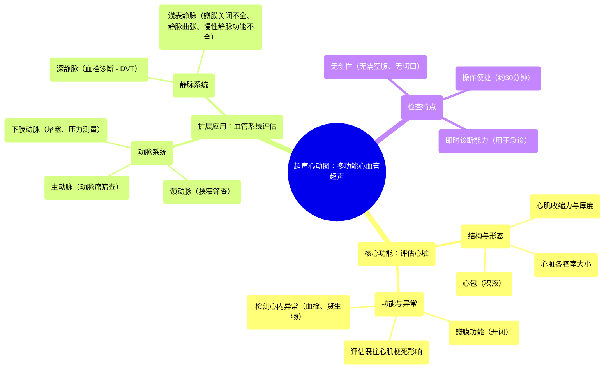

# 3_What is an Echocardiogram

  <video controls preload="metadata" playsinline>
    <source src="https://helly.s3.bitiful.net/心血管学科/%E4%B8%93%E8%BE%91%2008%EF%BC%9A%E5%BF%83%E8%A1%80%E7%AE%A1%E6%A3%80%E6%9F%A5%E6%8A%80%E6%9C%AF%20%28Procedures%20and%20Tests%29/3_What%20is%20an%20Echocardiogram.mp4" type="video/mp4">
    
您的浏览器不支持播放，请升级。

  </video>

::: tip ⚡️ 核心考点 (30s速读)
*   **核心考点**：超声心动图是一种利用超声波无创评估心脏结构与功能的影像学检查。
*   **临床意义**：该技术不仅用于评估心肌收缩力、瓣膜功能、心包及心内异常，还广泛应用于全身血管系统（如颈动脉、主动脉、下肢动静脉）的疾病筛查与诊断，是心血管疾病诊疗中的关键工具。
:::

## 🧠 深度精讲
*   **概念1：超声心动图的核心功能与应用**
    超声心动图是心血管领域的“听诊器”和“眼睛”。它通过超声波实时生成心脏的动态图像，医生可以直观地观察心脏的收缩与舒张、各腔室的大小、室壁的厚度与运动。视频中强调，它能评估**心肌收缩强度**、**瓣膜的开闭功能**（有无狭窄或反流）、**心包**（有无积液）、以及检测心内的**血栓**、**赘生物**（如感染性心内膜炎的微生物团块）和因**既往心肌梗死**导致的室壁运动异常。这些信息对于诊断心力衰竭、瓣膜病、心肌病、心包疾病等至关重要。

*   **概念2：超声技术的扩展应用——血管超声**
    视频重点指出，同一台超声设备通过更换探头和调整模式，可进行广泛的血管检查，这体现了现代超声技术的多功能性。其应用包括：
    1.  **颈动脉超声**：检查颈动脉是否存在**狭窄**（粥样硬化斑块），评估脑卒中风险。
    2.  **主动脉超声**：筛查**主动脉瘤**（主动脉异常扩张），防止破裂等致命并发症。
    3.  **下肢血管超声**：
        *   **动脉系统**：评估动脉是否**堵塞**，测量血流压力，诊断外周动脉疾病。
        *   **静脉系统**：诊断**深静脉血栓形成**（DVT）；评估**慢性静脉功能不全**，即浅表静脉瓣膜**关闭不全（渗漏）**，这是导致下肢水肿、肿胀和静脉曲张的常见原因，即使没有明显可见的曲张静脉也可能发生。

*   **概念3：检查特点与临床场景**
    超声检查具有**无创、无需特殊准备（无需空腹）、操作时间短（约半小时）** 等优点，患者接受度高。此外，它具有**即时诊断**能力，在急诊场景中价值巨大，例如可快速诊断急性下肢深静脉血栓（DVT）或急性心包积液，为紧急治疗争取时间。

## 📚 双语术语表 (Terminology)
| 英文术语 | 中文翻译 | 定义/解释 |
| :--- | :--- | :--- |
| Echocardiogram | 超声心动图 | 利用超声波显示心脏结构和评估其功能的影像学检查。 |
| Pericardium | 心包 | 包裹心脏和心脏大血管根部的双层纤维浆膜囊。 |
| Vegetations | 赘生物 | 通常指附着在心脏瓣膜上的微生物团块，常见于感染性心内膜炎。 |
| Carotid arteries | 颈动脉 | 位于颈部，向大脑供血的主要动脉。 |
| Aortic aneurysm | 主动脉瘤 | 主动脉壁局部异常扩张或膨出。 |
| Deep Vein Thrombosis (DVT) | 深静脉血栓形成 | 血液在深静脉内不正常地凝结，阻塞血管。 |
| Pericardial effusion | 心包积液 | 心包腔内液体异常积聚。 |
| Chronic venous insufficiency | 慢性静脉功能不全 | 静脉瓣膜功能不全导致血液回流受阻，引起下肢水肿、皮肤改变等症状。 |
| Non-invasive | 无创的 | 指检查或治疗不穿透皮肤或进入体腔，通常无痛且风险低。 |

## 🗺️ 知识图谱

