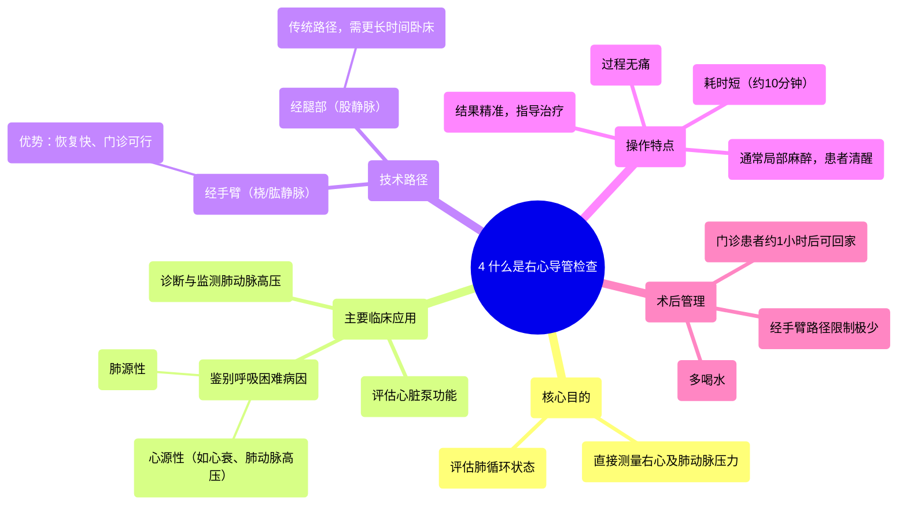

# 4 What is Right Heart Catheterization 

  <video controls preload="metadata" playsinline>
    <source src="https://helly.s3.bitiful.net/心血管学科/%E4%B8%93%E8%BE%91%2008%EF%BC%9A%E5%BF%83%E8%A1%80%E7%AE%A1%E6%A3%80%E6%9F%A5%E6%8A%80%E6%9C%AF%20%28Procedures%20and%20Tests%29/4%20What%20is%20Right%20Heart%20Catheterization%20.mp4" type="video/mp4">
    
您的浏览器不支持播放，请升级。

  </video>

::: tip ⚡️ 核心考点 (30s速读)
*   **核心考点**：右心导管检查是一种通过外周静脉（如上臂）将导管送入右心及肺动脉，以直接测量其内部压力的诊断性操作。
*   **临床意义**：主要用于鉴别不明原因的呼吸困难，评估肺动脉高压，并精确指导后续治疗方案，避免临床猜测。
:::

## 🧠 深度精讲
*   **概念1**：右心导管检查的核心目的是**直接测量压力**。它能够精确获取右心房、右心室、肺动脉及其分支（肺毛细血管楔压，间接反映左心房压力）的压力数据。这些数据是评估右心功能和肺循环状态的“金标准”。
*   **概念2**：该检查的**主要临床应用场景**是**鉴别诊断呼吸困难**。当患者出现气短症状时，病因可能源于心脏（如心力衰竭、肺动脉高压）或肺部本身疾病。通过测量肺动脉压力，医生可以明确病因方向。
*   **概念3**：现代右心导管检查常采用**经桡动脉/肱动脉路径**（从手臂进入），而非传统的股静脉路径（从腹股沟进入）。其优势在于患者**术后恢复快、限制少**（无需长时间卧床），可在门诊进行，极大提高了便利性和患者舒适度。
*   **概念4**：检查过程通常在**局部麻醉**下进行，患者保持清醒或轻度镇静。导管在血管内的行进和压力测量本身是**无痛**的。整个操作时间短（视频中提到约10分钟），能快速获得关键诊断信息，实现“精准医疗”。

## 📚 双语术语表 (Terminology)
| 英文术语 | 中文翻译 | 定义/解释 |
| :--- | :--- | :--- |
| Right Heart Catheterization | 右心导管检查 | 一种将导管经静脉送入右心腔和肺动脉，以测量压力和评估心脏功能的介入诊断技术。 |
| Pulmonary Hypertension | 肺动脉高压 | 指肺动脉压力异常升高的病理状态，是右心导管检查的重要指征之一。 |
| Swan-Ganz Catheter | 斯旺-甘兹导管 | 一种用于右心导管检查的特制球囊漂浮导管，可随血流漂入肺动脉进行压力测量。 |
| Shortness of Breath (SOB) | 呼吸困难 / 气短 | 患者的主观症状，右心导管检查常用于鉴别其心脏性或肺源性病因。 |
| Pulmonary Artery Pressure | 肺动脉压 | 肺动脉内的血压，是评估肺循环阻力和右心负荷的关键参数。 |
| Outpatient Setting | 门诊环境 | 指患者无需住院，在门诊或日间手术中心即可完成检查和治疗的模式。 |
| Femoral Approach | 经股动脉路径 | 传统介入手术中通过腹股沟区的股动脉/股静脉进行导管操作的入路方式。 |
| Cardiac Cath Lab | 心导管室 | 配备有X光透视机、压力监测系统等设备，专门用于进行心脏介入诊断和治疗的房间。 |

## 🗺️ 知识图谱

