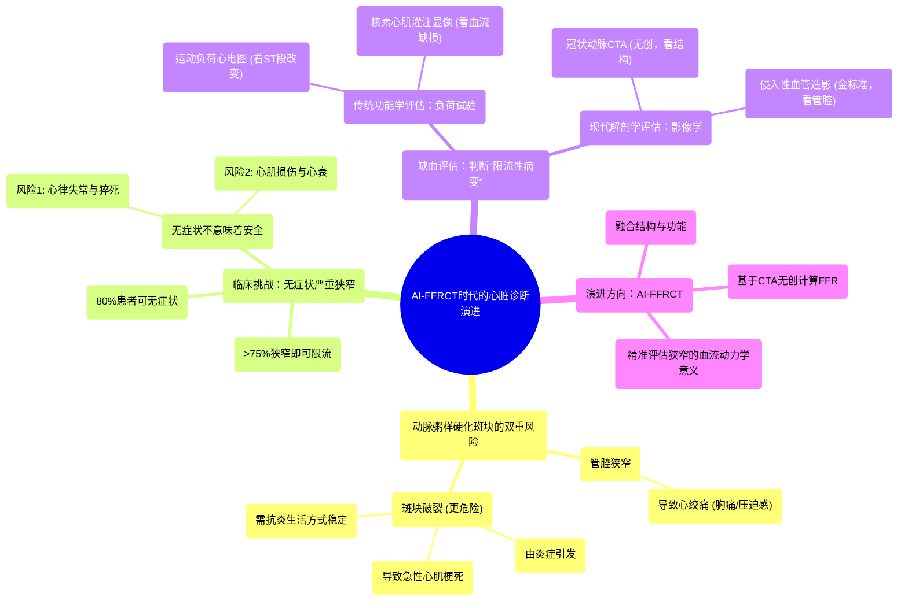

# 5_Evolution of Cardiac Diagnostics A New Era with AI-Powered FFR-CT

  <video controls preload="metadata" playsinline>
    <source src="https://helly.s3.bitiful.net/心血管学科/%E4%B8%93%E8%BE%91%2008%EF%BC%9A%E5%BF%83%E8%A1%80%E7%AE%A1%E6%A3%80%E6%9F%A5%E6%8A%80%E6%9C%AF%20%28Procedures%20and%20Tests%29/5_Evolution%20of%20Cardiac%20Diagnostics%20A%20New%20Era%20with%20AI-Powered%20FFR-CT.mp4" type="video/mp4">
    
您的浏览器不支持播放，请升级。

  </video>

::: tip ⚡️ 核心考点 (30s速读)
*   **核心考点**：动脉粥样硬化斑块的危险性不仅在于导致血管狭窄，更在于其破裂风险。判断一个狭窄病变是否为“限流性病变”（即是否显著减少心肌供血）是临床决策的关键。
*   **临床意义**：无症状的严重狭窄（>75%）同样危险，可导致心律失常、心力衰竭甚至猝死。传统负荷试验（心电图、核素）和现代影像学（CTA、血管造影）是评估心肌缺血的主要手段，而FFR-CT代表了利用AI无创评估血流动力学功能的新方向。
:::

## 🧠 深度精讲

*   **斑块的双重危险**：动脉粥样硬化斑块的危险性体现在两方面。第一，**管腔狭窄**：斑块使动脉变窄，可能导致心绞痛（胸痛、压迫感等）。第二，也是更危险的，是**斑块破裂**：斑块内部的炎症使其变得不稳定，像“粉刺”一样破裂，引发血栓，导致急性心肌梗死。因此，治疗和预防的核心策略之一是采用**抗炎生活方式和饮食**以稳定斑块，防止其增长和破裂。

*   **“限流性病变”与临床症状的脱节**：当冠状动脉狭窄程度**平均超过75%**时，血流会开始显著减少。然而，临床症状（如胸痛）并不可靠：**高达80%**的此类严重狭窄患者可能没有典型心绞痛。没有症状不意味着安全，只意味着“心绞痛预警系统”失灵。无症状的严重狭窄同样会导致严重后果。

*   **无症状严重狭窄的潜在危害**：即使没有胸痛，心肌供血不足也会带来两大风险：1. **心律失常**：缺血心肌易发生恶性心律失常（如心室颤动），导致心源性猝死。2. **心肌损伤与心力衰竭**：长期缺血会使心肌收缩力减弱（射血分数降低），患者可能出现呼吸困难，并逐渐发展为充血性心力衰竭。一旦通过介入治疗解除阻塞，心肌功能常可恢复。

*   **传统缺血评估方法**：为了判断斑块是否引起了有临床意义的缺血（即是否为“限流性病变”），传统上采用**负荷试验**。
    *   **运动负荷心电图**：患者在运动时，心电图出现ST段压低等改变，提示心肌缺血。
    *   **核素心肌灌注显像**：注射放射性示踪剂，通过显像直接显示在负荷状态下，哪部分心肌区域存在血流灌注缺损。

*   **现代影像学评估**：直接观察血管解剖结构的方法。
    *   **冠状动脉CT血管成像**：无创检查，可以清晰显示冠状动脉的钙化斑块和管腔狭窄情况，是筛查和评估的重要工具。
    *   **侵入性冠状动脉造影**：诊断的“金标准”。通过导管向冠状动脉内注射造影剂，直接动态观察血管腔的狭窄。但其主要显示的是**管腔形态**，无法评估斑块本身的稳定性（如炎症），也无法直接判断某个特定狭窄对血流的影响程度（功能学评估）。

## 📚 双语术语表 (Terminology)
| 英文术语 | 中文翻译 | 定义/解释 |
| :--- | :--- | :--- |
| Atherosclerotic Plaque | 动脉粥样硬化斑块 | 在动脉血管壁内层形成的脂肪、胆固醇、钙和其他物质沉积物。 |
| Plaque Rupture | 斑块破裂 | 不稳定斑块表面的纤维帽破裂，内容物暴露于血液中，引发血栓形成，是急性心肌梗死的主要机制。 |
| Flow-limiting Lesion | 限流性病变 | 指冠状动脉的狭窄程度足以在心肌需氧量增加时（如运动）限制血流，导致心肌缺血的病变。 |
| Angina | 心绞痛 | 由于心肌暂时性缺血缺氧引起的以胸痛、压迫感或不适为特征的临床综合征。 |
| Ejection Fraction (EF) | 射血分数 | 衡量心脏每次收缩时泵出血液百分比的指标，是评估心脏泵血功能的核心参数。 |
| Arrhythmia | 心律失常 | 心脏跳动的节律或频率异常。缺血可诱发潜在的致命性心律失常。 |
| Sudden Cardiac Death | 心源性猝死 | 由心脏原因引起的、症状出现后1小时内的自然死亡。常由心室颤动导致。 |
| Congestive Heart Failure (CHF) | 充血性心力衰竭 | 心脏泵血功能下降，无法满足身体代谢需要，导致体液潴留（充血）的一种临床综合征。 |
| Stress Test | 负荷试验 | 通过运动或药物增加心脏负荷，同时监测心电图、症状或心肌灌注影像变化，以诱发和检测心肌缺血的检查方法。 |
| Nuclear Stress Test | 核素负荷试验 | 负荷试验的一种，通过注射放射性示踪剂并成像，来评估负荷状态下心肌各区域的血流灌注情况。 |
| Coronary CT Angiography (CCTA) | 冠状动脉CT血管成像 | 利用CT扫描技术，通过静脉注射造影剂，无创地显示冠状动脉三维图像的检查方法。 |
| Invasive Coronary Angiography | 侵入性冠状动脉造影 | 将导管经动脉送入冠状动脉开口，直接注射造影剂并拍摄X光动态影像，是诊断冠状动脉狭窄的金标准。 |
| FFR-CT | 无创血流储备分数CT分析 | 一种基于常规冠状动脉CTA影像，利用计算流体动力学（常由AI辅助）模拟计算出血管特定位置血流储备分数的无创技术，用于评估狭窄的功能学意义。 |

## 🗺️ 知识图谱

