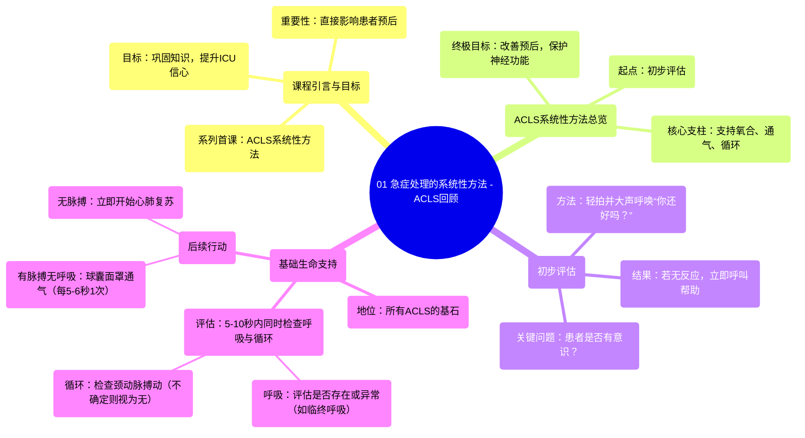

# 01 The Systematic Approach to Emergency Situations - ACLS Review

  <video controls preload="metadata" playsinline>
    <source src="https://helly.s3.bitiful.net/心血管学科/%E4%B8%93%E8%BE%91%2009%EF%BC%9A%E5%BF%83%E8%84%8F%E6%80%A5%E6%95%91%E4%B8%8E%E9%AB%98%E7%BA%A7%E7%94%9F%E5%91%BD%E6%94%AF%E6%8C%81%20%28ACLS%20Mastery%29/01%20The%20Systematic%20Approach%20to%20Emergency%20Situations%20-%20ACLS%20Review.mp4" type="video/mp4">
    
您的浏览器不支持播放，请升级。

  </video>

::: tip ⚡️ 核心考点 (30s速读)
*   **核心考点**：ACLS系统性方法始于快速初步评估，核心是判断患者意识状态。若患者无反应，立即启动紧急反应系统，并遵循BLS流程，在5-10秒内同时评估呼吸与循环（脉搏），以最小化延迟，为后续高级干预奠定基础。
*   **临床意义**：掌握这一系统性方法能确保在危重患者病情恶化或发生心跳骤停时，医护人员能快速、有序、高效地采取行动，直接关系到患者的生存率和神经功能预后。
:::

## 🧠 深度精讲

*   **课程目标与重要性**：本课程是ACLS系列的第一课，旨在帮助ICU医护人员理解并掌握处理危及生命情况的系统性方法。ACLS指南融合了全球专业知识与美国心脏协会（AHA）的最佳实践，目标是改善患者预后。视频是学习的补充，但不能替代正式的ACLS/BLS认证。在ICU工作中，熟练掌握这些指南至关重要。
*   **系统性方法概述**：ACLS培训的总体目标是成为更好的循证医学实践者。AHA提供了一个系统性方法，核心目标是支持患者的氧合、通气和循环，最终目的是保护神经功能。整个过程始于对情况的初步印象和评估。
*   **初步评估**：这是系统性方法的起点。需要快速收集信息：患者位置、外观、监护仪数据。**最关键的部分是评估患者意识水平**（是否清醒）。评估方法是“轻拍并大声呼唤”：“你还好吗？”。
*   **启动BLS（基础生命支持）**：如果患者无反应（意识不清），**第一步永远是立即呼叫帮助**，启动紧急反应系统（如抢救警报）。BLS是所有ACLS流程的基础。
*   **BLS评估与行动**：
    *   **评估内容**：在**5-10秒内**，**同时评估**患者的**呼吸**和**循环（脉搏）**。
    *   **呼吸评估**：判断是否有呼吸或是否存在异常呼吸（如**临终呼吸**）。临终呼吸是心跳骤停后的一种反射性费力喘息，不属于正常呼吸。
    *   **循环评估**：检查**颈动脉搏动**（最易触及，误差小）。**原则**：如果无法确定是否有脉搏，则按无脉搏处理。
    *   **后续行动**：
        *   **有脉搏，无/异常呼吸**：立即使用**球囊面罩**（简易呼吸器）进行人工呼吸，频率为每5-6秒1次。确保密封良好，看到胸廓起伏，避免过度通气。
        *   **无脉搏**：立即开始心肺复苏（CPR）。

## 📚 双语术语表 (Terminology)
| 英文术语 | 中文翻译 | 定义/解释 |
| :--- | :--- | :--- |
| ACLS | 高级心血管生命支持 | 一套用于处理心跳骤停和其他心血管急症的标准化指南和流程。 |
| BLS | 基础生命支持 | 针对心跳骤停的初步急救措施，包括心肺复苏和早期除颤。 |
| AHA | 美国心脏协会 | 制定心血管急救指南的国际权威机构。 |
| Systematic Approach | 系统性方法 | 处理急症时遵循的标准化、有序的步骤和流程。 |
| Initial Assessment | 初步评估 | 对急症患者状况的快速初始判断，核心是意识状态。 |
| Agonal Breathing | 临终呼吸 | 心跳骤停后出现的反射性、费力的喘息，不是有效呼吸。 |
| Carotid Pulse | 颈动脉搏动 | 位于颈部的动脉搏动，是BLS中评估循环的首选部位。 |
| Bag Valve Mask (BVM) | 球囊面罩（简易呼吸器） | 用于为无自主呼吸但有脉搏的患者提供正压通气的器械。 |
| Code | 抢救代码 | 医院内宣布患者发生心跳骤停并启动团队复苏的警报系统。 |

## 🗺️ 知识图谱

