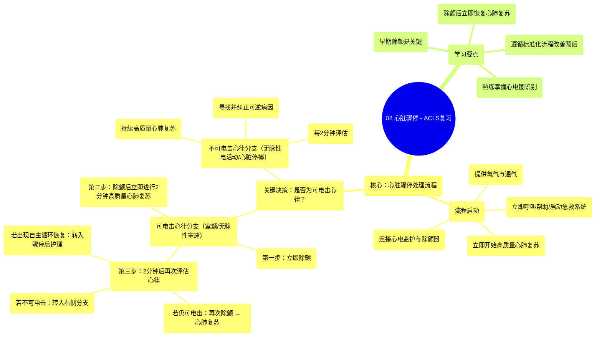

# 02 Cardiac Arrest - ACLS Review

  <video controls preload="metadata" playsinline>
    <source src="https://helly.s3.bitiful.net/心血管学科/%E4%B8%93%E8%BE%91%2009%EF%BC%9A%E5%BF%83%E8%84%8F%E6%80%A5%E6%95%91%E4%B8%8E%E9%AB%98%E7%BA%A7%E7%94%9F%E5%91%BD%E6%94%AF%E6%8C%81%20%28ACLS%20Mastery%29/02%20Cardiac%20Arrest%20-%20ACLS%20Review.mp4" type="video/mp4">
    
您的浏览器不支持播放，请升级。

  </video>

::: tip ⚡️ 核心考点 (30s速读)
*   **核心考点**：心脏骤停处理流程的核心是立即识别心律是否为“可电击心律”（室颤/无脉性室速），并据此选择不同分支进行抢救。
*   **临床意义**：早期高质量心肺复苏和快速除颤是提高心脏骤停患者生存率的关键。流程强调在除颤后立即恢复心肺复苏，并每2分钟重新评估心律与脉搏。
:::

## 🧠 深度精讲

*   **课程目标与重要性**：本课程旨在系统讲解美国心脏协会高级心血管生命支持中的**心脏骤停处理流程**。该流程是ACLS中最常用、最重要的算法，用于指导对无脉搏心脏骤停患者的标准化抢救，其熟练掌握对改善患者预后至关重要。
*   **流程启动与初步评估**：
    1.  **启动应急反应**：发现患者无反应、无脉搏后，立即呼叫帮助/启动急救系统，并**立即开始高质量心肺复苏**。
    2.  **同步支持**：在实施心肺复苏的同时，需为患者提供氧气和通气支持，并尽快连接心电监护仪和除颤器。
*   **核心决策点：是否为可电击心律？** 连接监护设备后，需立即评估患者心律。这是整个流程的第一个关键决策点，决定了后续的抢救路径。
    *   **可电击心律**：包括**心室颤动**和**无脉性室性心动过速**。处理目标是尽快进行电除颤。
    *   **不可电击心律**：包括**无脉性电活动**和**心脏停搏**。处理重点在于持续心肺复苏、寻找并纠正可逆病因。
*   **可电击心律分支（左侧路径）详解**：
    1.  **立即除颤**：识别为可电击心律后，应**立即给予电击**。首次电击能量建议为120-200焦耳（双相波）。除颤的目的是通过电流“击晕”心脏，终止恶性心律失常，而非直接重启心脏。
    2.  **电击后立即心肺复苏**：电击后，**不要**等待观察心律，而应**立即恢复高质量心肺复苏**，持续2分钟（约5个循环）。
    3.  **建立静脉/骨内通道**：在第一个2分钟心肺复苏周期内，应建立可靠的给药通道。
    4.  **2分钟后再评估**：2分钟心肺复苏结束后，再次评估心律和脉搏。
        *   **若仍为可电击心律**：**再次除颤**（能量可酌情增加），然后**立即恢复**2分钟心肺复苏。此循环可重复。
        *   **若转为不可电击心律**：转入右侧分支处理。
        *   **若出现自主循环恢复迹象**：则转入**心脏骤停后综合治疗**流程。
*   **不可电击心律分支（右侧路径）提示**：对于无脉性电活动或心脏停搏，核心是**持续高质量心肺复苏**，同时每2分钟评估心律，并积极寻找并治疗可逆病因（如低血容量、缺氧、酸中毒等）。本视频重点讲解了左侧（可电击心律）分支。

## 📚 双语术语表 (Terminology)
| 英文术语 | 中文翻译 | 定义/解释 |
| :--- | :--- | :--- |
| ACLS | 高级心血管生命支持 | 一套用于治疗心脏急症（如心脏骤停、急性冠脉综合征）的标准化临床干预流程和技能。 |
| Cardiac Arrest Algorithm | 心脏骤停处理流程 | ACLS中用于指导无脉搏心脏骤停患者抢救的核心决策路径图。 |
| Shockable Rhythm | 可电击心律 | 指通过电除颤可能终止的心律失常，主要包括心室颤动和无脉性室性心动过速。 |
| VFib (Ventricular Fibrillation) | 心室颤动 | 一种致命性心律失常，心室肌出现快速、无序的颤动，无法有效泵血。 |
| Pulseless VTAC (Ventricular Tachycardia) | 无脉性室性心动过速 | 一种快速的室性心律，频率通常>100次/分，且无法产生有效的脉搏和血压。 |
| High-quality CPR | 高质量心肺复苏 | 强调足够深度、速率、充分回弹、最小中断和避免过度通气的胸外按压。 |
| Defibrillation | 电除颤 | 使用除颤器向心脏释放一定能量的电流，以终止某些快速性心律失常（如室颤）的过程。 |
| ROSC (Return of Spontaneous Circulation) | 自主循环恢复 | 心脏骤停后，患者恢复有效的心律和可触及的脉搏，是抢救成功的阶段性标志。 |
| PEA (Pulseless Electrical Activity) | 无脉性电活动 | 心电监护显示有电活动（心律），但患者无脉搏、无有效循环。 |
| Asystole | 心脏停搏 | 心电图上呈一条直线，无任何电活动和机械收缩。 |

## 🗺️ 知识图谱

