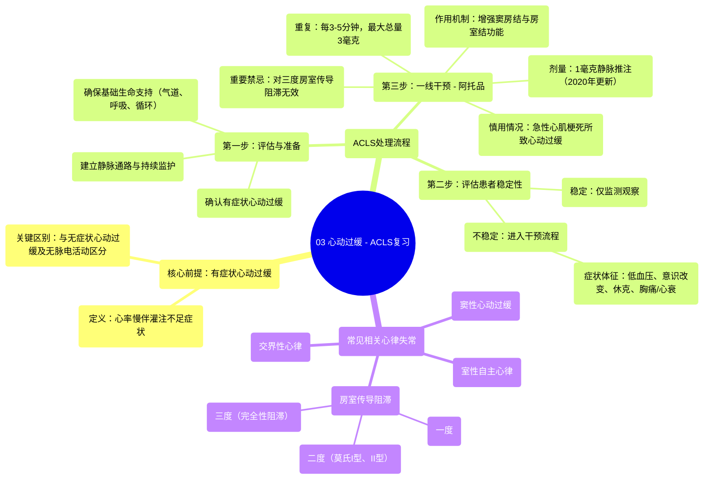

# 03 Bradycardia - ACLS Review

  <video controls preload="metadata" playsinline>
    <source src="https://helly.s3.bitiful.net/心血管学科/%E4%B8%93%E8%BE%91%2009%EF%BC%9A%E5%BF%83%E8%84%8F%E6%80%A5%E6%95%91%E4%B8%8E%E9%AB%98%E7%BA%A7%E7%94%9F%E5%91%BD%E6%94%AF%E6%8C%81%20%28ACLS%20Mastery%29/03%20Bradycardia%20-%20ACLS%20Review.mp4" type="video/mp4">
    
您的浏览器不支持播放，请升级。

  </video>

::: tip ⚡️ 核心考点 (30s速读)
*   **核心考点**：掌握“有症状心动过缓”的识别与ACLS处理流程，特别是阿托品的使用时机、剂量更新及禁忌。
*   **临床意义**：快速识别因心率过慢导致灌注不足的危重患者，并遵循系统化流程进行干预，以稳定血流动力学，避免心脏骤停。
:::

## 🧠 深度精讲
*   **概念1：有症状心动过缓的识别**
    本课程的核心是处理“有症状心动过缓”，而非所有心率<60次/分的情况。关键区别在于患者是否因心率过慢（通常<50次/分）而出现灌注不足的体征。这些症状是启动处理流程的指征，包括：低血压（如收缩压<90 mmHg）、意识水平改变（如反应迟钝）、休克体征（如皮肤湿冷、苍白）、缺血性胸痛或急性心力衰竭。如果患者无症状，仅需监测。

*   **概念2：ACLS心动过缓处理流程**
    流程遵循系统化步骤：1) **评估与准备**：确认患者符合有症状心动过缓标准，并确保基础生命支持（气道、呼吸、循环）到位，建立静脉通路，持续监护。2) **评估灌注/稳定性**：判断患者是否“不稳定”（即出现上述症状）。3) **一线药物干预**：对于不稳定的有症状心动过缓，首选静脉推注**阿托品1毫克**（2020年AHA更新剂量，旧剂量0.5毫克已不再推荐），可每3-5分钟重复，最大总量3毫克。4) **药物禁忌与考量**：需注意阿托品通过增强窦房结和房室结功能起效，因此对**三度（完全性）房室传导阻滞无效**，对部分二度传导阻滞效果也差。此外，若心动过缓由急性心肌梗死引起，使用阿托品可能因增加心肌耗氧量而有害。5) **后续步骤**：若阿托品无效，流程将导向经皮起搏或输注肾上腺素/多巴胺等二级干预（视频后续内容）。

*   **概念3：常见相关心律**
    能够识别与有症状心动过缓相关的特定心律至关重要，包括：窦性心动过缓、一度房室传导阻滞、二度房室传导阻滞（莫氏I型/文氏型、莫氏II型）、三度房室传导阻滞（完全性心脏阻滞）以及交界性、室性自主心律。准确的心电图判读是正确应用流程的基础。

## 📚 双语术语表 (Terminology)
| 英文术语 | 中文翻译 | 定义/解释 |
| :--- | :--- | :--- |
| **Symptomatic Bradycardia** | **有症状心动过缓** | 心率缓慢（通常<50次/分）并导致灌注不足相关症状（如低血压、意识改变）的状态，是ACLS流程的启动指征。 |
| **ACLS (Advanced Cardiovascular Life Support)** | **高级心血管生命支持** | 美国心脏协会制定的一套用于处理心脏骤停和围心脏骤停期危重症的系统化临床干预流程与技能。 |
| **Atropine** | **阿托品** | 用于治疗有症状心动过缓的一线药物，为抗胆碱能药，通过阻断迷走神经、增强窦房结和房室结的自律性与传导来提升心率。 |
| **Third-Degree AV Block (Complete Heart Block)** | **三度房室传导阻滞（完全性心脏阻滞）** | 一种严重的心律失常，心房冲动完全不能下传至心室，心房和心室各自独立跳动。**阿托品对此无效**。 |
| **Perfusion** | **灌注** | 血液流向身体组织以输送氧气和营养物质的过程。有症状心动过缓的核心问题就是灌注不足。 |
| **Algorithm** | **流程/算法** | 一套按步骤解决问题的标准化指令或决策路径。在ACLS中，指针对特定心脏急症（如心动过缓）的标准化处理步骤。 |
| **MOIST (Mobitz)** | **莫氏** | 二度房室传导阻滞的分型，包括莫氏I型（文氏型，通常预后较好）和莫氏II型（预后较差，易进展为完全性传导阻滞）。 |

## 🗺️ 知识图谱

