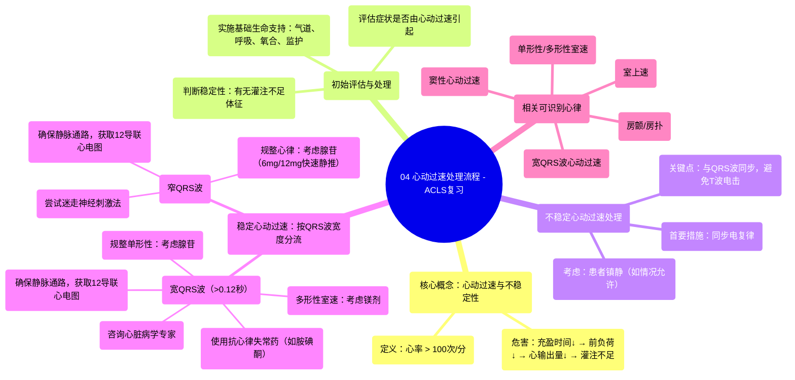

# 04 Tachycardia Algorithm - ACLS Review

  <video controls preload="metadata" playsinline>
    <source src="https://helly.s3.bitiful.net/心血管学科/%E4%B8%93%E8%BE%91%2009%EF%BC%9A%E5%BF%83%E8%84%8F%E6%80%A5%E6%95%91%E4%B8%8E%E9%AB%98%E7%BA%A7%E7%94%9F%E5%91%BD%E6%94%AF%E6%8C%81%20%28ACLS%20Mastery%29/04%20Tachycardia%20Algorithm%20-%20ACLS%20Review.mp4" type="video/mp4">
    
您的浏览器不支持播放，请升级。

  </video>

::: tip ⚡️ 核心考点 (30s速读)
*   **核心考点**：掌握心动过速（心率>100次/分）导致不稳定的机制，以及不稳定心动过速的紧急处理流程。
*   **临床意义**：快速识别不稳定体征（如胸痛、休克、意识改变），并立即启动同步电复律，是防止病情恶化为心脏骤停的关键。
:::

## 🧠 深度精讲

*   **心动过速的定义与危害**：心动过速指心率大于100次/分。心率过快会缩短心脏舒张期充盈时间，导致前负荷和心输出量下降，从而引发组织灌注不足，即不稳定性心动过速。
*   **相关心律识别**：不稳定心动过速可能源于多种心律，包括：窦性心动过速、心房颤动（房颤）、心房扑动（房扑）、折返性室上性心动过速（室上速）、单形性室速、多形性室速以及宽QRS波心动过速。准确识别心律是选择正确治疗的基础。
*   **初始评估与稳定措施**：面对心动过速患者，首要步骤是评估症状是否由心动过速本身引起（通常心率>150次/分时需高度怀疑）。同时，立即实施基础生命支持：维持气道、必要时辅助呼吸、给氧、监测心电图、血压和血氧饱和度。
*   **不稳定心动过速的处理**：如果患者出现灌注不足的体征（如胸痛、休克、呼吸困难、意识水平改变、急性心衰），**首要措施是进行同步电复律**。同步电复律与除颤类似，但会与患者QRS波同步，以避免电击落在易损期（T波）而诱发更严重的心律失常。若患者能耐受，应考虑给予镇静。
*   **稳定心动过速的流程**：若患者情况稳定，则根据QRS波宽度进行分流处理：
    *   **宽QRS波心动过速（QRS > 0.12秒）**：确保静脉通路，获取12导联心电图。若心律规整且为单形性，可考虑使用腺苷。同时需考虑使用抗心律失常药物（如胺碘酮、普鲁卡因胺、索他洛尔）。若为多形性室速，可考虑给予镁剂（1-2克）。此时应咨询心脏病学专家。
    *   **窄QRS波心动过速**：确保静脉通路，获取12导联心电图。可尝试迷走神经刺激法（如Valsalva动作、用吸管用力吹气，或由经过培训的人员进行颈动脉窦按摩）。若心律规整，可考虑使用腺苷（首剂6mg快速静推，必要时可追加两次12mg）。

## 📚 双语术语表 (Terminology)
| 英文术语 | 中文翻译 | 定义/解释 |
| :--- | :--- | :--- |
| Tachycardia | 心动过速 | 心率大于100次/分。 |
| Unstable Tachycardia | 不稳定性心动过速 | 心动过速导致灌注不足（如胸痛、休克、意识改变）的危急状态。 |
| Synchronized Cardioversion | 同步电复律 | 与患者心电图QRS波同步释放电击，用于终止不稳定心动过速。 |
| Adenosine | 腺苷 | 一种可快速终止某些室上性心动过速的药物，需快速静脉推注。 |
| QRS Complex | QRS波群 | 心电图上代表心室除极的波形。宽度大于0.12秒定义为宽QRS波。 |
| Polymorphic VTAC | 多形性室速 | 一种QRS波形态不断变化的恶性室性心动过速。 |
| Vagal Maneuvers | 迷走神经刺激法 | 通过刺激迷走神经来尝试终止某些室上性心动过速的物理方法，如Valsalva动作。 |
| ACLS | 高级心血管生命支持 | 一套用于处理心脏骤停和围心脏骤停期危重症的标准化流程和技能。 |

## 🗺️ 知识图谱

