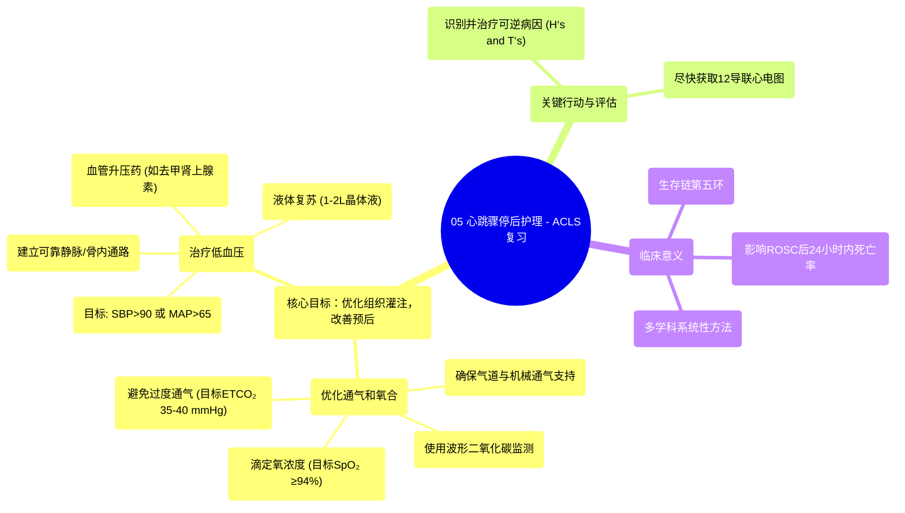

# 05 Post Cardiac Arrest - ACLS Review

  <video controls preload="metadata" playsinline>
    <source src="https://helly.s3.bitiful.net/心血管学科/%E4%B8%93%E8%BE%91%2009%EF%BC%9A%E5%BF%83%E8%84%8F%E6%80%A5%E6%95%91%E4%B8%8E%E9%AB%98%E7%BA%A7%E7%94%9F%E5%91%BD%E6%94%AF%E6%8C%81%20%28ACLS%20Mastery%29/05%20Post%20Cardiac%20Arrest%20-%20ACLS%20Review.mp4" type="video/mp4">
    
您的浏览器不支持播放，请升级。

  </video>

::: tip ⚡️ 核心考点 (30s速读)
*   **核心考点**：心跳骤停后护理（PCAC）是AHA生存链的第五环，核心目标是优化组织灌注，以改善患者死亡率和生活质量。
*   **临床意义**：大多数死亡发生在ROSC后24小时内。系统性的PCAC方法，聚焦于优化通气和治疗低血压，对预后有深远影响。
:::

## 🧠 深度精讲
*   **心跳骤停后护理（PCAC）的目标与意义**：PCAC是高级心血管生命支持（ACLS）的关键环节，其重点从“挽救生命”转向“改善预后”。它旨在通过一个多学科协作的系统性方法，优化患者ROSC后的生理状态，核心是保障大脑等重要器官的灌注，从而降低死亡率和神经功能残疾，提高患者远期生活质量。
*   **两大核心干预领域**：
    1.  **优化通气和氧合**：
        *   **气道与呼吸支持**：多数患者意识不清，需建立高级气道（如气管插管）进行机械通气，并使用**波形二氧化碳监测（波形二氧化碳图）** 确认导管位置并指导管理。
        *   **氧合滴定**：复苏时使用100%氧浓度，ROSC后应滴定吸氧浓度，维持血氧饱和度（SpO₂）≥94%即可，避免不必要的氧暴露。
        *   **通气管理**：避免过度通气。目标是将呼气末二氧化碳分压（ETCO₂）维持在35-40 mmHg左右。过度通气会降低胸腔内压和脑血流量，对预后不利。但需个体化评估，某些情况可能允许高碳酸血症或低碳酸血症。
    2.  **治疗低血压**：
        *   **目标**：维持收缩压（SBP）> 90 mmHg 或平均动脉压（MAP）> 65 mmHg。
        *   **步骤**：立即建立可靠的静脉/骨内（IV/IO）通路。
            *   **第一步：液体复苏**：快速输注1-2升晶体液（如生理盐水或乳酸林格氏液）。
            *   **第二步：血管升压药**：若液体复苏后血压仍不达标，需启动血管升压药持续输注，常用药物包括**去甲肾上腺素**、**肾上腺素**或**多巴胺**。需精确滴定至目标血压，避免过度升压。
*   **其他关键行动**：
    *   **识别并治疗可逆病因**：立即回顾并处理可能导致心跳骤停的“H‘s and T‘s”（低血容量、缺氧等可逆因素）。
    *   **获取12导联心电图**：尽快完成，以评估是否存在ST段抬高型心肌梗死等需要紧急处理的冠脉事件。

## 📚 双语术语表 (Terminology)
| 英文术语 | 中文翻译 | 定义/解释 |
| :--- | :--- | :--- |
| Post-Cardiac Arrest Care (PCAC) | 心跳骤停后护理 | 自主循环恢复后，为优化患者预后而采取的一系列系统性、多学科的干预措施。 |
| Return of Spontaneous Circulation (ROSC) | 自主循环恢复 | 心脏在停止有效搏动后，重新恢复有效的、可触及的脉搏和循环。 |
| Chain of Survival | 生存链 | 美国心脏协会提出的一系列关键环节，旨在提高心跳骤停患者的生存率，PCAC是其中第五环。 |
| Waveform Capnography | 波形二氧化碳监测（波形二氧化碳图） | 持续监测患者呼气末二氧化碳分压（ETCO₂）波形和数值的技术，用于确认气管插管位置、评估心肺复苏质量和指导通气。 |
| End-Tidal CO2 (ETCO₂) | 呼气末二氧化碳分压 | 在一次呼气末测得的二氧化碳分压，是反映通气、代谢和循环状态的重要参数。 |
| Hypotension | 低血压 | 血压低于正常水平，在PCAC中特指SBP < 90 mmHg 或 MAP < 65 mmHg。 |
| Vasopressors | 血管升压药（升压药） | 一类通过收缩血管来升高血压的药物，如去甲肾上腺素、肾上腺素。 |
| Intraosseous (IO) Access | 骨内通路 | 一种通过骨髓腔建立紧急给药和输液通路的技术，用于无法快速建立静脉通路时。 |
| H‘s and T‘s | H‘s and T‘s（可逆性病因） | 在ACLS中，用于系统性地记忆和排查可能导致或加重心跳骤停的可逆性病因（如低血容量、缺氧、酸中毒等）。 |
| 12-lead ECG | 12导联心电图 | 一种标准的心电图检查，用于全面评估心脏电活动，诊断心肌缺血、梗死和心律失常。 |

## 🗺️ 知识图谱

