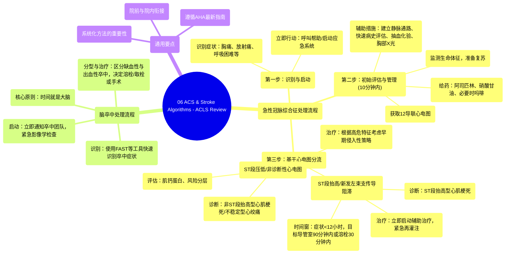

# 06 ACS & Stroke Algorithms - ACLS Review

  <video controls preload="metadata" playsinline>
    <source src="https://helly.s3.bitiful.net/心血管学科/%E4%B8%93%E8%BE%91%2009%EF%BC%9A%E5%BF%83%E8%84%8F%E6%80%A5%E6%95%91%E4%B8%8E%E9%AB%98%E7%BA%A7%E7%94%9F%E5%91%BD%E6%94%AF%E6%8C%81%20%28ACLS%20Mastery%29/06%20ACS%20%26%20Stroke%20Algorithms%20-%20ACLS%20Review.mp4" type="video/mp4">
    
您的浏览器不支持播放，请升级。

  </video>

::: tip ⚡️ 核心考点 (30s速读)
*   **核心考点**：掌握急性冠脉综合征（ACS）与脑卒中（Stroke）的快速识别、初始评估与紧急处理流程，特别是STEMI的再灌注时间窗。
*   **临床意义**：在ICU或急诊环境中，系统化地应用这些算法能显著缩短诊断到治疗的时间，改善心肌梗死和脑卒中患者的预后，降低死亡率和致残率。
:::

## 🧠 深度精讲
*   **急性冠脉综合征（ACS）处理流程**：核心在于快速识别疑似心肌梗死（MI）的症状（如胸痛、放射痛、呼吸困难等），并在**10分钟内**完成关键初始步骤：获取12导联心电图、生命体征、建立静脉通路、给予阿司匹林和硝酸甘油。随后根据心电图结果（ST段抬高/压低）进行分流，决定是进行紧急再灌注治疗（如PCI或溶栓）还是启动早期侵入性策略。
*   **脑卒中（Stroke）处理流程**：视频中虽未展开，但根据ACLS指南，其核心同样是“时间就是大脑”。重点在于快速识别卒中症状（如FAST原则：面部下垂、手臂无力、言语困难），立即启动卒中团队，尽快完成头部影像学检查（如CT），以区分缺血性卒中（需考虑溶栓或取栓）和出血性卒中（需神经外科干预）。
*   **院前与院内衔接**：算法强调院前启动的重要性（如EMS识别、传输信息），但住院环境中的应用同样关键。医护人员需熟悉院内卒中/胸痛预警流程，确保患者从入院到接受决定性治疗的过程无缝衔接。

## 📚 双语术语表 (Terminology)
| 英文术语 | 中文翻译 | 定义/解释 |
| :--- | :--- | :--- |
| ACS (Acute Coronary Syndrome) | 急性冠脉综合征 | 由于冠状动脉血流突然减少引起的一组临床症状，包括不稳定型心绞痛、非ST段抬高型心肌梗死和ST段抬高型心肌梗死。 |
| STEMI (ST-Elevation Myocardial Infarction) | ST段抬高型心肌梗死 | 一种心肌梗死类型，心电图表现为ST段持续性抬高，通常需要紧急再灌注治疗。 |
| NSTEMI (Non-ST-Elevation Myocardial Infarction) | 非ST段抬高型心肌梗死 | 心肌梗死的一种类型，心电图无ST段持续性抬高，但心肌标志物（如肌钙蛋白）升高。 |
| ECG / 12-Lead ECG | 心电图 / 12导联心电图 | 记录心脏电活动的检查，是诊断ACS分型的基石。 |
| Reperfusion Therapy | 再灌注治疗 | 旨在恢复阻塞冠状动脉血流的治疗，包括经皮冠状动脉介入治疗和溶栓治疗。 |
| Fibrinolytic Therapy | 溶栓治疗 | 使用药物溶解冠状动脉内血栓的再灌注方法。 |
| Cath Lab (Catheterization Laboratory) | 导管室 | 进行心脏导管介入手术（如PCI）的专门场所。 |
| AHA (American Heart Association) | 美国心脏协会 | 制定心血管急救与护理国际指南的权威机构。 |
| ACLS (Advanced Cardiovascular Life Support) | 高级心血管生命支持 | 针对心脏骤停和其他心血管急症的标准化抢救流程和技能培训。 |

## 🗺️ 知识图谱

