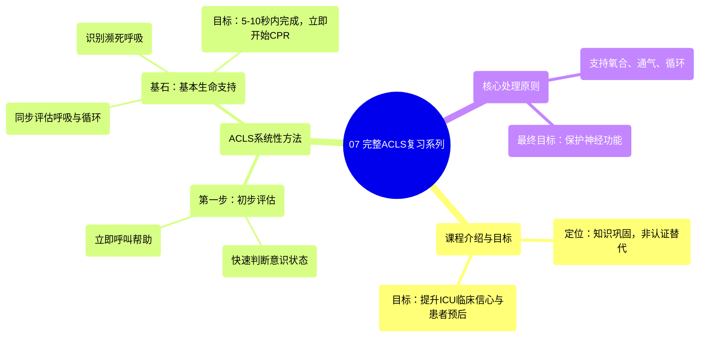

# 07 The Comprehensive ACLS Review Series!

  <video controls preload="metadata" playsinline>
    <source src="https://helly.s3.bitiful.net/心血管学科/%E4%B8%93%E8%BE%91%2009%EF%BC%9A%E5%BF%83%E8%84%8F%E6%80%A5%E6%95%91%E4%B8%8E%E9%AB%98%E7%BA%A7%E7%94%9F%E5%91%BD%E6%94%AF%E6%8C%81%20%28ACLS%20Mastery%29/07%20The%20Comprehensive%20ACLS%20Review%20Series%21.mp4" type="video/mp4">
    
您的浏览器不支持播放，请升级。

  </video>

::: tip ⚡️ 核心考点 (30s速读)
*   **核心考点**：ACLS（高级心血管生命支持）的系统性方法始于对患者意识状态的快速初步评估，并立即启动BLS（基本生命支持）作为所有后续高级干预的基础。
*   **临床意义**：在ICU等危重环境，时间就是生命。快速识别心跳骤停、立即启动高质量CPR并呼叫帮助，是改善患者预后的最关键第一步。本视频系列旨在巩固ACLS知识，但不能替代官方认证。
:::

## 🧠 深度精讲

*   **系统性方法的起点**：ACLS的处理流程始于对患者和环境的**初步评估**。这包括快速获取信息：患者位置、外观、监护仪数据。其中，**判断患者意识（清醒 vs. 昏迷）** 是决定从流程哪个环节介入的关键。
*   **BLS是ACLS的基石**：无论后续采用何种高级算法，**基本生命支持（BLS）** 永远是第一步。对于意识不清的患者，应立即**呼叫帮助/启动应急系统**，然后同步评估**呼吸**和**循环**（检查颈动脉搏动）。此评估需在**5-10秒内**完成，目标是最大限度缩短发现心跳骤停到开始CPR的延迟。
*   **识别异常呼吸**：需注意**濒死呼吸（Agonal Breathing）** 并非有效呼吸，它是心跳骤停后可能出现的一种反射性费力喘息，不能视为循环存在的标志。一旦怀疑，应按无呼吸、无脉搏处理。
*   **课程定位与目标**：本系列课程回顾美国心脏协会（AHA）的ACLS指南与最佳实践，旨在帮助临床工作者（尤其是ICU医护人员）巩固知识，在患者病情恶化或发生心跳骤停时能快速、正确地思考和行动，最终目标是**支持患者氧合、通气和循环，以保护神经功能，改善预后**。但强调**本视频不能替代ACLS和BLS的官方认证课程**。

## 📚 双语术语表 (Terminology)
| 英文术语 | 中文翻译 | 定义/解释 |
| :--- | :--- | :--- |
| ACLS | 高级心血管生命支持 | 一套用于处理心跳骤停和其他心血管急症的标准化指南和干预措施。 |
| BLS | 基本生命支持 | 针对心跳骤停患者的基础救命技术，包括胸外按压、人工呼吸和早期除颤。 |
| AHA | 美国心脏协会 | 制定心血管急救指南的国际权威机构之一。 |
| Agonal Breathing | 濒死呼吸 | 心跳骤停后可能出现的一种无效的、反射性的喘息样呼吸，并非正常呼吸。 |
| Carotid Pulse | 颈动脉搏动 | 位于颈部的动脉搏动，是BLS评估循环时推荐检查的部位。 |
| Code | 抢救代码 | 医院内宣布发生紧急医疗情况（通常指心跳骤停）并启动团队反应的术语。 |
| CPR | 心肺复苏 | 通过胸外按压和人工呼吸维持最低限度循环和氧合的急救技术。 |

## 🗺️ 知识图谱

