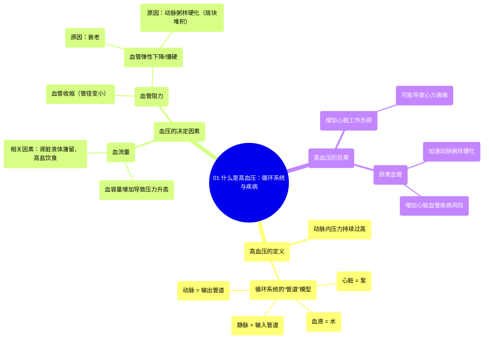

# 01 What is hypertension Circulatory System and Disease NCLEX-RN Khan Academy

  <video controls preload="metadata" playsinline>
    <source src="https://helly.s3.bitiful.net/心血管学科/%E4%B8%93%E8%BE%91%2010%EF%BC%9A%E9%AB%98%E8%A1%80%E5%8E%8B%E7%AE%A1%E7%90%86%E6%8C%87%E5%8D%97%20%28Hypertension%29/01%20What%20is%20hypertension%20Circulatory%20System%20and%20Disease%20NCLEX-RN%20Khan%20Academy.mp4" type="video/mp4">
    
您的浏览器不支持播放，请升级。

  </video>

::: tip ⚡️ 核心考点 (30s速读)
*   **核心考点**：高血压是动脉内压力持续过高的状态，其核心决定因素是**血流量**和**血管阻力**。
*   **临床意义**：高血压会增加心脏泵血负担，长期可导致心脏肥大、心力衰竭，并损害血管（如动脉粥样硬化），是心脑血管疾病的主要危险因素。
:::

## 🧠 深度精讲

*   **概念1：高血压的定义与循环系统模型**
    高血压（Hypertension）是指血液在动脉血管内流动时对血管壁造成的压力持续高于正常水平。为了便于理解，可以将人体的循环系统比作一个**管道系统**：心脏是**泵**，血液是**水**，动脉是将血液泵出的管道，静脉是将血液回收的管道。动脉侧的压力（动脉压）过高，意味着心脏需要更费力地工作才能将血液泵出。

*   **概念2：决定血压的两大关键因素**
    血压的高低主要由两个因素决定：**血流量**和**血管阻力**。
    1.  **血流量**：指单位时间内流经血管的血液体积。血流量增加（如体内液体潴留、高盐饮食导致血容量增加），就像把水龙头开大，试图让更多水通过相同尺寸的管道，会导致压力升高。
    2.  **血管阻力**：指血液流经血管时所遇到的困难程度。阻力增加主要源于：
        *   **血管管径变小**：即**血管收缩**。这就像给水管装上小喷嘴，水流压力会急剧增大。
        *   **血管弹性下降/僵硬**：健康的动脉具有弹性，可以缓冲压力。当动脉因衰老或**动脉粥样硬化**（血管内脂肪斑块堆积）而变硬时，其扩张能力下降，阻力增加，血压随之升高。

*   **概念3：高血压的病理生理影响**
    长期的高血压状态迫使心脏持续超负荷工作，可能导致心肌肥厚，最终发展为心力衰竭。同时，高压血流会冲击和损伤血管内皮，加速动脉粥样硬化斑块的形成和发展，从而增加冠心病、脑卒中、肾动脉硬化等严重并发症的风险。

## 📚 双语术语表 (Terminology)
| 英文术语 | 中文翻译 | 定义/解释 |
| :--- | :--- | :--- |
| Hypertension | 高血压 | 动脉血压持续高于正常水平的病理状态。 |
| Blood Pressure | 血压 | 血液在血管内流动时作用于单位面积血管壁的侧压力。 |
| Circulatory System | 循环系统 | 由心脏、血管和血液组成的封闭管道系统，负责运输物质。 |
| Arterial Pressure | 动脉压 | 血液在动脉血管内产生的压力。 |
| Venous Pressure | 静脉压 | 血液在静脉血管内产生的压力。 |
| Flow | 血流量/流量 | 单位时间内流经心血管系统某一截面的血液体积。 |
| Resistance | 阻力 | 血液在血管内流动时所遇到的阻力，主要取决于血管半径和长度。 |
| Vasoconstriction | 血管收缩 | 血管平滑肌收缩，导致血管管径变小。 |
| Vasodilation | 血管舒张 | 血管平滑肌舒张，导致血管管径变大。 |
| Atherosclerosis | 动脉粥样硬化 | 动脉血管内膜下脂质、复合糖类积聚，并伴有纤维组织增生和钙质沉着，形成斑块，使动脉壁增厚变硬、管腔狭窄。 |
| Plaque | 斑块 | 在动脉粥样硬化过程中，沉积于血管壁的脂质、钙和细胞碎片等组成的团块。 |

## 🗺️ 知识图谱

