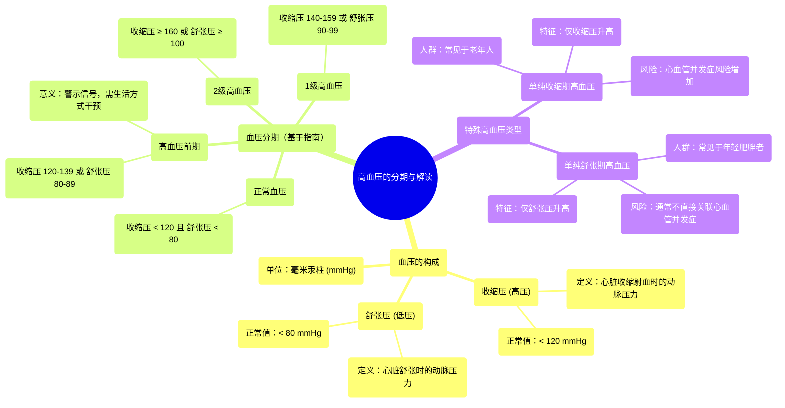

# 02 Stages of hypertension Circulatory System and Disease NCLEX-RN Khan Academy

  <video controls preload="metadata" playsinline>
    <source src="https://helly.s3.bitiful.net/心血管学科/%E4%B8%93%E8%BE%91%2010%EF%BC%9A%E9%AB%98%E8%A1%80%E5%8E%8B%E7%AE%A1%E7%90%86%E6%8C%87%E5%8D%97%20%28Hypertension%29/02%20Stages%20of%20hypertension%20Circulatory%20System%20and%20Disease%20NCLEX-RN%20Khan%20Academy.mp4" type="video/mp4">
    
您的浏览器不支持播放，请升级。

  </video>

::: tip ⚡️ 核心考点 (30s速读)
*   **核心考点**：血压读数由收缩压（高压）和舒张压（低压）组成，其单位为毫米汞柱（mmHg）。高血压的诊断基于这两个数值，分为高血压前期、1级和2级高血压。
*   **临床意义**：单纯收缩期高血压（仅收缩压升高）常见于老年人，与心血管风险增加相关；单纯舒张期高血压（仅舒张压升高）多见于年轻肥胖人群，通常不直接关联心血管并发症。
:::

## 🧠 深度精讲
*   **概念1：血压读数的构成与单位**
    血压测量值通常表示为“收缩压/舒张压”，例如“120/80 mmHg”。单位“mmHg”代表“毫米汞柱”，是血压的标准计量单位。收缩压（高压）反映心脏收缩（心室射血）时血液对血管壁产生的压力；舒张压（低压）反映心脏舒张（两次心跳之间）时血管内的压力。

*   **概念2：高血压的分期标准**
    根据美国相关指南（视频中提及），血压水平可划分为几个区间：
    *   **正常/安全区（绿色）**：收缩压 < 120 mmHg **且** 舒张压 < 80 mmHg。
    *   **高血压前期（黄色）**：收缩压 120-139 mmHg **或** 舒张压 80-89 mmHg。此阶段提示血压已高于理想水平，是生活方式干预的重要窗口期。
    *   **1级高血压（红色）**：收缩压 140-159 mmHg **或** 舒张压 90-99 mmHg。
    *   **2级高血压（红色）**：收缩压 ≥ 160 mmHg **或** 舒张压 ≥ 100 mmHg。
    *   **诊断原则**：高血压的诊断基于收缩压和舒张压中较高的分期。例如，150/85 mmHg 属于1级高血压（因收缩压达1级标准）。

*   **概念3：特殊类型的高血压**
    *   **单纯收缩期高血压**：收缩压达到高血压标准（≥140 mmHg），而舒张压正常（<90 mmHg）。常见于动脉硬化加剧的老年人，是心血管事件（如卒中、心衰）的重要风险因素。
    *   **单纯舒张期高血压**：舒张压达到高血压标准（≥90 mmHg），而收缩压正常（<140 mmHg）。更多见于年轻、肥胖或超重人群。与单纯收缩期高血压不同，它通常不被认为与同等程度的心血管并发症风险直接相关。

## 📚 双语术语表 (Terminology)
| 英文术语 | 中文翻译 | 定义/解释 |
| :--- | :--- | :--- |
| Blood Pressure (BP) | 血压 | 血液在血管内流动时作用于单位面积血管壁的侧压力。 |
| Systolic Blood Pressure | 收缩压（高压） | 心脏收缩时，血液射入动脉，动脉血压达到的最高值。 |
| Diastolic Blood Pressure | 舒张压（低压） | 心脏舒张时，动脉血压下降到的最低值。 |
| mmHg | 毫米汞柱 | 血压的测量单位，源于传统水银血压计。 |
| Hypertension | 高血压 | 在未使用降压药物的情况下，非同日3次测量诊室血压，收缩压≥140mmHg和/或舒张压≥90mmHg。 |
| Prehypertension | 高血压前期 | 血压水平高于正常但尚未达到高血压诊断标准的阶段，是干预的关键时期。 |
| Isolated Systolic Hypertension | 单纯收缩期高血压 | 仅收缩压升高达到高血压标准，而舒张压正常的一种高血压类型。 |
| Isolated Diastolic Hypertension | 单纯舒张期高血压 | 仅舒张压升高达到高血压标准，而收缩压正常的一种高血压类型。 |
| Cardiovascular Complications | 心血管并发症 | 由高血压等疾病引起的心脏和血管系统损害，如心肌梗死、心力衰竭、脑卒中等。 |

## 🗺️ 知识图谱

