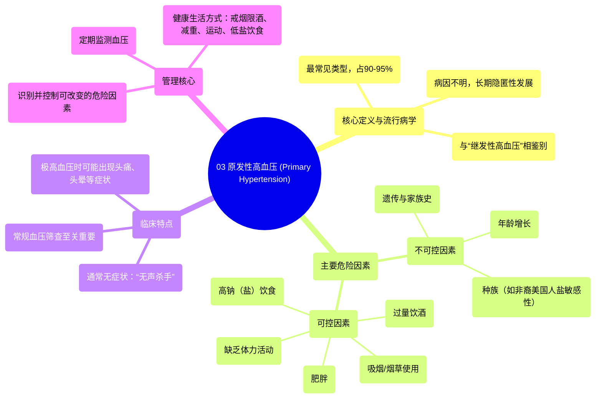

# 03 Primary hypertension Circulatory System and Disease NCLEX-RN Khan Academy

  <video controls preload="metadata" playsinline>
    <source src="https://helly.s3.bitiful.net/心血管学科/%E4%B8%93%E8%BE%91%2010%EF%BC%9A%E9%AB%98%E8%A1%80%E5%8E%8B%E7%AE%A1%E7%90%86%E6%8C%87%E5%8D%97%20%28Hypertension%29/03%20Primary%20hypertension%20Circulatory%20System%20and%20Disease%20NCLEX-RN%20Khan%20Academy.mp4" type="video/mp4">
    
您的浏览器不支持播放，请升级。

  </video>

::: tip ⚡️ 核心考点 (30s速读)
*   **核心考点**：原发性高血压是高血压最常见的类型（占90-95%），其特点是**没有明确的单一病因**，而是由多种危险因素共同作用，在长期内逐渐发展形成。
*   **临床意义**：原发性高血压通常**没有明显症状**，被称为“无声杀手”，因此定期测量血压至关重要。其管理核心在于识别并控制可改变的危险因素。
:::

## 🧠 深度精讲
*   **概念1：原发性高血压的定义与特点**
    原发性高血压是指没有明确、可识别的单一病因（如肾脏疾病、内分泌肿瘤等）的高血压。它约占所有高血压病例的90-95%。其核心特点是**病因不明**和**长期、隐匿性发展**。由于没有特定病因，其发生被认为与多种遗传和环境因素（即危险因素）的复杂交互作用有关。

*   **概念2：危险因素详解**
    虽然病因不明，但已确定一系列增加患病风险的因素，可分为**可控制**与**不可控制**两类：
    *   **可控制的危险因素**：
        *   **吸烟/咀嚼烟草**：尼古丁等化学物质会直接、暂时性升高血压，并损害动脉血管内皮，增加血管阻力。
        *   **过量饮酒**：单次大量饮酒可致血压暂时升高；长期酗酒会损害心肌，降低泵血效率，身体为代偿而升高血压。
        *   **肥胖**：体重增加导致身体需要更多血液供应，血容量增加，从而升高血压。
        *   **缺乏体力活动**：久坐不动导致心脏功能减弱，循环效率下降，身体可能通过升高血压来代偿。
        *   **高钠（盐）饮食**：体内钠离子增多会导致水钠潴留，增加血容量，进而升高血压。
    *   **不可控制/部分可控的危险因素**：
        *   **年龄**：血管弹性随年龄增长而下降，血压升高风险增加。男性45岁后、女性65岁后更常见。
        *   **遗传/家族史**：高血压有明显的家族聚集倾向。如果父母患有高血压，子女患病风险增高。
        *   **种族（非裔美国人）**：该人群具有更高的“盐敏感性”，即摄入相同量的盐分后，身体潴留更多的钠和水，血压升高的反应更明显，因此控制盐摄入对他们尤为重要。

*   **概念3：临床表现与诊断挑战**
    原发性高血压最显著且危险的特征是**通常无症状**。绝大多数患者在血压显著升高甚至出现并发症（如心脏病、脑卒中）前，没有任何不适感，因此被称为“无声杀手”。这凸显了**常规体检中进行血压筛查的极端重要性**。仅在血压极度升高（高血压危象）时，才可能出现头痛、视力模糊、头晕、定向障碍等症状。

*   **概念4：与继发性高血压的区分**
    这是重要的鉴别诊断点。**继发性高血压**是指由某种明确疾病（如肾动脉狭窄、原发性醛固酮增多症、嗜铬细胞瘤等）直接导致的高血压，约占病例的5-10%。如果找到了明确的病因，则诊断为继发性高血压。治疗继发性高血压的关键在于处理其原发病病。

## 📚 双语术语表 (Terminology)
| 英文术语 | 中文翻译 | 定义/解释 |
| :--- | :--- | :--- |
| Primary Hypertension | 原发性高血压 | 最常见的高血压类型，病因不明，与多种遗传和环境危险因素相关。 |
| Secondary Hypertension | 继发性高血压 | 由某种特定疾病或病因（如肾脏疾病）直接导致的高血压。 |
| Risk Factors | 危险因素 | 增加个体患某种疾病（如高血压）可能性的状况、习惯或特征。 |
| Silent Killer | 无声杀手 | 对原发性高血压的形容，因其通常无症状，但会 silently 损害心、脑、肾等靶器官。 |
| Salt Sensitivity | 盐敏感性 | 个体对食盐摄入呈现明显的血压升高反应的一种体质特征。 |
| Blood Pressure (BP) | 血压 | 血液在血管内流动时作用于单位面积血管壁的侧压力。 |
| Moderation (in alcohol) | （饮酒）适度 | 建议的酒精摄入量，通常指男性每日不超过2标准杯，女性和老年男性不超过1标准杯。 |

## 🗺️ 知识图谱

