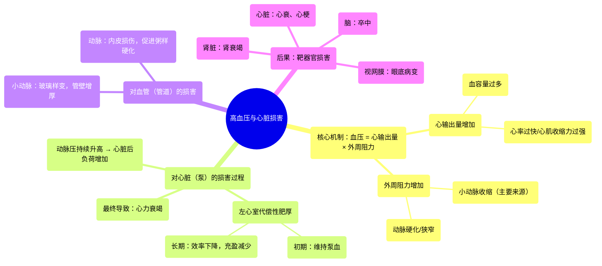

# 04 Hypertension and heart damage Circulatory System and Disease NCLEX-RN Khan Academy

  <video controls preload="metadata" playsinline>
    <source src="https://helly.s3.bitiful.net/心血管学科/%E4%B8%93%E8%BE%91%2010%EF%BC%9A%E9%AB%98%E8%A1%80%E5%8E%8B%E7%AE%A1%E7%90%86%E6%8C%87%E5%8D%97%20%28Hypertension%29/04%20Hypertension%20and%20heart%20damage%20Circulatory%20System%20and%20Disease%20NCLEX-RN%20Khan%20Academy.mp4" type="video/mp4">
    
您的浏览器不支持播放，请升级。

  </video>

::: tip ⚡️ 核心考点 (30s速读)
*   **核心考点**：高血压通过增加心脏后负荷，导致左心室代偿性肥厚，最终发展为心力衰竭。
*   **临床意义**：控制血压不仅是降低数值，更是为了预防心脏结构和功能的不可逆损害，避免心力衰竭的发生。
:::

## 🧠 深度精讲

*   **概念1：高血压如何损害心脏（泵）？**
    高血压意味着动脉系统内的压力持续升高。心脏（尤其是左心室）必须克服这个升高的压力才能将血液泵入全身。这就像用一个水泵对抗一个更高的水压，需要更用力。长期“更用力”工作，会导致左心室心肌细胞代偿性增粗、肥大，即**左心室肥厚**。起初，这可以维持心输出量，但长期来看，肥厚的心肌会变得僵硬、效率降低，且心腔的充盈空间减少，最终导致泵血能力下降，引发**心力衰竭**。

*   **概念2：血压的决定因素与调节**
    血压（特别是动脉压）主要由两个因素决定：**血流量（心输出量）** 和 **外周血管阻力**。其关系可简化为：**血压 ≈ 心输出量 × 外周血管阻力**。任何增加这两者的因素（如血容量增加、动脉血管收缩/硬化）都会升高血压。因此，降压治疗也主要围绕减少血容量（利尿剂）、降低心输出量（β受体阻滞剂）或降低外周阻力（钙通道阻滞剂、血管紧张素转换酶抑制剂等）展开。

*   **概念3：循环系统的“阻力”分布**
    血管系统中的阻力并非均匀分布。最大的阻力来自**小动脉**。它们是动脉系统的“末梢开关”，通过收缩或舒张来精细调节流向各器官组织的血流量和血压。当小动脉因各种原因（如交感神经兴奋、肾素-血管紧张素系统激活）持续收缩时，外周阻力显著增加，是导致高血压的主要机制之一。相比之下，大动脉和静脉提供的阻力较小。

## 📚 双语术语表 (Terminology)
| 英文术语 | 中文翻译 | 定义/解释 |
| :--- | :--- | :--- |
| Hypertension | 高血压 | 动脉血压持续高于正常水平的病理状态。 |
| Arterial Pressure | 动脉压 | 血液在动脉内流动时对血管壁产生的侧压力。 |
| Venous Pressure | 静脉压 | 血液在静脉内流动时对血管壁产生的侧压力，通常远低于动脉压。 |
| Cardiac Output | 心输出量 | 每分钟由一侧心室泵出的血液总量，是血流量（Flow）的体现。 |
| Peripheral Resistance | 外周血管阻力 | 血液在血管系统中流动所遇到的总阻力，主要来自小动脉。 |
| Left Ventricular Hypertrophy (LVH) | 左心室肥厚 | 左心室心肌为应对长期压力负荷（如高血压）而发生的代偿性增厚。 |
| Heart Failure | 心力衰竭 | 心脏泵血功能下降，无法满足机体代谢需要的综合征。 |
| Arteriole | 小动脉 | 连接动脉和毛细血管的微小血管，是调节外周阻力和器官血流的主要部位。 |

## 🗺️ 知识图谱

