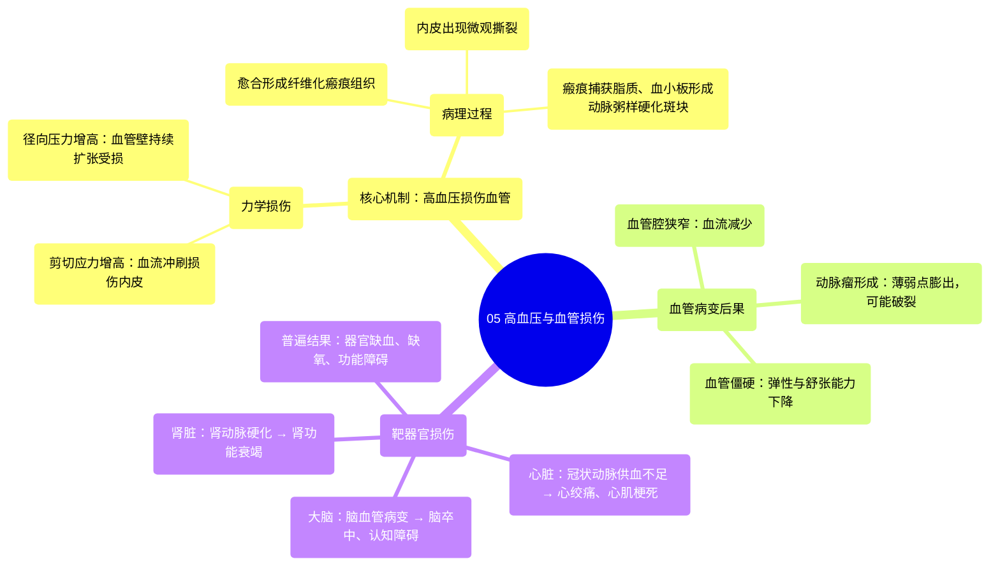

# 05 Hypertension and blood vessel damage Circulatory System and Disease NCLEX-RN Khan Academy

  <video controls preload="metadata" playsinline>
    <source src="https://helly.s3.bitiful.net/心血管学科/%E4%B8%93%E8%BE%91%2010%EF%BC%9A%E9%AB%98%E8%A1%80%E5%8E%8B%E7%AE%A1%E7%90%86%E6%8C%87%E5%8D%97%20%28Hypertension%29/05%20Hypertension%20and%20blood%20vessel%20damage%20Circulatory%20System%20and%20Disease%20NCLEX-RN%20Khan%20Academy.mp4" type="video/mp4">
    
您的浏览器不支持播放，请升级。

  </video>

::: tip ⚡️ 核心考点 (30s速读)
*   **核心考点**：高血压通过增加血管壁的剪切应力和径向压力，损伤血管内皮，引发动脉粥样硬化，最终导致靶器官（如心、脑、肾）供血不足和功能障碍。
*   **临床意义**：理解此机制是预防和治疗高血压并发症（如冠心病、脑卒中、肾衰竭、动脉瘤）的基础，强调控制血压以保护靶器官的重要性。
:::

## 🧠 深度精讲

*   **高血压与靶器官损伤的关联**：高血压（高血压）并非一个孤立的数字问题，其核心危害在于对特定重要器官——即“靶器官”——的进行性损害。这些器官（如心脏、大脑、肾脏）因其功能至关重要且血供丰富，对血管状态的改变尤为敏感。损伤的桥梁是**血管系统**。高血压直接作用于为这些器官供血的血管，血管的损伤必然导致下游器官的缺血和功能障碍。

*   **血管损伤的力学机制：剪切应力与径向压力**：
    1.  **剪切应力**：血液在血管内流动时，与血管内壁（内皮）产生摩擦力，这种力称为剪切应力。血压升高时，血流速度或压力增大，对管壁的“冲刷”力（剪切应力）显著增加。类比洪水冲刷河岸，过高的剪切应力会直接造成内皮细胞的微观损伤。
    2.  **径向压力**：血压本质是血液对血管壁的侧向压力。高血压意味着血管需要承受更大的、试图将其撑开的向外压力。这种持续的机械张力会使血管壁结构疲劳、受损。

*   **从内皮损伤到动脉粥样硬化**：内皮损伤是关键的起始步骤。损伤处愈合后会形成**纤维化瘢痕组织**。这种粗糙的瘢痕表面像一张网，容易捕获血液中的**胆固醇、脂肪和血小板**等物质。这些物质不断堆积，就形成了**动脉粥样硬化斑块**。斑块会占据血管腔空间，导致血管**狭窄**、**僵硬**、**弹性下降**。

*   **最终病理结果：缺血与结构破坏**：
    1.  **器官缺血**：狭窄且僵硬的血管无法输送足够的血液到靶器官，导致其缺氧、营养不良，功能受损（如心绞痛、肾功能下降、认知功能减退）。
    2.  **动脉瘤形成**：在长期高压冲击下，血管壁（尤其是中层）逐渐薄弱，可能在局部膨出，形成**动脉瘤**。动脉瘤有破裂风险，可导致致命性内出血（如主动脉夹层、脑出血）。

## 📚 双语术语表 (Terminology)
| 英文术语 | 中文翻译 | 定义/解释 |
| :--- | :--- | :--- |
| Hypertension | 高血压 | 动脉内血压持续高于正常水平的病理状态。 |
| Target Organs | 靶器官 | 特别容易受到高血压损害的重要器官，如心、脑、肾、眼。 |
| Endothelium | 内皮 | 血管最内层的单层细胞衬里，在调节血管张力、抗凝等方面起关键作用。 |
| Shear Stress | 剪切应力 | 血液流动时，平行于血管壁方向作用于内皮上的摩擦力。 |
| Atherosclerotic Plaque | 动脉粥样硬化斑块 | 在动脉血管壁内形成的、由脂质、钙、纤维组织等构成的斑块，导致血管狭窄。 |
| Aneurysm | 动脉瘤 | 血管壁局部异常膨出，形似气球，有破裂风险。 |
| Fibrotic Tissue | 纤维化组织 | 损伤愈合后形成的以胶原纤维为主的瘢痕组织，弹性差。 |

## 🗺️ 知识图谱

