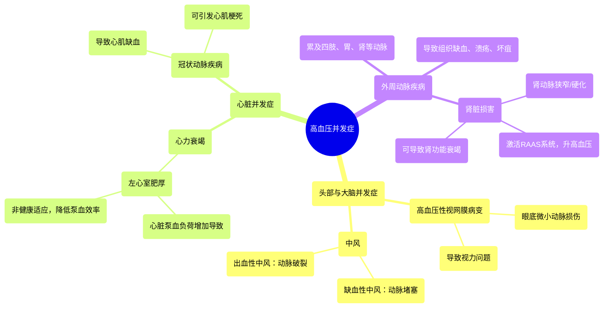

# 06 Complications of hypertension Circulatory System and Disease NCLEX-RN Khan Academy

  <video controls preload="metadata" playsinline>
    <source src="https://helly.s3.bitiful.net/心血管学科/%E4%B8%93%E8%BE%91%2010%EF%BC%9A%E9%AB%98%E8%A1%80%E5%8E%8B%E7%AE%A1%E7%90%86%E6%8C%87%E5%8D%97%20%28Hypertension%29/06%20Complications%20of%20hypertension%20Circulatory%20System%20and%20Disease%20NCLEX-RN%20Khan%20Academy.mp4" type="video/mp4">
    
您的浏览器不支持播放，请升级。

  </video>

::: tip ⚡️ 核心考点 (30s速读)
*   **核心考点**：高血压并发症主要分为三类：头部/大脑、心脏、外周动脉。理解各类并发症的病理生理机制是掌握其临床表现和危害的关键。
*   **临床意义**：高血压是导致心、脑、肾、眼等靶器官损害的主要危险因素。识别和管理这些并发症对于预防中风、心力衰竭、心肌梗死及终末期肾病至关重要。
:::

## 🧠 深度精讲

*   **概念1：高血压性视网膜病变**
    高血压会损害眼底的微小动脉，导致血管壁变弱、渗漏或出血。眼科医生通过眼底镜检查可以直接观察到这些血管变化，如动脉狭窄、出血、渗出等。这是高血压靶器官损害的直观证据，也提示全身血管可能已存在类似损伤。

*   **概念2：中风**
    大脑需要持续稳定的血液供应。高血压可导致两种主要类型的中风：1) **缺血性中风**：动脉粥样硬化斑块或血栓堵塞脑动脉，导致脑组织缺血坏死。2) **出血性中风**：长期高血压使脑内小动脉壁变脆，最终破裂出血。两种类型都会导致相应脑功能区受损，引发偏瘫、失语、感觉障碍等症状。

*   **概念3：心力衰竭与左心室肥厚**
    长期高血压使外周血管阻力增加，心脏（尤其是左心室）需要更用力地收缩才能将血液泵出。这种持续的超负荷工作会导致左心室心肌代偿性增厚，即**左心室肥厚**。然而，这种肥厚并非健康适应，它会降低心脏的舒张功能和泵血效率，最终发展为**心力衰竭**，表现为活动后气促、乏力、水肿等。

*   **概念4：冠状动脉疾病与心肌梗死**
    冠状动脉是为心脏自身供血的血管。高血压可加速冠状动脉的粥样硬化进程，导致血管狭窄。当斑块破裂形成血栓完全堵塞血管时，其供血区域的心肌细胞因缺血缺氧而坏死，即发生**心肌梗死**（心脏病发作），表现为剧烈胸痛、大汗、濒死感等。

*   **概念5：外周动脉疾病与肾脏损害**
    高血压引起的动脉粥样硬化不仅限于心脑血管，也可累及全身外周动脉，如四肢、胃肠道和肾脏的动脉。**外周动脉疾病**可导致间歇性跛行（行走时肢体疼痛）、组织缺血甚至坏疽。**肾脏**是高血压最常损害的靶器官之一。肾动脉狭窄或肾内小动脉硬化会导致肾血流量减少。肾脏误以为全身血容量不足，从而激活肾素-血管紧张素-醛固酮系统，导致水钠潴留，反而进一步升高血压，形成恶性循环。长期缺血最终可导致肾功能衰竭。

## 📚 双语术语表 (Terminology)
| 英文术语 | 中文翻译 | 定义/解释 |
| :--- | :--- | :--- |
| Hypertension | 高血压 | 体循环动脉血压持续升高的病理状态。 |
| Hypertensive retinopathy | 高血压性视网膜病变 | 因高血压导致眼底视网膜血管损伤的疾病。 |
| Stroke | 中风 | 由于脑部供血中断导致的脑组织损伤。 |
| Heart failure | 心力衰竭 | 心脏泵血功能无法满足身体代谢需要的综合征。 |
| Left ventricular hypertrophy (LVH) | 左心室肥厚 | 左心室心肌为应对压力负荷而发生的代偿性增厚。 |
| Coronary artery disease (CAD) | 冠状动脉疾病 | 冠状动脉因粥样硬化导致狭窄或阻塞的疾病。 |
| Myocardial infarction (MI) | 心肌梗死 | 冠状动脉急性闭塞导致部分心肌缺血性坏死，即“心脏病发作”。 |
| Peripheral artery disease (PAD) | 外周动脉疾病 | 心脏和大脑以外的动脉发生狭窄或阻塞的疾病。 |
| Atherosclerosis | 动脉粥样硬化 | 动脉壁内脂质、胆固醇等物质沉积形成斑块的疾病过程。 |

## 🗺️ 知识图谱

