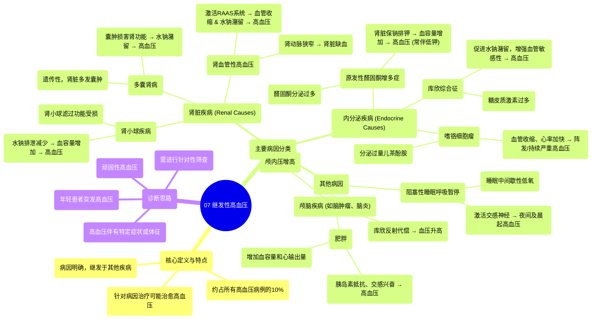

# 07 Secondary hypertension Circulatory System and Disease NCLEX-RN Khan Academy

  <video controls preload="metadata" playsinline>
    <source src="https://helly.s3.bitiful.net/心血管学科/%E4%B8%93%E8%BE%91%2010%EF%BC%9A%E9%AB%98%E8%A1%80%E5%8E%8B%E7%AE%A1%E7%90%86%E6%8C%87%E5%8D%97%20%28Hypertension%29/07%20Secondary%20hypertension%20Circulatory%20System%20and%20Disease%20NCLEX-RN%20Khan%20Academy.mp4" type="video/mp4">
    
您的浏览器不支持播放，请升级。

  </video>

::: tip ⚡️ 核心考点 (30s速读)
*   **核心考点**：继发性高血压与原发性高血压的根本区别在于病因明确，是由其他特定疾病或状况直接导致的血压升高。
*   **临床意义**：虽然仅占高血压病例的约10%，但识别继发性高血压至关重要，因为针对其根本病因进行治疗，可能实现高血压的治愈或显著改善。
:::

## 🧠 深度精讲

*   **概念1：继发性高血压的定义与流行病学**
    继发性高血压是指由特定、可识别的疾病或病因所导致的血压升高。与病因不明的原发性高血压（占90%）不同，继发性高血压的病因是明确的。其核心在于，高血压是“继发于”另一种原发疾病的结果。因此，临床诊断的关键步骤之一就是排除或确认这些潜在的继发性病因。

*   **概念2：肾脏相关病因 (Renal Causes)**
    肾脏是调控血压的核心器官，主要通过调节水钠平衡来实现。任何损害肾脏正常功能的疾病都可能导致水钠潴留、血容量增加，从而引发高血压。
    *   **多囊肾病**：一种遗传性疾病，肾脏内形成多个充满液体的囊肿。囊肿增大或增多会压迫并损害正常肾组织，影响其排泄功能，导致液体潴留和血压升高。
    *   **肾小球疾病**：肾小球是肾脏的滤过单位。当肾小球发生炎症或其他病变（如肾小球肾炎）时，其滤过功能受损，同样会导致水钠排泄减少，血容量增加。
    *   **肾血管性高血压**：指供应肾脏血液的肾动脉发生狭窄。狭窄导致肾脏血流灌注减少，肾脏误以为全身血容量不足，从而激活肾素-血管紧张素-醛固酮系统，强力收缩血管并保留水钠，致使血压显著升高。

*   **概念3：内分泌相关病因 (Endocrine Causes)**
    多种内分泌激素直接参与血压调节，其分泌异常是继发性高血压的常见原因。
    *   **库欣综合征**：由于各种原因导致体内糖皮质激素水平长期过高。糖皮质激素具有类似醛固酮的作用，可导致水钠潴留，并增强血管对升压物质的敏感性。
    *   **原发性醛固酮增多症**：肾上腺皮质肿瘤或增生导致醛固酮分泌过多。醛固酮作用于肾脏远曲小管，强力促进钠的重吸收和钾的排泄，伴随水潴留，导致血容量增加和高血压，常伴有低血钾。
    *   **嗜铬细胞瘤**：肾上腺髓质或交感神经节的肿瘤，阵发性或持续性地分泌大量儿茶酚胺（如肾上腺素、去甲肾上腺素）。这些激素引起血管强烈收缩、心率加快，导致阵发性或持续性严重高血压，常伴头痛、心悸、出汗三联征。

*   **概念4：其他重要病因 (Other Causes)**
    *   **阻塞性睡眠呼吸暂停**：睡眠中反复出现呼吸暂停，导致间歇性低氧和高碳酸血症。这会激活交感神经系统，引起夜间及晨起血压升高，是顽固性高血压的重要原因。
    *   **肥胖**：既是原发性高血压的重要危险因素，也可作为独立病因。肥胖导致血容量、心输出量增加，并常伴有胰岛素抵抗和交感神经兴奋，共同促使血压升高。
    *   **颅脑疾病**：如脑肿瘤、脑炎等导致颅内压增高。为维持脑组织灌注，机体通过库欣反射（Cushing‘s reflex）代偿性升高血压，这是一种生命体征危急的信号。

## 📚 双语术语表 (Terminology)
| 英文术语 | 中文翻译 | 定义/解释 |
| :--- | :--- | :--- |
| Secondary hypertension | 继发性高血压 | 由特定疾病或病因引起的血压升高。 |
| Primary hypertension | 原发性高血压 | 病因未明的高血压，占绝大多数病例。 |
| Renal | 肾脏的 | 与肾脏相关的。 |
| Polycystic kidney disease | 多囊肾病 | 一种遗传性疾病，特征为双肾出现多个囊肿。 |
| Glomerular disease | 肾小球疾病 | 影响肾小球滤过功能的一类疾病。 |
| Reno-vascular hypertension | 肾血管性高血压 | 因肾动脉狭窄导致肾脏缺血而引起的高血压。 |
| Cushing syndrome | 库欣综合征 | 因长期暴露于高水平糖皮质激素引起的临床综合征。 |
| Primary aldosteronism | 原发性醛固酮增多症 | 肾上腺自主分泌过多醛固酮，导致高血压和低血钾。 |
| Pheochromocytoma | 嗜铬细胞瘤 | 起源于肾上腺髓质等嗜铬组织的肿瘤，分泌过量儿茶酚胺。 |
| Sleep apnea | 睡眠呼吸暂停 | 睡眠中呼吸反复暂停的综合征，常导致日间嗜睡和高血压。 |
| Aldosterone | 醛固酮 | 肾上腺皮质分泌的一种激素，主要作用是保钠排钾。 |
| Norepinephrine / Epinephrine | 去甲肾上腺素 / 肾上腺素 | 儿茶酚胺类激素和神经递质，参与应激反应，能升高血压、加快心率。 |

## 🗺️ 知识图谱

