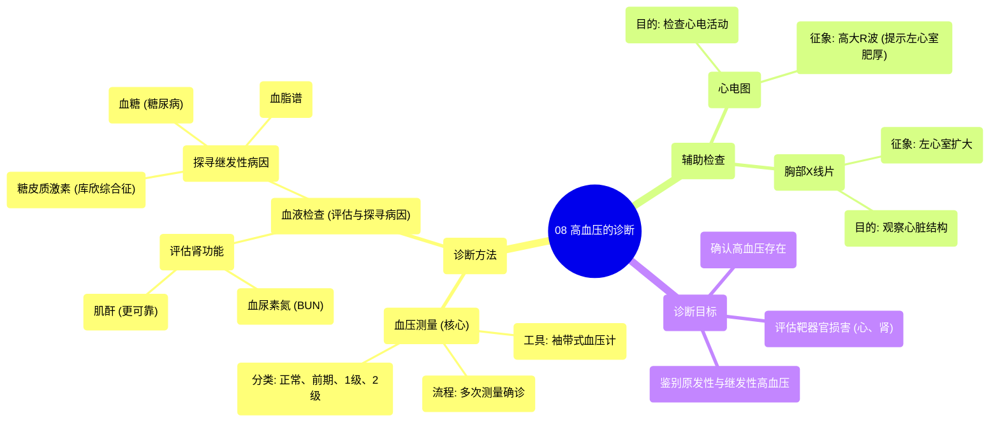

# 08 Diagnosis of hypertension Circulatory System and Disease NCLEX-RN Khan Academy

  <video controls preload="metadata" playsinline>
    <source src="https://helly.s3.bitiful.net/心血管学科/%E4%B8%93%E8%BE%91%2010%EF%BC%9A%E9%AB%98%E8%A1%80%E5%8E%8B%E7%AE%A1%E7%90%86%E6%8C%87%E5%8D%97%20%28Hypertension%29/08%20Diagnosis%20of%20hypertension%20Circulatory%20System%20and%20Disease%20NCLEX-RN%20Khan%20Academy.mp4" type="video/mp4">
    
您的浏览器不支持播放，请升级。

  </video>

::: tip ⚡️ 核心考点 (30s速读)
*   **核心考点**：高血压的诊断依赖于多次血压测量，并结合血液检查（如BUN、肌酐）和心电图、胸片等辅助检查，以评估靶器官损害和探寻病因。
*   **临床意义**：诊断高血压不仅是看血压数值，更要评估其对心、肾等器官的损害程度，并鉴别是原发性还是继发性高血压，以指导精准治疗。
:::

## 🧠 深度精讲
*   **血压测量与诊断流程**：诊断高血压最常用的方法是使用袖带式血压计进行直接物理测量。诊断不能仅凭单次测量结果，因为血压在一天中存在波动。通常需要在不同时间、多次就诊中测量2-3次，才能做出最终诊断。根据测量值，血压可分为正常、高血压前期、1级高血压和2级高血压。
*   **血液检查的作用**：血液检查是诊断高血压及其并发症的关键工具。主要目的有两个：一是评估高血压对靶器官（尤其是肾脏）的损害程度；二是帮助寻找继发性高血压的病因。
    *   **评估肾功能**：通过检测**血尿素氮**和**肌酐**的水平来评估肾脏功能。这两种物质都是代谢废物，正常情况下由肾脏清除。如果肾脏因高血压受损，清除能力下降，它们在血液中的水平就会升高。肌酐水平是评估肾功能的更可靠指标。
    *   **探寻病因**：检查血液中的其他成分有助于发现高血压的潜在原因。例如，**糖皮质激素**水平升高可能提示库欣综合征；**血糖**水平升高可能提示糖尿病，后者会加速高血压和心脏病的发展；**血脂谱**异常（如胆固醇升高）也是高血压和心脏病的重要危险因素。
*   **其他辅助检查**：
    *   **心电图**：用于检查心脏的电活动。长期高血压可能导致左心室肥厚，在心电图上可能表现为高大的R波。
    *   **胸部X线片**：有时可以直接观察到因长期高血压导致的左心室扩大。
    *   **综合应用**：医生会综合血压测量、血液检查和影像学检查的结果，不仅确认高血压的存在，还要评估其严重程度、对器官的损害，并尽可能明确其病因（是原发性还是继发于其他疾病）。

## 📚 双语术语表 (Terminology)
| 英文术语 | 中文翻译 | 定义/解释 |
| :--- | :--- | :--- |
| Blood Pressure (BP) | 血压 | 血液在血管内流动时作用于单位面积血管壁的侧压力。 |
| Hypertension | 高血压 | 在未使用降压药物的情况下，非同日3次测量诊室血压，收缩压≥140 mmHg 和/或 舒张压≥90 mmHg。 |
| Sphygmomanometer / Blood Pressure Cuff | 血压计 / 血压袖带 | 用于测量血压的仪器，通常包括一个可充气的臂带和一个压力计。 |
| Blood Urea Nitrogen (BUN) | 血尿素氮 | 血液中尿素所含的氮量，是评估肾小球滤过功能的指标之一。 |
| Creatinine | 肌酐 | 肌肉代谢产生的一种废物，主要由肾小球滤过排出体外，是评估肾功能的常用且更可靠的指标。 |
| Glucocorticoids | 糖皮质激素 | 由肾上腺皮质分泌的一类甾体激素，具有调节糖、脂肪和蛋白质代谢等功能。库欣综合征时其水平异常升高。 |
| Lipid Profile | 血脂谱 | 对血液中脂质（如总胆固醇、甘油三酯、低密度脂蛋白、高密度脂蛋白）的检测分析。 |
| Electrocardiogram (ECG/EKG) | 心电图 | 记录心脏电活动的检查，可用于诊断心律失常、心肌缺血、心室肥厚等。 |
| Left Ventricular Hypertrophy (LVH) | 左心室肥厚 | 长期压力负荷过重（如高血压）导致左心室心肌代偿性增厚，是心血管事件的独立危险因素。 |
| Secondary Hypertension | 继发性高血压 | 由某些明确疾病（如肾动脉狭窄、嗜铬细胞瘤、原发性醛固酮增多症等）引起的高血压。 |

## 🗺️ 知识图谱

