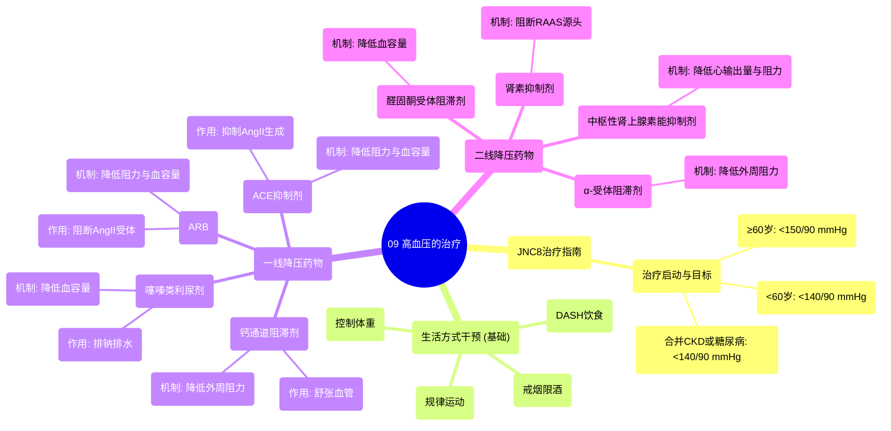

# 09 Treatment of hypertension Circulatory System and Disease NCLEX-RN Khan Academy

  <video controls preload="metadata" playsinline>
    <source src="https://helly.s3.bitiful.net/心血管学科/%E4%B8%93%E8%BE%91%2010%EF%BC%9A%E9%AB%98%E8%A1%80%E5%8E%8B%E7%AE%A1%E7%90%86%E6%8C%87%E5%8D%97%20%28Hypertension%29/09%20Treatment%20of%20hypertension%20Circulatory%20System%20and%20Disease%20NCLEX-RN%20Khan%20Academy.mp4" type="video/mp4">
    
您的浏览器不支持播放，请升级。

  </video>

::: tip ⚡️ 核心考点 (30s速读)
*   **核心考点**：JNC8高血压治疗启动时机与降压目标值；一线降压药（噻嗪类利尿剂、钙通道阻滞剂、ACEI、ARB）的作用机制。
*   **临床意义**：根据年龄、是否合并慢性肾病或糖尿病，制定个体化的血压控制目标。治疗以生活方式干预为基础，首选一线药物，无效时考虑二线药物。
:::

## 🧠 深度精讲

*   **JNC8治疗指南**：这是美国国家联合委员会第八次报告提出的高血压管理核心建议。它明确了开始药物治疗的血压阈值以及不同人群的降压目标值，是临床决策的重要依据。其核心在于个体化治疗，尤其关注老年患者（≥60岁）与年轻患者（<60岁）或合并特定疾病（慢性肾病、糖尿病）患者的目标差异。
*   **生活方式干预 (DASH)**：DASH（防治高血压饮食方式）是高血压治疗的基石。它强调减少钠摄入，增加全谷物、水果、蔬菜和低脂乳制品的摄入。此外，戒烟、限酒、规律运动和减重（如肥胖）是同等重要的非药物措施，应贯穿治疗始终。
*   **一线降压药物**：这类药物因疗效确切、安全性好、成本较低而被推荐为初始治疗。它们主要通过影响血压形成的两个核心因素——血容量和血管阻力——来发挥作用。
    *   **噻嗪类利尿剂**：作用于肾脏，促进钠和水的排泄，从而**降低血容量**，使血压下降。
    *   **钙通道阻滞剂**：阻断血管平滑肌细胞上的钙离子通道，抑制血管收缩，促使**血管舒张**，**降低外周阻力**。
    *   **血管紧张素转换酶抑制剂**：抑制血管紧张素II的生成。血管紧张素II是一种强效的血管收缩剂，并能促进醛固酮分泌导致水钠潴留。因此，ACEI能同时**降低血管阻力**和**减少血容量**。
    *   **血管紧张素II受体拮抗剂**：不阻止血管紧张素II的生成，而是阻断其与受体的结合，从而拮抗其收缩血管和促进醛固酮分泌的作用，最终效果与ACEI类似。
*   **二线降压药物**：当一线药物效果不佳或患者存在禁忌时使用。它们通过更特异的途径调节血压。
    *   **醛固酮受体阻滞剂**：直接阻断醛固酮的作用，减少肾脏的钠水重吸收，**降低血容量**。
    *   **肾素抑制剂**：抑制肾素活性，从源头阻断肾素-血管紧张素-醛固酮系统的激活，从而**降低血管阻力**和**血容量**。
    *   **α-肾上腺素能受体阻滞剂**：阻断血管平滑肌上的α受体，抑制交感神经介导的血管收缩，导致**血管舒张**，**阻力下降**。
    *   **中枢性肾上腺素能抑制剂**：作用于中枢神经系统，抑制交感神经输出，从而减慢心率、舒张血管，**降低心输出量和外周阻力**。

## 📚 双语术语表 (Terminology)
| 英文术语 | 中文翻译 | 定义/解释 |
| :--- | :--- | :--- |
| JNC8 | 美国国家联合委员会第八次报告 | 发布高血压诊断与管理指南的权威机构报告。 |
| Systolic Blood Pressure | 收缩压 | 心脏收缩时，血液对血管壁产生的最高压力。 |
| Diastolic Blood Pressure | 舒张压 | 心脏舒张时，血液对血管壁产生的最低压力。 |
| DASH | 防治高血压饮食方式 | 一种强调低钠、高钾、高纤维的饮食模式，用于预防和控制高血压。 |
| Thiazide Diuretics | 噻嗪类利尿剂 | 一类通过促进肾脏排钠、排水来降低血容量的降压药。 |
| Calcium Channel Blockers (CCB) | 钙通道阻滞剂 | 一类通过阻断血管平滑肌钙离子通道，使血管舒张来降低血压的药物。 |
| ACE Inhibitors (ACEI) | 血管紧张素转换酶抑制剂 | 一类通过抑制血管紧张素II的生成，来舒张血管、减少血容量的降压药。 |
| Angiotensin II Receptor Blockers (ARB) | 血管紧张素II受体拮抗剂 | 一类通过阻断血管紧张素II与其受体结合，来拮抗其升压效应的降压药。 |
| Aldosterone Receptor Blockers | 醛固酮受体阻滞剂 | 一类通过阻断醛固酮的作用，减少钠水重吸收来降低血容量的药物。 |
| Renin Inhibitors | 肾素抑制剂 | 一类通过直接抑制肾素活性，阻断RAAS系统启动的降压药。 |
| Alpha-Adrenergic Blockers | α-肾上腺素能受体阻滞剂 | 一类通过阻断血管α受体，抑制血管收缩来降低外周阻力的降压药。 |
| Central Adrenergic Inhibitors | 中枢性肾上腺素能抑制剂 | 一类通过抑制中枢交感神经输出，来降低心率和外周阻力的降压药。 |
| Renin-Angiotensin-Aldosterone System (RAAS) | 肾素-血管紧张素-醛固酮系统 | 人体内调节血压、血容量和电解质平衡的重要激素系统。 |

## 🗺️ 知识图谱

