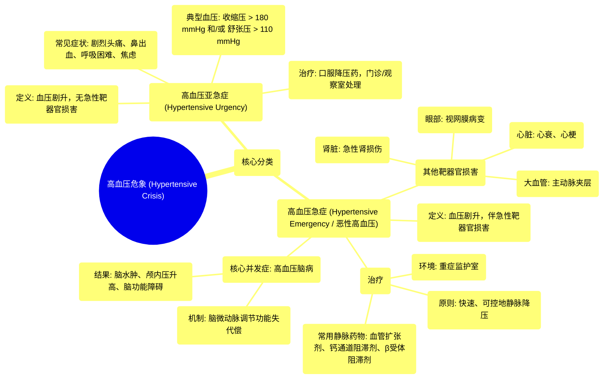

# 10 Hypertensive crisis Circulatory System and Disease NCLEX-RN Khan Academy

  <video controls preload="metadata" playsinline>
    <source src="https://helly.s3.bitiful.net/心血管学科/%E4%B8%93%E8%BE%91%2010%EF%BC%9A%E9%AB%98%E8%A1%80%E5%8E%8B%E7%AE%A1%E7%90%86%E6%8C%87%E5%8D%97%20%28Hypertension%29/10%20Hypertensive%20crisis%20Circulatory%20System%20and%20Disease%20NCLEX-RN%20Khan%20Academy.mp4" type="video/mp4">
    
您的浏览器不支持播放，请升级。

  </video>

::: tip ⚡️ 核心考点 (30s速读)
*   **核心考点**：高血压危象分为“高血压亚急症”和“高血压急症”。两者的核心区别在于**有无靶器官的急性损害**。
*   **临床意义**：高血压急症（恶性高血压）是危及生命的急症，需立即静脉用药降压，以防止对大脑、心脏、肾脏等靶器官造成不可逆的永久性损伤。
:::

## 🧠 深度精讲

*   **概念1：高血压危象的定义与分类**
    高血压危象是指血压在短时间内急剧、严重升高的一种临床状态。它主要分为两大类：
    1.  **高血压亚急症**：指血压严重升高（通常收缩压 > 180 mmHg 和/或舒张压 > 110 mmHg），但**没有**伴随新发或进行性的靶器官（如心、脑、肾）损害。患者可能出现剧烈头痛、鼻出血、呼吸困难、严重焦虑等症状。治疗上通常可在门诊或观察室通过口服降压药处理。
    2.  **高血压急症**：指血压严重升高，并已导致**急性或进行性的靶器官损害**。即使血压数值未达到上述标准，但对于血压平时不高的患者，相对较低的血压也可能引发急症。此情况也称为“恶性高血压”，是真正的医疗急症。

*   **概念2：高血压急症的病理生理与并发症**
    当血压急剧升高超过脑血管的自我调节能力时，会导致一系列严重后果：
    *   **高血压脑病**：极高的动脉压使脑部小动脉（微动脉）丧失调节血流的能力，导致液体和血液成分渗漏到脑组织间隙，引起**脑水肿**和**颅内压升高**，最终导致脑功能障碍。表现为头痛、视力改变、意识障碍、抽搐等。
    *   **其他靶器官损害**：包括急性心力衰竭、心肌梗死、主动脉夹层、急性肾损伤、视网膜病变等。

*   **概念3：高血压急症的治疗原则**
    治疗目标是**快速但可控地降低血压**，以阻止靶器官损害进展，但又避免降压过快导致重要器官灌注不足。
    *   **给药途径**：必须使用**静脉注射**降压药物，以确保药物迅速起效。
    *   **常用药物**：包括静脉用血管扩张剂（如硝普钠）、钙通道阻滞剂（如尼卡地平）、β受体阻滞剂（如拉贝洛尔）等。
    *   **治疗环境**：患者需在**重症监护室**或同等密切监护的环境下进行治疗，以便实时监测血压和器官功能。

## 📚 双语术语表 (Terminology)
| 英文术语 | 中文翻译 | 定义/解释 |
| :--- | :--- | :--- |
| Hypertensive crisis | 高血压危象 | 血压在短时间内急剧、严重升高的临床状态。 |
| Hypertensive urgency | 高血压亚急症 | 血压严重升高，但无急性靶器官损害。 |
| Hypertensive emergency | 高血压急症 | 血压严重升高，并伴有急性或进行性靶器官损害。 |
| Malignant hypertension | 恶性高血压 | 高血压急症的别称，强调其危重性。 |
| Target organ | 靶器官 | 长期或急剧高血压主要损害的身体器官，如心、脑、肾、眼。 |
| Encephalopathy | 脑病 | 泛指大脑功能紊乱的疾病状态。 |
| Hypertensive encephalopathy | 高血压脑病 | 因血压急剧升高导致的急性脑功能障碍，是高血压急症的典型并发症。 |
| Cerebral edema | 脑水肿 | 脑组织内液体积聚。 |
| Arteriole | 微动脉 / 小动脉 | 连接动脉与毛细血管的细小血管，在血压调节中起关键作用。 |
| Intravenous (IV) medication | 静脉注射药物 | 通过静脉途径直接注入血液的药物，起效最快。 |

## 🗺️ 知识图谱

