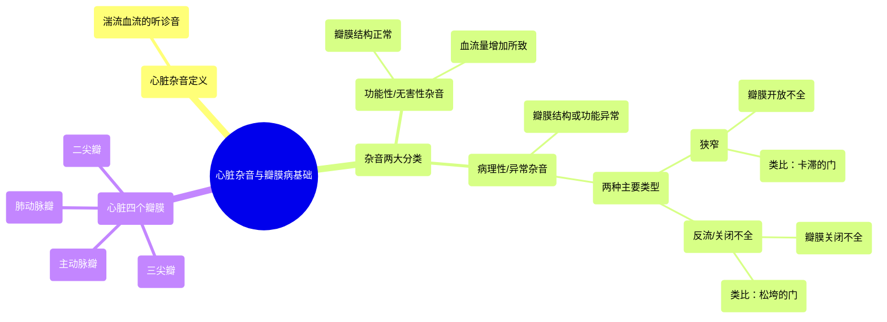

# 01 What is valvular heart disease Circulatory System and Disease NCLEX-RN Khan Academy

  <video controls preload="metadata" playsinline>
    <source src="https://helly.s3.bitiful.net/心血管学科/%E4%B8%93%E8%BE%91%2011%EF%BC%9A%E5%86%A0%E5%BF%83%E7%97%85%E4%B8%8E%E5%BF%83%E8%82%8C%E6%A2%97%E6%AD%BB%20%28Heart%20AttacksMI%29/01%20What%20is%20valvular%20heart%20disease%20Circulatory%20System%20and%20Disease%20NCLEX-RN%20Khan%20Academy.mp4" type="video/mp4">
    
您的浏览器不支持播放，请升级。

  </video>

::: tip ⚡️ 核心考点 (30s速读)
*   **核心考点**：心脏杂音是湍流血流的听诊音，分为功能性（无害）和病理性（异常）两类。病理性杂音源于瓣膜功能障碍，主要表现为**狭窄**（瓣膜开放不全）和**反流/关闭不全**（瓣膜关闭不全）。
*   **临床意义**：听到杂音时，关键在于鉴别其性质。功能性杂音（如血流增加）通常无害，而病理性杂音提示瓣膜结构异常（如瘢痕、老化），需要进一步评估。
:::

## 🧠 深度精讲

*   **心脏杂音的本质**：心脏杂音是血液在流经心脏结构（特别是瓣膜）时产生湍流所发出的声音。可以将其想象为飞机颠簸时“不平稳”的气流声在血液中的体现。
*   **功能性（无害）杂音**：瓣膜结构本身完全正常，但由于血流量显著增加（如运动、怀孕、贫血时），血流速度加快，产生轻微湍流，从而形成杂音。这是一种生理性现象。
*   **病理性（异常）杂音**：根本原因是**瓣膜本身的结构或功能异常**。这种异常导致血流动力学改变，产生湍流。病理性杂音是瓣膜性心脏病的重要体征。
*   **瓣膜功能障碍的两种类型**：
    1.  **狭窄**：瓣膜开放受限，开口变窄。如同生锈、卡滞的门，学生（血液）需要用力推挤才能通过狭窄的出口，造成拥堵和混乱（湍流）。
    2.  **反流/关闭不全**：瓣膜关闭不严，留有缝隙。如同关不紧、松垮的门，部分学生（血液）在门（瓣膜）本应关闭时，从缝隙中漏回，产生逆向血流和湍流。
*   **听诊特点**：视频中演示了常见杂音的特点：在正常的“lub-dub”（第一、第二心音）之间，可以听到额外的“吹风样”或“吹气样”声音。

## 📚 双语术语表 (Terminology)
| 英文术语 | 中文翻译 | 定义/解释 |
| :--- | :--- | :--- |
| Heart murmur | 心脏杂音 | 血液湍流通过心脏结构（尤其是瓣膜）时产生的异常听诊音。 |
| Turbulent flow | 湍流 | 不规则、混乱的血流状态，是产生杂音的直接原因。 |
| Functional / Innocent murmur | 功能性 / 无害性杂音 | 瓣膜结构正常，因血流量增加而产生的杂音，通常无临床意义。 |
| Pathologic murmur | 病理性杂音 | 由于心脏结构（主要是瓣膜）异常导致的杂音，提示存在疾病。 |
| Stenosis / Stenotic | 狭窄 | 瓣膜开口变窄，阻碍血液前向流动的病理状态。 |
| Regurgitation / Insufficiency | 反流 / 关闭不全 | 瓣膜关闭不全，导致血液在不应回流时发生逆向泄漏的病理状态。 |
| Mitral valve | 二尖瓣 | 位于左心房和左心室之间的瓣膜，有两个瓣叶。 |
| Tricuspid valve | 三尖瓣 | 位于右心房和右心室之间的瓣膜，有三个瓣叶。 |
| Aortic valve | 主动脉瓣 | 位于左心室和主动脉之间的瓣膜，通常有三个瓣叶。 |
| Pulmonic valve | 肺动脉瓣 | 位于右心室和肺动脉之间的瓣膜，通常有三个瓣叶。 |

## 🗺️ 知识图谱

