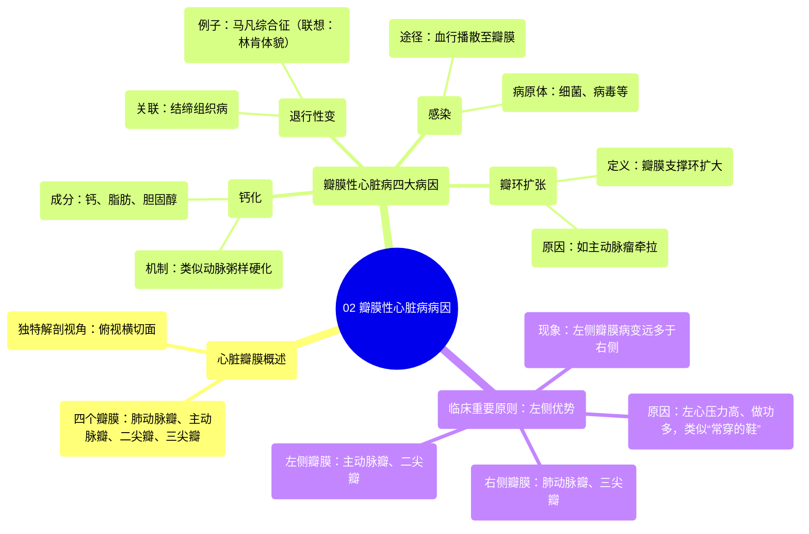

# 02 Valvular heart disease causes Circulatory System and Disease NCLEX-RN Khan Academy

  <video controls preload="metadata" playsinline>
    <source src="https://helly.s3.bitiful.net/心血管学科/%E4%B8%93%E8%BE%91%2011%EF%BC%9A%E5%86%A0%E5%BF%83%E7%97%85%E4%B8%8E%E5%BF%83%E8%82%8C%E6%A2%97%E6%AD%BB%20%28Heart%20AttacksMI%29/02%20Valvular%20heart%20disease%20causes%20Circulatory%20System%20and%20Disease%20NCLEX-RN%20Khan%20Academy.mp4" type="video/mp4">
    
您的浏览器不支持播放，请升级。

  </video>

::: tip ⚡️ 核心考点 (30s速读)
*   **核心考点**：瓣膜性心脏病的四大病因：钙化、退行性变、感染、瓣环扩张。左侧瓣膜（主动脉瓣、二尖瓣）病变远比右侧（肺动脉瓣、三尖瓣）常见。
*   **临床意义**：理解病因是诊断和治疗的基础。左侧瓣膜因承受更高压力而更易受损，类似“经常穿的鞋”磨损更快。
:::

## 🧠 深度精讲

*   **心脏瓣膜定位**：视频通过一个独特的“俯视”视角图，展示了四个瓣膜的相对位置。想象你站在楼顶俯视一个人的后脑勺，透过其胸腔看到的横切面。从左到右（按图中位置）依次是：肺动脉瓣、主动脉瓣、二尖瓣、三尖瓣。
*   **病因一：钙化**：瓣膜上钙离子与脂肪、胆固醇结合形成斑块，这个过程与导致动脉粥样硬化的机制非常相似。这会导致瓣膜变硬、狭窄。
*   **病因二：退行性变**：常与结缔组织病相关，即构成瓣膜结构的蛋白质出现问题。典型例子是马凡综合征（可通过亚伯拉罕·林肯的典型体貌特征联想记忆：高瘦、长指、长脸）。
*   **病因三：感染**：病原体（细菌、病毒等）进入血液后，随血流到达心脏瓣膜表面，可粘附并引发感染或免疫反应，损害瓣膜功能。
*   **病因四：瓣环扩张**：瓣膜底部的纤维支撑环（瓣环）因疾病（如主动脉瘤）而被过度牵拉、扩张，导致瓣膜关闭不全。
*   **左侧优势原则**：左侧瓣膜（主动脉瓣、二尖瓣）疾病远比右侧常见。因为左心是向全身泵血的“主力”，承受的压力更高，每次心跳血液都强力冲击这些瓣膜，类似“经常穿的鞋”磨损更快。右心压力低，做功少，因此右侧瓣膜病变较少。

## 📚 双语术语表 (Terminology)
| 英文术语 | 中文翻译 | 定义/解释 |
| :--- | :--- | :--- |
| Valvular heart disease | 瓣膜性心脏病 | 心脏瓣膜结构或功能异常导致的心脏疾病。 |
| Murmur | 心脏杂音 | 血液流经病变瓣膜时产生的异常心音。 |
| Mitral regurgitation | 二尖瓣反流 | 二尖瓣关闭不全，导致左心室收缩时血液反流入左心房。 |
| Aortic stenosis | 主动脉瓣狭窄 | 主动脉瓣开放受限，导致左心室射血受阻。 |
| Calcification | 钙化 | 钙盐在瓣膜上异常沉积，使其变硬、失去弹性。 |
| Atherosclerosis | 动脉粥样硬化 | 脂肪、胆固醇等物质在动脉壁沉积形成斑块的疾病。 |
| Valve degeneration | 瓣膜退行性变 | 瓣膜组织随年龄或疾病发生的结构性退化。 |
| Connective tissue disorder | 结缔组织病 | 影响胶原蛋白等结缔组织的一类疾病，如马凡综合征。 |
| Marfan syndrome | 马凡综合征 | 一种常染色体显性遗传的结缔组织病，常影响心血管系统（包括主动脉和瓣膜）。 |
| Annulus | 瓣环 | 心脏瓣膜底部的纤维性支撑环。 |
| Annular dilation | 瓣环扩张 | 瓣环因病理性扩大而失去正常支撑功能。 |
| Aortic aneurysm | 主动脉瘤 | 主动脉壁局部异常膨出。 |
| Left-sided valves | 左侧瓣膜 | 指主动脉瓣和二尖瓣。 |
| Right-sided valves | 右侧瓣膜 | 指肺动脉瓣和三尖瓣。 |

## 🗺️ 知识图谱

