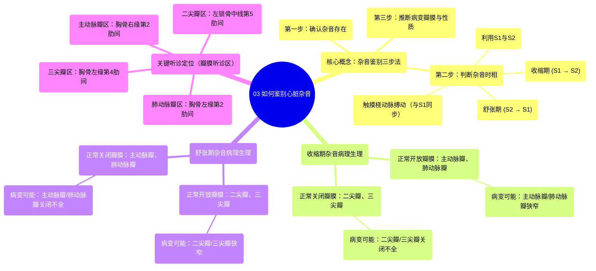

# 03 How to identify murmurs Circulatory System and Disease NCLEX-RN Khan Academy

  <video controls preload="metadata" playsinline>
    <source src="https://helly.s3.bitiful.net/心血管学科/%E4%B8%93%E8%BE%91%2011%EF%BC%9A%E5%86%A0%E5%BF%83%E7%97%85%E4%B8%8E%E5%BF%83%E8%82%8C%E6%A2%97%E6%AD%BB%20%28Heart%20AttacksMI%29/03%20How%20to%20identify%20murmurs%20Circulatory%20System%20and%20Disease%20NCLEX-RN%20Khan%20Academy.mp4" type="video/mp4">
    
您的浏览器不支持播放，请升级。

  </video>

::: tip ⚡️ 核心考点 (30s速读)
*   **核心考点**：心脏杂音的鉴别诊断遵循“三步法”：1. 确认杂音存在；2. 判断杂音时相（收缩期/舒张期）；3. 根据时相推断可能的病变瓣膜（狭窄或关闭不全）。
*   **临床意义**：通过听诊杂音的时相和最强听诊点（位置），可以快速定位病变瓣膜，是心血管疾病体格检查的基本功，对诊断瓣膜性心脏病至关重要。
:::

## 🧠 深度精讲

*   **心脏周期与心音**：心脏活动分为“收缩期”和“舒张期”。第一心音（S1）标志收缩期开始，由二尖瓣和三尖瓣关闭产生；第二心音（S2）标志舒张期开始，由主动脉瓣和肺动脉瓣关闭产生。因此，S1与S2之间为收缩期，S2与下一个S1之间为舒张期。
*   **杂音产生的病理生理基础**：杂音源于血流通过异常瓣膜时产生的湍流。关键在于理解各期瓣膜的“正常”开闭状态：
    *   **收缩期**：主动脉瓣和肺动脉瓣**正常开放**（射血）；二尖瓣和三尖瓣**正常关闭**（防止血液反流回心房）。因此，收缩期杂音可能源于：1) **主动脉瓣/肺动脉瓣狭窄**（开放不全）；2) **二尖瓣/三尖瓣关闭不全**（关闭不全）。
    *   **舒张期**：二尖瓣和三尖瓣**正常开放**（心室充盈）；主动脉瓣和肺动脉瓣**正常关闭**（防止血液反流回心室）。因此，舒张期杂音可能源于：1) **二尖瓣/三尖瓣狭窄**（开放不全）；2) **主动脉瓣/肺动脉瓣关闭不全**（关闭不全）。
*   **听诊定位（瓣膜听诊区）**：每个瓣膜有其对应的最佳听诊区域，这是鉴别具体是哪个瓣膜病变的关键。
    *   **主动脉瓣区**：胸骨右缘第2肋间（右第2肋间）。
    *   **肺动脉瓣区**：胸骨左缘第2肋间（左第2肋间）。
    *   **三尖瓣区**：胸骨左缘第4肋间。
    *   **二尖瓣区**：左锁骨中线第5肋间（心尖搏动处）。
*   **鉴别诊断流程（逻辑算法）**：
    1.  **是否存在杂音？** → 是。
    2.  **杂音发生在何时？** → 利用S1、S2或触摸桡动脉搏动（搏动与S1同步）判断是收缩期还是舒张期。
    3.  **根据时相推断病变**：结合上述“正常开闭”原则，列出该时相下所有可能的病变（狭窄或关闭不全）。
    4.  **听诊位置定位**：在相应的瓣膜听诊区听到的杂音最响，即可最终定位病变瓣膜。

## 📚 双语术语表 (Terminology)
| 英文术语 | 中文翻译 | 定义/解释 |
| :--- | :--- | :--- |
| Systole | 收缩期 | 心脏收缩，将血液泵入主动脉和肺动脉的时期。 |
| Diastole | 舒张期 | 心脏舒张，血液回流充盈心室的时期。 |
| S1 (First Heart Sound) | 第一心音 | 标志收缩期开始，主要由二尖瓣和三尖瓣关闭产生。 |
| S2 (Second Heart Sound) | 第二心音 | 标志舒张期开始，主要由主动脉瓣和肺动脉瓣关闭产生。 |
| Murmur | 心脏杂音 | 血液流经心脏或大血管时产生湍流所引起的心音以外的异常声音。 |
| Stenosis | 狭窄 | 心脏瓣膜开放受限，导致血流通过受阻。 |
| Regurgitation | 关闭不全/反流 | 心脏瓣膜关闭不全，导致血液逆流。 |
| Aortic Valve | 主动脉瓣 | 位于左心室和主动脉之间的瓣膜。 |
| Pulmonic Valve | 肺动脉瓣 | 位于右心室和肺动脉之间的瓣膜。 |
| Mitral Valve | 二尖瓣 | 位于左心房和左心室之间的瓣膜。 |
| Tricuspid Valve | 三尖瓣 | 位于右心房和右心室之间的瓣膜。 |
| Intercostal Space | 肋间隙 | 相邻两根肋骨之间的空间。 |
| Midclavicular Line | 锁骨中线 | 通过锁骨中点所作的垂直线，是重要的体表定位标志。 |

## 🗺️ 知识图谱

