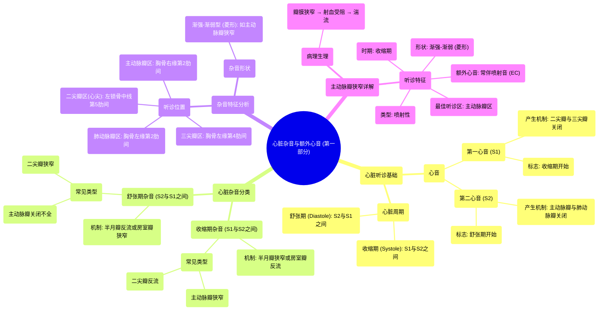

# 04 Systolic murmurs, diastolic murmurs, and extra heart sounds - Part 1 NCLEX-RN Khan Academy

  <video controls preload="metadata" playsinline>
    <source src="https://helly.s3.bitiful.net/心血管学科/%E4%B8%93%E8%BE%91%2011%EF%BC%9A%E5%86%A0%E5%BF%83%E7%97%85%E4%B8%8E%E5%BF%83%E8%82%8C%E6%A2%97%E6%AD%BB%20%28Heart%20AttacksMI%29/04%20Systolic%20murmurs%2C%20diastolic%20murmurs%2C%20and%20extra%20heart%20sounds%20-%20Part%201%20NCLEX-RN%20Khan%20Academy.mp4" type="video/mp4">
    
您的浏览器不支持播放，请升级。

  </video>

::: tip ⚡️ 核心考点 (30s速读)
*   **核心考点**：心脏杂音的分类（收缩期/舒张期）取决于其出现在S1-S2（收缩期）还是S2-S1（舒张期）之间。杂音的特征由其“位置”（听诊区）和“形状”（如渐强-渐弱型）决定。
*   **临床意义**：主动脉瓣狭窄是典型的收缩期喷射性杂音，表现为“渐强-渐弱”（菱形）形态，常伴有喷射音，在主动脉瓣听诊区（胸骨右缘第二肋间）最响亮。
:::

## 🧠 深度精讲

*   **心脏听诊基础**：心脏周期由第一心音（S1）和第二心音（S2）划分。S1标志收缩期开始（心室收缩），由二尖瓣和三尖瓣关闭产生；S2标志舒张期开始（心室舒张），由主动脉瓣和肺动脉瓣关闭产生。
*   **杂音分类逻辑**：杂音的产生源于瓣膜病变导致的血流湍流。判断杂音是收缩期还是舒张期的根本依据，在于分析在特定时期，哪个瓣膜本应开放或关闭却发生了异常。
    *   **收缩期杂音**：发生在S1和S2之间。此时心室收缩，主动脉瓣和肺动脉瓣本应**开放**以射血，二尖瓣和三尖瓣本应**关闭**以防止血液反流。因此，主动脉瓣/肺动脉瓣**狭窄**（开放受阻）或二尖瓣/三尖瓣**关闭不全**（反流）会产生收缩期杂音。
    *   **舒张期杂音**：发生在S2和S1之间。此时心室舒张，主动脉瓣和肺动脉瓣本应**关闭**，二尖瓣和三尖瓣本应**开放**以充盈心室。因此，主动脉瓣/肺动脉瓣**关闭不全**（反流）或二尖瓣/三尖瓣**狭窄**（开放受阻）会产生舒张期杂音。
*   **听诊位置**：四个主要听诊区对应血液流经各瓣膜后的主要传导方向：
    1.  **主动脉瓣区**：胸骨右缘第二肋间。
    2.  **肺动脉瓣区**：胸骨左缘第二肋间。
    3.  **三尖瓣区**：胸骨左缘第四肋间。
    4.  **二尖瓣区（心尖区）**：左锁骨中线与第五肋间交点处。
*   **主动脉瓣狭窄详解**：
    *   **机制**：在S1（二尖瓣关闭）后，心室开始收缩，但需先积累足够压力才能推开狭窄的主动脉瓣。瓣叶突然弹开时产生**喷射音**。随后血流加速通过狭窄瓣口，产生湍流，杂音强度随收缩力增强而增加（渐强）；心室收缩末期压力下降，血流减少，杂音减弱（渐弱），形成典型的“渐强-渐弱”型（菱形）杂音。
    *   **特征**：收缩期、喷射性、菱形杂音，常伴喷射音，最佳听诊位置在主动脉瓣区。

## 📚 双语术语表 (Terminology)
| 英文术语 | 中文翻译 | 定义/解释 |
| :--- | :--- | :--- |
| Systole | 收缩期 | 心脏收缩，将血液泵出的时期，介于S1和S2之间。 |
| Diastole | 舒张期 | 心脏放松并充盈血液的时期，介于S2和S1之间。 |
| S1 (First Heart Sound) | 第一心音 | 主要由二尖瓣和三尖瓣关闭产生，标志收缩期开始。 |
| S2 (Second Heart Sound) | 第二心音 | 主要由主动脉瓣和肺动脉瓣关闭产生，标志舒张期开始。 |
| Systolic Murmur | 收缩期杂音 | 发生在S1和S2之间的心脏杂音。 |
| Diastolic Murmur | 舒张期杂音 | 发生在S2和S1之间的心脏杂音。 |
| Aortic Stenosis (AS) | 主动脉瓣狭窄 | 主动脉瓣开口狭窄，导致左心室射血受阻，产生收缩期喷射性杂音。 |
| Crescendo-Decrescendo Murmur | 渐强-渐弱型杂音 | 杂音强度先增强后减弱，形状似菱形，是主动脉瓣狭窄的典型特征。 |
| Ejection Click (EC) | 喷射音 | 狭窄的半月瓣（如主动脉瓣）在开放时突然绷紧产生的额外心音。 |
| Aortic Area | 主动脉瓣听诊区 | 位于胸骨右缘第二肋间，是听诊主动脉瓣病变（如狭窄）的最佳位置。 |
| Mitral Area (Apex) | 二尖瓣听诊区（心尖区） | 位于左锁骨中线第五肋间，是听诊二尖瓣病变的最佳位置。 |

## 🗺️ 知识图谱

