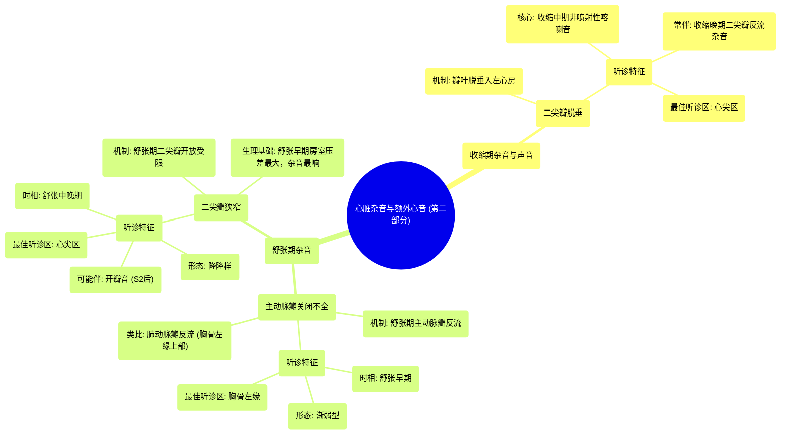

# 05 Systolic murmurs, diastolic murmurs, and extra heart sounds - Part 2 NCLEX-RN Khan Academy

  <video controls preload="metadata" playsinline>
    <source src="https://helly.s3.bitiful.net/心血管学科/%E4%B8%93%E8%BE%91%2011%EF%BC%9A%E5%86%A0%E5%BF%83%E7%97%85%E4%B8%8E%E5%BF%83%E8%82%8C%E6%A2%97%E6%AD%BB%20%28Heart%20AttacksMI%29/05%20Systolic%20murmurs%2C%20diastolic%20murmurs%2C%20and%20extra%20heart%20sounds%20-%20Part%202%20NCLEX-RN%20Khan%20Academy.mp4" type="video/mp4">
    
您的浏览器不支持播放，请升级。

  </video>

::: tip ⚡️ 核心考点 (30s速读)
*   **核心考点**：掌握二尖瓣脱垂的听诊特征（收缩中期喀喇音伴或不伴收缩晚期杂音）、主动脉瓣关闭不全的听诊特征（舒张早期、胸骨左缘、渐弱型杂音）以及二尖瓣狭窄的听诊特征（舒张中晚期、心尖区、隆隆样杂音，常伴开瓣音）。
*   **临床意义**：这些杂音和额外心音是诊断特定心脏瓣膜病的关键线索。例如，收缩中期喀喇音是二尖瓣脱垂的“诊断性”体征；主动脉瓣关闭不全的杂音位置（胸骨左缘）反映了血流方向；二尖瓣狭窄的杂音强度与舒张期房室压力差变化相关。
:::

## 🧠 深度精讲

*   **二尖瓣脱垂**
    *   **机制**：二尖瓣瓣叶在收缩期向左心房膨出（脱垂），脱垂的瓣叶或拉紧的腱索突然绷紧，产生一个**非喷射性**的**收缩中期喀喇音**。
    *   **听诊特征**：
        1.  **核心体征**：**收缩中期喀喇音**。这是诊断二尖瓣脱垂的**关键**。
        2.  **伴随杂音**：常伴有二尖瓣反流，表现为喀喇音之后的**收缩晚期杂音**（杂音具体形态有不同描述，但喀喇音本身更重要）。
        3.  **最佳听诊区**：**心尖区（二尖瓣区）**。

*   **主动脉瓣关闭不全**
    *   **机制**：舒张期主动脉瓣关闭不全，血液从主动脉反流回左心室。
    *   **听诊特征**：
        1.  **杂音时相**：**舒张早期**，始于第二心音（S2，主动脉瓣关闭）之后。
        2.  **杂音形态**：**渐弱型**。因为舒张早期左心室压力最低，反流量最大，杂音最响；随着心室充盈压力升高，反流减少，杂音减弱。
        3.  **最佳听诊区**：**胸骨左缘**。因为反流血液冲击左心室流出道，声音沿此方向传导，而非标准的主动脉瓣听诊区。
    *   **类比**：右心系统的**肺动脉瓣反流**也产生**舒张早期渐弱型杂音**，但最佳听诊区在**胸骨左缘上部**。

*   **二尖瓣狭窄**
    *   **机制**：舒张期二尖瓣开放受限，血流从左心房流入左心室受阻。
    *   **听诊特征**：
        1.  **杂音时相**：**舒张中晚期**。杂音在舒张早期（快速充盈期）最响，因为此时房室压力差最大。
        2.  **杂音形态**：常描述为**隆隆样**。
        3.  **额外心音**：狭窄的二尖瓣在开放时可能产生一个高调的**开瓣音**，位于第二心音（S2）之后。
        4.  **最佳听诊区**：**心尖区**。

## 📚 双语术语表 (Terminology)
| 英文术语 | 中文翻译 | 定义/解释 |
| :--- | :--- | :--- |
| Systolic murmur | 收缩期杂音 | 发生在心脏收缩期（第一心音与第二心音之间）的异常心音。 |
| Diastolic murmur | 舒张期杂音 | 发生在心脏舒张期（第二心音与下一周期第一心音之间）的异常心音。 |
| Mitral valve prolapse | 二尖瓣脱垂 | 心脏收缩时，二尖瓣的一个或两个瓣叶向左心房膨出的病理状态。 |
| Click | 喀喇音 | 一种高调、短促的额外心音。 |
| Non-ejection click | 非喷射性喀喇音 | 与血液通过半月瓣喷射无关的喀喇音，如二尖瓣脱垂产生的喀喇音。 |
| Mid-systolic click | 收缩中期喀喇音 | 发生在收缩中期的喀喇音，是二尖瓣脱垂的特征性听诊发现。 |
| Mitral regurgitation | 二尖瓣反流 | 收缩期血液从左心室经关闭不全的二尖瓣反流回左心房。 |
| Aortic regurgitation | 主动脉瓣关闭不全 | 舒张期血液从主动脉经关闭不全的主动脉瓣反流回左心室。 |
| Left sternal border | 胸骨左缘 | 胸骨左侧边缘的区域，是听诊主动脉瓣关闭不全等杂音的重要位置。 |
| Early diastolic murmur | 舒张早期杂音 | 始于第二心音之后，发生在舒张早期的杂音，如主动脉瓣关闭不全的杂音。 |
| Decrescendo murmur | 渐弱型杂音 | 杂音强度从起始到结束逐渐减弱。 |
| Mitral stenosis | 二尖瓣狭窄 | 二尖瓣开口狭窄，阻碍舒张期血液从左心房流入左心室。 |
| Opening snap | 开瓣音 | 二尖瓣狭窄时，僵硬的瓣膜在舒张期开放时突然绷紧产生的高调额外心音。 |
| Apex / Mitral area | 心尖区 / 二尖瓣区 | 位于左锁骨中线第5肋间，是听诊二尖瓣相关杂音（如二尖瓣狭窄、反流、脱垂）的最佳位置。 |

## 🗺️ 知识图谱

