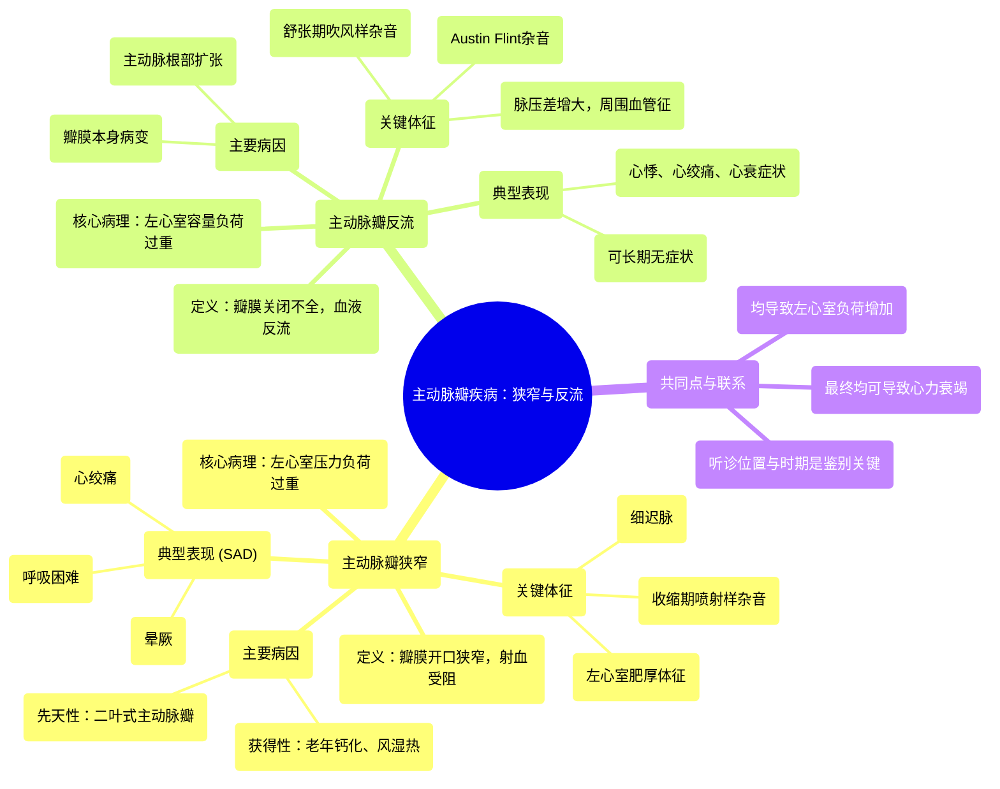

# 06 Aortic stenosis and aortic regurgitation Circulatory System and Disease NCLEX-RN Khan Academy

  <video controls preload="metadata" playsinline>
    <source src="https://helly.s3.bitiful.net/心血管学科/%E4%B8%93%E8%BE%91%2011%EF%BC%9A%E5%86%A0%E5%BF%83%E7%97%85%E4%B8%8E%E5%BF%83%E8%82%8C%E6%A2%97%E6%AD%BB%20%28Heart%20AttacksMI%29/06%20Aortic%20stenosis%20and%20aortic%20regurgitation%20Circulatory%20System%20and%20Disease%20NCLEX-RN%20Khan%20Academy.mp4" type="video/mp4">
    
您的浏览器不支持播放，请升级。

  </video>

::: tip ⚡️ 核心考点 (30s速读)
*   **核心考点**：主动脉瓣狭窄（AS）是瓣膜开口变窄，导致左心室射血受阻；主动脉瓣反流（AR）是瓣膜关闭不全，导致血液在舒张期从主动脉反流回左心室。
*   **临床意义**：两者均导致左心室负荷增加，最终引起心力衰竭。AS典型表现为“SAD”（晕厥、心绞痛、呼吸困难），听诊为收缩期喷射样杂音；AR典型表现为脉压差增大、舒张期吹风样杂音。
:::

## 🧠 深度精讲

*   **主动脉瓣狭窄 (Aortic Stenosis, AS)**
    *   **定义**：主动脉瓣开口变窄，阻碍左心室向主动脉射血。
    *   **病理生理**：左心室需克服更大阻力泵血，导致左心室压力负荷增加，引发左心室向心性肥厚。最终可导致心输出量下降、心肌缺血和心力衰竭。
    *   **病因**：
        1.  **先天性二叶式主动脉瓣**：最常见的先天性病因，两个瓣叶承担三个瓣叶的工作，易早期钙化、狭窄。
        2.  **老年退行性钙化**：与动脉粥样硬化危险因素相似（如高血压、高血脂、糖尿病、吸烟），瓣膜随年龄增长钙化、僵硬。
        3.  **风湿性心脏病**：较少见，常与二尖瓣病变并存。
    *   **临床表现 (SAD)**：
        *   **S (Syncope)**：晕厥，常于活动时发生，因心输出量不足导致脑供血减少。
        *   **A (Angina)**：心绞痛，因心肌肥厚耗氧增加和/或合并冠状动脉疾病导致心肌缺血。
        *   **D (Dyspnea)**：呼吸困难，左心室舒张末压升高导致肺淤血。
    *   **体征**：
        *   **脉搏**：细迟脉（脉搏细弱、上升缓慢）。
        *   **心尖搏动**：心尖搏动最强点可能向左下或内侧移位（左心室肥厚所致）。
        *   **听诊**：胸骨右缘第二肋间可闻及**收缩期喷射样杂音**，向颈部传导，可能伴有收缩期喷射音。
    *   **并发症**：左心室肥厚、心力衰竭、微血管病性溶血性贫血（因红细胞通过狭窄瓣膜时受剪切力破坏）、猝死。

*   **主动脉瓣反流 (Aortic Regurgitation, AR)**
    *   **定义**：主动脉瓣关闭不全，在舒张期血液从主动脉反流回左心室。
    *   **病理生理**：左心室在舒张期同时接受来自左心房和主动脉反流的血液，导致**容量负荷过重**，引起左心室离心性肥厚和扩张。收缩期需泵出更多血液，导致脉压差增大。
    *   **病因**：
        *   **瓣膜病变**：二叶式主动脉瓣、感染性心内膜炎、风湿热、退行性变。
        *   **主动脉根部扩张**：马凡综合征、主动脉夹层、高血压、梅毒性主动脉炎等导致瓣环扩大，瓣叶对合不良。
    *   **临床表现**：
        *   **急性**：可突发严重呼吸困难、肺水肿、心源性休克。
        *   **慢性**：可长期无症状，后期出现心悸、心绞痛、活动后气促、心力衰竭症状。
    *   **体征**：
        *   **血管征**：脉压差增大，出现**水肿脉**（脉搏骤起骤落）、**枪击音**、**杜氏双重杂音**等周围血管征。
        *   **心尖搏动**：心尖搏动弥散、有力，向左下移位。
        *   **听诊**：胸骨左缘第3、4肋间可闻及**舒张期吹风样递减型杂音**；心尖部可能闻及**Austin Flint杂音**（舒张期隆隆样杂音，因反流血液冲击二尖瓣前叶导致相对性二尖瓣狭窄）。
    *   **并发症**：左心衰竭、感染性心内膜炎。

## 📚 双语术语表 (Terminology)
| 英文术语 | 中文翻译 | 定义/解释 |
| :--- | :--- | :--- |
| Aortic Stenosis (AS) | 主动脉瓣狭窄 | 主动脉瓣开口变窄，阻碍左心室射血。 |
| Aortic Regurgitation (AR) | 主动脉瓣反流 / 主动脉瓣关闭不全 | 主动脉瓣关闭不全，导致舒张期血液从主动脉反流回左心室。 |
| Left Ventricle (LV) | 左心室 | 心脏左下腔室，负责将氧合血泵入主动脉。 |
| Bicuspid Aortic Valve | 二叶式主动脉瓣 | 一种先天性畸形，主动脉瓣只有两个瓣叶（正常为三个），易发生狭窄或反流。 |
| Calcification | 钙化 | 钙盐在组织（如心脏瓣膜）中异常沉积，导致硬化。 |
| Syncope | 晕厥 | 短暂性意识丧失，通常由脑供血不足引起。 |
| Angina | 心绞痛 | 因心肌缺血引起的胸痛或不适。 |
| Dyspnea | 呼吸困难 | 主观感觉呼吸费力或气短。 |
| Pulsus Parvus et Tardus | 细迟脉 | 主动脉瓣狭窄的典型脉搏，表现为脉搏细弱且上升缓慢。 |
| Left Ventricular Hypertrophy (LVH) | 左心室肥厚 | 左心室心肌增厚，通常是对压力或容量负荷过重的代偿反应。 |
| Systolic Ejection Murmur | 收缩期喷射样杂音 | 主动脉瓣狭窄的特征性杂音，发生在心脏收缩期，血液通过狭窄瓣膜时产生。 |
| Diastolic Decrescendo Murmur | 舒张期递减型杂音 | 主动脉瓣反流的特征性杂音，发生在心脏舒张期，强度逐渐减弱。 |
| Point of Maximal Impulse (PMI) | 心尖搏动最强点 | 心脏收缩时心尖部冲击胸壁最明显的部位。 |
| Microangiopathic Hemolytic Anemia (MAHA) | 微血管病性溶血性贫血 | 红细胞在微小血管（或异常瓣膜）中受机械性损伤而破裂导致的贫血。 |

## 🗺️ 知识图谱

