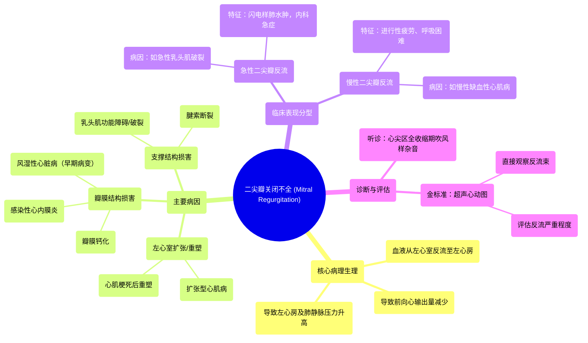

# 07 Mitral valve regurgitation and mitral valve prolapse NCLEX-RN Khan Academy

  <video controls preload="metadata" playsinline>
    <source src="https://helly.s3.bitiful.net/心血管学科/%E4%B8%93%E8%BE%91%2011%EF%BC%9A%E5%86%A0%E5%BF%83%E7%97%85%E4%B8%8E%E5%BF%83%E8%82%8C%E6%A2%97%E6%AD%BB%20%28Heart%20AttacksMI%29/07%20Mitral%20valve%20regurgitation%20and%20mitral%20valve%20prolapse%20NCLEX-RN%20Khan%20Academy.mp4" type="video/mp4">
    
您的浏览器不支持播放，请升级。

  </video>

::: tip ⚡️ 核心考点 (30s速读)
*   **核心考点**：二尖瓣关闭不全（Mitral Regurgitation， MR）是指左心室收缩时，二尖瓣无法完全闭合，导致部分血液从左心室反流回左心房。
*   **临床意义**：反流的血液会增加左心房和肺循环的压力，导致肺淤血、呼吸困难等症状。病因多样，包括左心室扩张、风湿热、感染性心内膜炎、乳头肌功能障碍等，可分为急性和慢性，处理方式不同。
:::

## 🧠 深度精讲

*   **概念1：二尖瓣关闭不全的病理生理**
    二尖瓣位于左心房和左心室之间，其正常功能是保证血液从左心房单向流入左心室。当二尖瓣因各种原因变得“松软无力”（floppy）或关闭不全时，左心室收缩射血时，部分血液会异常地反流回左心房。这会导致两个主要后果：1）前向射入主动脉供应全身的血液减少，引起疲劳、乏力；2）反流的血液使左心房压力升高，并向后传递至肺静脉和肺部毛细血管，引起肺淤血、肺水肿，导致呼吸困难、端坐呼吸等症状。

*   **概念2：主要病因与机制**
    1.  **左心室扩张/重塑**：如心肌梗死（MI）后心室重塑、扩张型心肌病（DCM）。心室腔扩大拉伸二尖瓣瓣环，导致瓣叶对合不良。
    2.  **瓣膜结构损害**：
        *   **风湿性心脏病**：是二尖瓣反流的早期病变（晚期为二尖瓣狭窄）。
        *   **感染性心内膜炎**：瓣膜上的赘生物妨碍瓣膜闭合。
        *   **瓣膜钙化**：影响瓣叶活动度。
    3.  **瓣膜支撑结构损害**：
        *   **乳头肌功能障碍或破裂**：常见于急性心肌梗死。
        *   **腱索断裂**：导致瓣叶连枷样运动，关闭不全。
        这些支撑结构（乳头肌、腱索）的损伤会直接导致二尖瓣瓣叶无法有效关闭。

*   **概念3：急性与慢性二尖瓣反流**
    *   **急性**（如急性乳头肌破裂）：心脏无代偿时间，左心房压力骤升，迅速导致**急性肺水肿（闪电样肺水肿）**，属于需要紧急处理的**内科急症**。
    *   **慢性**（如慢性缺血性心肌病所致左心室扩张）：心脏有较长时间通过代偿机制（如左心房、左心室扩大）适应，症状发展相对缓慢，表现为进行性加重的**疲劳、活动后气短**和慢性肺淤血。

*   **概念4：诊断与表现**
    *   **听诊**：心尖区可闻及全收缩期吹风样杂音。
    *   **超声心动图**：是确诊和评估反流严重程度的**金标准**。视频中显示，收缩期左心房内出现蓝色血流信号（反流束），直观证实了二尖瓣反流的存在。
    *   **症状与体征**：取决于急慢性。除上述呼吸困难和疲劳外，还可能出现心房颤动（因左心房扩大）、肺动脉高压等表现。

## 📚 双语术语表 (Terminology)
| 英文术语 | 中文翻译 | 定义/解释 |
| :--- | :--- | :--- |
| Mitral Regurgitation (MR) | 二尖瓣关闭不全（二尖瓣反流） | 左心室收缩时，二尖瓣未能完全闭合，血液反流回左心房。 |
| Left Ventricle (LV) | 左心室 | 心脏腔室之一，接收左心房血液并将其泵入主动脉。 |
| Left Atrium (LA) | 左心房 | 接收来自肺静脉的富氧血液，并将其送入左心室。 |
| Floppy Valve | 松软无力的瓣膜 | 描述二尖瓣脱垂或关闭不全时瓣叶组织异常、闭合不良的状态。 |
| Echocardiogram | 超声心动图 | 利用超声波检查心脏结构和功能的影像学技术，是诊断瓣膜病的主要工具。 |
| Dilated Cardiomyopathy | 扩张型心肌病 | 一种以心脏（尤其是左心室）扩大和收缩功能减弱为特征的心肌病。 |
| Rheumatic Fever | 风湿热 | A组链球菌感染后引起的自身免疫性疾病，可损害心脏瓣膜（风湿性心脏病）。 |
| Endocarditis | 心内膜炎 | 心脏内膜（尤其是瓣膜）的感染，常形成赘生物。 |
| Papillary Muscle | 乳头肌 | 心室壁上的锥形肌肉，通过腱索连接并牵拉房室瓣，防止其翻入心房。 |
| Chordae Tendineae | 腱索 | 连接乳头肌和房室瓣瓣叶的纤维条索，稳定瓣叶。 |
| Acute Pulmonary Edema | 急性肺水肿 | 液体快速积聚于肺间质和肺泡，导致严重呼吸窘迫，常见于急性左心衰。 |
| Chronic Coronary Artery Disease | 慢性冠状动脉疾病 | 冠状动脉粥样硬化导致心肌长期缺血、缺氧的疾病状态。 |

## 🗺️ 知识图谱

