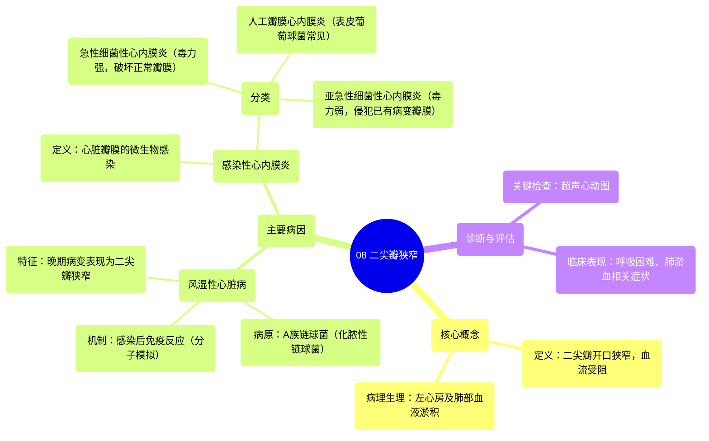

# 08 Mitral stenosis Circulatory System and Disease NCLEX-RN Khan Academy

  <video controls preload="metadata" playsinline>
    <source src="https://helly.s3.bitiful.net/心血管学科/%E4%B8%93%E8%BE%91%2011%EF%BC%9A%E5%86%A0%E5%BF%83%E7%97%85%E4%B8%8E%E5%BF%83%E8%82%8C%E6%A2%97%E6%AD%BB%20%28Heart%20AttacksMI%29/08%20Mitral%20stenosis%20Circulatory%20System%20and%20Disease%20NCLEX-RN%20Khan%20Academy.mp4" type="video/mp4">
    
您的浏览器不支持播放，请升级。

  </video>

::: tip ⚡️ 核心考点 (30s速读)
*   **核心考点**：二尖瓣狭窄是指二尖瓣（左心房与左心室之间的瓣膜）无法正常开启，导致左心房血液流入左心室受阻。
*   **临床意义**：血液在左心房和肺部淤积，导致肺淤血、呼吸困难。主要病因是风湿性心脏病（由A族链球菌感染后的免疫反应引起）和感染性心内膜炎。
:::

## 🧠 深度精讲

*   **概念1：二尖瓣狭窄的定义与血流动力学影响**
    二尖瓣是位于左心房和左心室之间的单向阀门。当它发生**狭窄**（变紧、无法充分打开）时，从左心房流入左心室的血液就会受阻。这会导致血液在左心房内淤积，压力升高。由于左心房接收来自肺静脉的血液，这种压力会逆向传递到肺部，引起**肺静脉高压**和**肺淤血**，这是患者出现呼吸困难、咳嗽等临床症状的根本原因。

*   **概念2：主要病因——风湿性心脏病**
    这是二尖瓣狭窄最常见的病因。其过程并非细菌直接攻击心脏，而是一种**免疫介导**的损伤：
    1.  **初始感染**：患者感染A族链球菌（通常是化脓性链球菌），引起链球菌性咽炎（“链球菌咽喉炎”）。
    2.  **免疫交叉反应（分子模拟）**：如果感染未得到及时有效治疗，约2-3周后，身体产生的抗体在攻击细菌的同时，由于细菌抗原与人体心脏瓣膜等组织的抗原结构相似，也会错误地攻击自身组织，引起**风湿热**。
    3.  **心脏损害**：反复的风湿热发作会导致心脏瓣膜（尤其是二尖瓣）的慢性炎症、增厚、粘连和钙化。早期可表现为**二尖瓣反流**，晚期则形成典型的**二尖瓣狭窄**。因此，二尖瓣狭窄是风湿性心脏病的特征性晚期表现。

*   **概念3：主要病因——感染性心内膜炎**
    这是心脏瓣膜（包括二尖瓣）的感染性炎症，可直接破坏瓣膜结构，导致狭窄或关闭不全。根据瓣膜基础情况和致病微生物毒力不同，可分为：
    1.  **急性细菌性心内膜炎**：由毒力强的细菌（如金黄色葡萄球菌）引起，可迅速破坏**正常瓣膜**，病情凶险。
    2.  **亚急性细菌性心内膜炎**：常由毒力较弱的细菌（如草绿色链球菌，口腔正常菌群）引起，多发生在**已有病变的瓣膜**（如风湿性病变）上。牙科操作等导致一过性菌血症是常见诱因。
    3.  **人工瓣膜心内膜炎**：瓣膜置换术后，人工瓣膜是感染的高危部位，特征性病原体是表皮葡萄球菌。

## 📚 双语术语表 (Terminology)
| 英文术语 | 中文翻译 | 定义/解释 |
| :--- | :--- | :--- |
| Mitral Stenosis | 二尖瓣狭窄 | 二尖瓣开口狭窄，阻碍血液从左心房流入左心室。 |
| Echocardiogram | 超声心动图 | 利用超声波检查心脏结构和功能的影像学技术。 |
| Left Atrium (LA) | 左心房 | 接收来自肺静脉氧合血的心腔。 |
| Left Ventricle (LV) | 左心室 | 将氧合血泵入主动脉供应全身的心腔。 |
| Mitral Valve | 二尖瓣 | 位于左心房和左心室之间的瓣膜。 |
| Rheumatic Fever | 风湿热 | A族链球菌感染后引发的自身免疫性疾病，可累及关节、皮肤、心脏等。 |
| Rheumatic Heart Disease | 风湿性心脏病 | 风湿热导致的心脏（尤其是瓣膜）永久性损害。 |
| Group A Streptococcus (GAS) | A族链球菌 | 一类细菌，其中化脓性链球菌是引起链球菌性咽炎和风湿热的病原体。 |
| Streptococcus pyogenes | 化脓性链球菌 | A族链球菌中的特定种类，是链球菌性咽炎的主要致病菌。 |
| Molecular Mimicry | 分子模拟 | 病原体抗原与宿主自身抗原相似，导致免疫系统错误攻击自身组织的机制。 |
| Infective Endocarditis | 感染性心内膜炎 | 心脏瓣膜或心内膜的微生物感染。 |
| Acute Bacterial Endocarditis | 急性细菌性心内膜炎 | 由高毒力细菌引起的快速进展、破坏性强的瓣膜感染。 |
| Subacute Bacterial Endocarditis | 亚急性细菌性心内膜炎 | 由低毒力细菌引起的缓慢进展的瓣膜感染，常发生于已有病变的瓣膜。 |
| Staphylococcus aureus | 金黄色葡萄球菌 | 一种常见细菌，可导致急性细菌性心内膜炎，毒力强。 |
| Streptococcus viridans | 草绿色链球菌 | 口腔正常菌群，是亚急性细菌性心内膜炎的常见病原体。 |
| Staphylococcus epidermidis | 表皮葡萄球菌 | 皮肤正常菌群，是人工瓣膜心内膜炎的特征性病原体。 |

## 🗺️ 知识图谱

