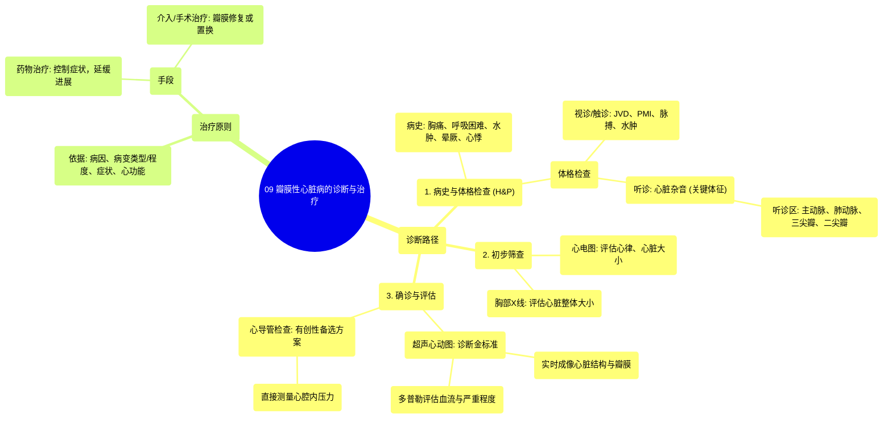

# 09 Valvular heart disease diagnosis and treatment NCLEX-RN Khan Academy

  <video controls preload="metadata" playsinline>
    <source src="https://helly.s3.bitiful.net/心血管学科/%E4%B8%93%E8%BE%91%2011%EF%BC%9A%E5%86%A0%E5%BF%83%E7%97%85%E4%B8%8E%E5%BF%83%E8%82%8C%E6%A2%97%E6%AD%BB%20%28Heart%20AttacksMI%29/09%20Valvular%20heart%20disease%20diagnosis%20and%20treatment%20NCLEX-RN%20Khan%20Academy.mp4" type="video/mp4">
    
您的浏览器不支持播放，请升级。

  </video>

::: tip ⚡️ 核心考点 (30s速读)
*   **核心考点**：瓣膜性心脏病的诊断始于详尽的病史与体格检查，确诊依赖于超声心动图（金标准），治疗决策需结合症状、病因及瓣膜病变的严重程度。
*   **临床意义**：掌握从病史、体征到确诊检查的临床路径，理解不同检查方法（如心电图、胸片、心超、心导管）的定位与价值，是评估和管理瓣膜性心脏病患者的基础。
:::

## 🧠 深度精讲

*   **诊断路径**：瓣膜性心脏病的诊断遵循“病史与体格检查 → 初步筛查 → 确诊与评估”的路径。任何优秀的诊断都始于一份良好的病史与体格检查，它能提供指向心脏问题的线索。
    *   **病史采集**：需重点询问有无胸痛、呼吸困难、运动不耐受、下肢水肿、慢性咳嗽、晕厥或心悸等非特异性但可能提示心脏问题的症状。
    *   **体格检查**：需系统性地寻找心脏疾病的体征，包括：
        *   **视诊与触诊**：颈静脉怒张（JVD，提示右心衰竭）、心尖搏动最强点（PMI）位置异常、脉搏不规律、外周水肿（尤其是足踝部）。
        *   **听诊**：寻找额外心音（如S3、S4奔马律）和**心脏杂音**。杂音是血液流经病变瓣膜时产生湍流的声音，是瓣膜病相对特异的体征。听诊需在四个关键区域进行：
            1.  **胸骨右缘上部**：主要对应主动脉瓣病变。
            2.  **胸骨左缘上部**：主要对应肺动脉瓣病变。
            3.  **胸骨左缘中下部**：主要对应三尖瓣病变，也可能为主动脉瓣。
            4.  **心尖区（锁骨中线第5肋间）**：主要对应二尖瓣病变。

*   **诊断性检查**：根据病史和体格检查的线索，选择进一步的检查以确认和量化诊断。
    *   **初步筛查**：
        *   **心电图**：用于评估心律（有无心律失常）和心脏腔室大小/肥厚情况，也可辅助诊断心肌梗死等。
        *   **胸部X线**：用于评估心脏整体大小（如心脏轮廓占胸腔比例>50%提示心脏肥大）和肺循环情况。
    *   **确诊与评估（金标准）**：
        *   **超声心动图**：利用声波实时成像心脏，是诊断瓣膜性心脏病的**金标准**。它可以：
            *   直接观察瓣膜的形态、结构和运动。
            *   评估心脏各腔室的大小和功能。
            *   利用多普勒技术显示血流方向、速度，从而**明确诊断并量化**瓣膜狭窄或关闭不全（反流）的严重程度（如轻度、中度、重度）。
    *   **有创检查（备选）**：
        *   **心导管检查**：当超声心动图结果不明确时考虑。通过动脉（如股动脉）插入导管至心脏，直接测量各心腔及跨瓣膜的压力差，提供精确的血流动力学数据以辅助诊断。因其有创性，通常非首选。

*   **治疗原则概述**：视频后半部分提及，治疗需个体化，取决于：
    *   **病因**：如风湿性、退行性、感染性等。
    *   **病变类型与严重程度**：是狭窄还是关闭不全，程度如何。
    *   **症状**：患者是否有心力衰竭、心绞痛、晕厥等症状。
    *   **心脏功能影响**：是否已导致左心室功能不全、心房扩大等。
    *   **治疗手段**：包括药物治疗（控制症状、延缓进展）和介入/手术治疗（瓣膜修复或置换，如经导管主动脉瓣置换术TAVR、外科手术）。

## 📚 双语术语表 (Terminology)
| 英文术语 | 中文翻译 | 定义/解释 |
| :--- | :--- | :--- |
| Valvular Heart Disease | 瓣膜性心脏病 | 心脏瓣膜（如二尖瓣、主动脉瓣）因结构或功能异常，导致狭窄或关闭不全（反流）的一类疾病。 |
| History and Physical (H&P) | 病史与体格检查 | 临床诊断的基础，通过询问病史和进行身体检查来收集信息。 |
| Murmur | 心脏杂音 | 血液流经心脏瓣膜、血管或心内异常通道时产生湍流所发出的异常声音。 |
| Echocardiography (Echo) | 超声心动图 | 利用超声波成像技术实时显示心脏结构和功能，是诊断瓣膜性心脏病的金标准。 |
| Cardiac Catheterization (Cardiac Cath) | 心导管检查 | 一种有创性诊断技术，将导管插入心脏或血管，用于测量压力、评估心脏功能或进行介入治疗。 |
| Stenosis | 狭窄 | 瓣膜开口变窄，阻碍血液正常向前流动。 |
| Regurgitation | 反流 / 关闭不全 | 瓣膜关闭不严，导致血液在心脏收缩或舒张时发生逆向泄漏。 |
| Jugular Venous Distension (JVD) | 颈静脉怒张 | 颈部静脉异常充盈或搏动，是右心压力增高或心力衰竭的体征。 |
| Point of Maximal Impulse (PMI) | 心尖搏动最强点 | 心脏收缩时心尖部冲击胸壁最明显的部位，其位置和性质可反映心脏大小和功能。 |
| Electrocardiogram (EKG/ECG) | 心电图 | 记录心脏电活动的检查，用于诊断心律失常、心肌缺血、心脏肥大等。 |

## 🗺️ 知识图谱

