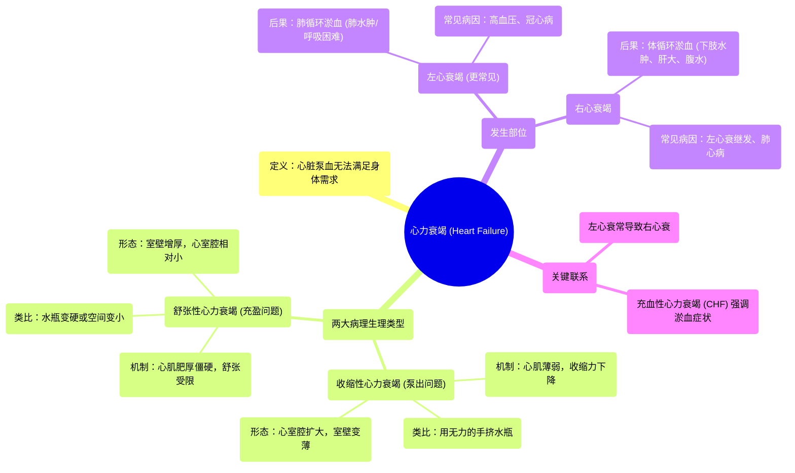

# 01 What is heart failure Circulatory System and Disease NCLEX-RN Khan Academy

  <video controls preload="metadata" playsinline>
    <source src="https://helly.s3.bitiful.net/心血管学科/%E4%B8%93%E8%BE%91%2012%EF%BC%9A%E5%BF%83%E5%8A%9B%E8%A1%B0%E7%AB%AD%E5%85%A8%E6%94%BB%E7%95%A5%20%28Heart%20Failure%29/01%20What%20is%20heart%20failure%20Circulatory%20System%20and%20Disease%20NCLEX-RN%20Khan%20Academy.mp4" type="video/mp4">
    
您的浏览器不支持播放，请升级。

  </video>

::: tip ⚡️ 核心考点 (30s速读)
*   **核心考点**：心力衰竭是心脏无法泵出足够血液以满足身体需求的病理状态。主要分为**收缩性心力衰竭**（泵血无力）和**舒张性心力衰竭**（充盈不足）。
*   **临床意义**：左心衰竭常导致**肺淤血**（如呼吸困难），右心衰竭常导致**体循环淤血**（如下肢水肿、腹水）。两者可单独或先后发生，左心衰常为始动因素。
:::

## 🧠 深度精讲

*   **概念1：心力衰竭的定义与生理基础**
    心脏的核心功能是作为一个泵，将含氧的动脉血（左心）泵向全身，并将回收的静脉血（右心）泵向肺部进行氧合。泵血量会根据身体活动需求动态调节。**心力衰竭**的本质就是心脏的泵血功能受损，无法满足机体代谢需求。

*   **概念2：收缩性心力衰竭**
    *   **机制**：问题出在“泵”的环节。心肌（尤其是心室肌）因病变（如心肌梗死）变得**薄弱、萎缩、收缩力下降**。想象一下用虚弱无力的手去挤压一个水瓶，很难把水挤出来。
    *   **心脏形态**：典型特征是心室腔**扩大**（试图容纳更多血液），但心室壁肌肉**变薄**。
    *   **结果**：每次心脏收缩（射血）时，泵出的血液量（每搏输出量）减少。

*   **概念3：舒张性心力衰竭**
    *   **机制**：问题出在“装”的环节。心肌因病变（如长期高血压）变得**肥厚、僵硬**，舒张能力下降。想象一下水瓶本身变硬了，或者瓶壁太厚导致内部空间变小，即使你用正常力气去挤，能装的水也少了，挤出的水自然也少。
    *   **心脏形态**：心室壁**增厚**，心室腔**相对变小或正常**。
    *   **结果**：心脏在舒张期**充盈血液的能力下降**，导致可供泵出的血液总量减少。

*   **概念4：左心衰竭与右心衰竭**
    *   **左心衰竭**：左心室泵血功能下降。血液无法有效泵出至全身，会**淤积在肺循环**，导致**肺淤血/肺水肿**，临床表现为呼吸困难、端坐呼吸、咳粉红色泡沫痰等。常由高血压、冠心病等引起。
    *   **右心衰竭**：右心室泵血功能下降。血液无法有效泵入肺循环，会**淤积在体循环**，导致**体循环淤血**，临床表现为下肢对称性凹陷性水肿、肝淤血肿大、颈静脉怒张、腹水等。
    *   **相互关系**：临床上**左心衰竭更常见**。长期左心衰导致肺循环压力增高，会加重右心负荷，最终可能引发**右心衰竭**，形成全心衰。

## 📚 双语术语表 (Terminology)
| 英文术语 | 中文翻译 | 定义/解释 |
| :--- | :--- | :--- |
| Heart Failure | 心力衰竭 | 心脏泵血功能无法满足机体代谢需求的临床综合征。 |
| Systolic Heart Failure | 收缩性心力衰竭 | 因心肌收缩力减弱导致心脏泵血能力下降的心衰类型。 |
| Diastolic Heart Failure | 舒张性心力衰竭 | 因心肌舒张功能受限、心室充盈不足导致泵血量减少的心衰类型。 |
| Systole | 收缩期 | 心动周期中心肌收缩、将血液泵出心室的阶段。 |
| Diastole | 舒张期 | 心动周期中心肌舒张、心室充盈血液的阶段。 |
| Left-sided Heart Failure | 左心衰竭 | 左心室泵血功能障碍，导致肺循环淤血。 |
| Right-sided Heart Failure | 右心衰竭 | 右心室泵血功能障碍，导致体循环淤血。 |
| Congestion / Congestive Heart Failure (CHF) | 淤血 / 充血性心力衰竭 | 因心衰导致血液在肺部或体循环中淤积的状态；CHF是心衰的常用同义词，尤其强调淤血症状。 |
| Ventricle | 心室 | 心脏下部的腔室，负责将血液泵出心脏（左心室泵向全身，右心室泵向肺部）。 |

## 🗺️ 知识图谱

