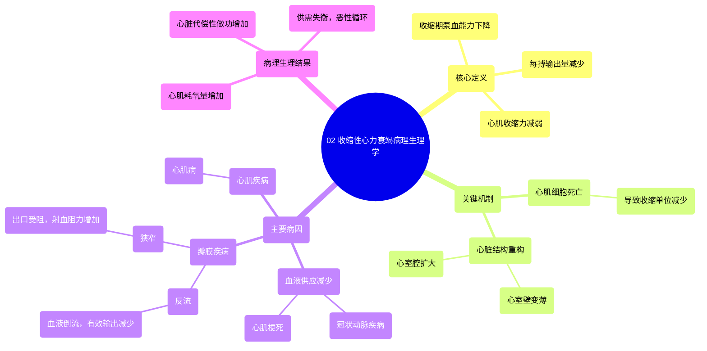

# 02 Systolic heart failure pathophysiology Circulatory System and Disease NCLEX-RN Khan Academy

  <video controls preload="metadata" playsinline>
    <source src="https://helly.s3.bitiful.net/心血管学科/%E4%B8%93%E8%BE%91%2012%EF%BC%9A%E5%BF%83%E5%8A%9B%E8%A1%B0%E7%AB%AD%E5%85%A8%E6%94%BB%E7%95%A5%20%28Heart%20Failure%29/02%20Systolic%20heart%20failure%20pathophysiology%20Circulatory%20System%20and%20Disease%20NCLEX-RN%20Khan%20Academy.mp4" type="video/mp4">
    
您的浏览器不支持播放，请升级。

  </video>

::: tip ⚡️ 核心考点 (30s速读)
*   **核心考点**：收缩性心力衰竭的核心是心脏泵血能力（心肌收缩力）下降，导致每搏输出量减少，无法满足身体需求。
*   **临床意义**：理解其病理生理是诊断和治疗的基础。主要病因包括心肌病、冠心病（心肌梗死）、瓣膜病（反流/狭窄），最终都导致心肌细胞死亡和心室重构（壁薄、腔大）。
:::

## 🧠 深度精讲

*   **概念1：收缩性心力衰竭的定义与机制**
    收缩性心力衰竭特指心脏在**收缩期**泵血功能受损。你可以把心脏想象成一个挤压的水瓶。健康的心脏能有力地“挤压”（收缩），将足量的血液泵出。但在收缩性心衰时，心肌的**收缩力**（或称**心肌收缩力**）显著减弱，就像用两根手指去捏瓶子，挤出的水量（**每搏输出量**）减少，无法满足全身器官的氧和营养需求。

*   **概念2：心肌细胞死亡与心脏重构**
    泵血无力的根本原因是**心肌细胞**的死亡。这些细胞像手拉手一样工作，共同收缩产生挤压力。当部分细胞因疾病死亡后，剩余细胞收缩效率降低，整体心肌变弱。长期发展会导致心脏**结构改变**：心室壁变薄、心室腔扩大，这是收缩性心衰的典型形态学特征。

*   **概念3：主要病因分类**
    导致心肌细胞死亡和收缩力下降的疾病主要分为四类：
    1.  **心肌病**：原发性心肌疾病，病因常不明，直接导致心肌衰弱。
    2.  **冠心病/心肌梗死**：**冠状动脉**因斑块狭窄或完全阻塞，导致心肌细胞缺血、缺氧而死亡。这是最常见的原因之一。
    3.  **瓣膜反流**：心脏瓣膜关闭不全（如二尖瓣反流），导致心室收缩时部分血液漏回心房，有效泵血量减少。心脏为代偿需更努力工作，加重负担。
    4.  **瓣膜狭窄**：心脏瓣膜开口狭窄（如主动脉瓣狭窄），心室收缩时需更大压力才能将血液泵出，同样导致心脏做功增加、心肌耗氧增多，最终失代偿。

## 📚 双语术语表 (Terminology)
| 英文术语 | 中文翻译 | 定义/解释 |
| :--- | :--- | :--- |
| Systolic Heart Failure | 收缩性心力衰竭 | 心脏收缩期泵血功能下降的心力衰竭类型。 |
| Systole | 收缩期 | 心动周期中心室收缩并将血液射出的阶段。 |
| Inotropy | 心肌收缩力 | 心肌纤维收缩的固有力量或强度。 |
| Stroke Volume | 每搏输出量 | 一次心搏中单侧心室射出的血液量。 |
| Cardiomyocyte | 心肌细胞 | 构成心肌组织的基本功能细胞。 |
| Cardiomyopathy | 心肌病 | 一组直接影响心肌结构和功能，导致泵血障碍的疾病。 |
| Coronary Artery Disease | 冠状动脉疾病 | 冠状动脉因粥样硬化斑块导致狭窄或阻塞的疾病。 |
| Regurgitation | 反流 | 心脏瓣膜关闭不全，导致血液在收缩期异常反向流动。 |
| Stenosis | 狭窄 | 心脏瓣膜开口异常狭小，阻碍血液正常流出。 |

## 🗺️ 知识图谱

