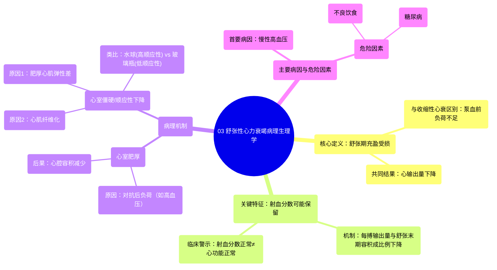

# 03 Diastolic heart failure pathophysiology Circulatory System and Disease NCLEX-RN Khan Academy

  <video controls preload="metadata" playsinline>
    <source src="https://helly.s3.bitiful.net/心血管学科/%E4%B8%93%E8%BE%91%2012%EF%BC%9A%E5%BF%83%E5%8A%9B%E8%A1%B0%E7%AB%AD%E5%85%A8%E6%94%BB%E7%95%A5%20%28Heart%20Failure%29/03%20Diastolic%20heart%20failure%20pathophysiology%20Circulatory%20System%20and%20Disease%20NCLEX-RN%20Khan%20Academy.mp4" type="video/mp4">
    
您的浏览器不支持播放，请升级。

  </video>

::: tip ⚡️ 核心考点 (30s速读)
*   **核心考点**：舒张性心力衰竭的核心病理生理是**心室充盈受损**，而非收缩功能障碍。其特点是心室壁**增厚（肥大）** 和/或**僵硬（顺应性降低）**，导致舒张期血液充盈不足，最终引起心输出量下降。
*   **临床意义**：舒张性心力衰竭常表现为**射血分数保留**，易被忽视。其主要病因是**慢性高血压**，导致心脏后负荷增加，引发代偿性心室肥厚和纤维化。理解其与收缩性心力衰竭在机制和表现上的区别，对诊断和治疗至关重要。
:::

## 🧠 深度精讲

*   **概念1：舒张性心力衰竭的定义与核心问题**
    舒张性心力衰竭是指心脏在舒张期（即心脏放松、血液充盈心室的阶段）无法有效充盈足够血液的一种心力衰竭类型。其根本问题在于**心室充盈受损**，而非收缩期泵血能力下降。这导致心脏每次搏动前可用的血液总量减少，因此即使收缩功能正常，泵出的血液（每搏输出量）也不足以满足身体需求。

*   **概念2：射血分数保留的“假象”**
    射血分数是评估心脏泵血功能的关键指标，计算公式为：**射血分数 = 每搏输出量 / 舒张末期容积**。
    *   在**收缩性心力衰竭**中，舒张末期容积可能正常甚至增大，但每搏输出量显著降低，导致射血分数下降。
    *   在**舒张性心力衰竭**中，**舒张末期容积**（可充盈的血液总量）和**每搏输出量**（实际泵出的血量）**同时降低**。因此，两者的比值（射血分数）可能仍保持在正常范围内，即出现“射血分数保留”的现象。但这绝不代表心脏功能正常，它仍然是心力衰竭的一种严重形式。

*   **概念3：舒张功能障碍的病理机制**
    导致心室充盈不足主要有两个相互关联的机制：
    1.  **心室肥厚**：为对抗长期升高的血压（后负荷），心室肌肉发生代偿性增厚（肥大）。增厚的肌肉**占据了心腔内的空间**，使得可用于充盈血液的腔室容积减小。
    2.  **心室僵硬/顺应性下降**：
        *   肥厚的心肌本身**弹性变差**，不易在舒张期伸展。
        *   更重要的是，心力衰竭过程中常伴随心肌细胞死亡和修复，形成**纤维化瘢痕组织**。这种纤维组织就像皮革一样，**顺应性极低**，无法被动扩张。
        *   **顺应性**是指组织在压力下被动扩张的能力。心脏顺应性降低，意味着在相同的充盈压力下，心脏能容纳的血液更少（就像往一个僵硬的水瓶里灌水，它不会像气球那样扩张，很快就满了）。

*   **概念4：主要病因与危险因素**
    舒张性心力衰竭通常是一种**继发性疾病**，由其他基础疾病引发。
    *   **首要病因：慢性高血压**。长期血管阻力增高，心脏需要更用力地收缩才能将血液泵出，导致心室壁压力负荷过重，从而引发心肌肥厚和纤维化。
    *   **重要危险因素**：任何能导致或加重高血压的因素，都是舒张性心力衰竭的危险因素，例如**不良饮食**（高盐、高脂）和**糖尿病**。

## 📚 双语术语表 (Terminology)
| 英文术语 | 中文翻译 | 定义/解释 |
| :--- | :--- | :--- |
| Diastolic Heart Failure | 舒张性心力衰竭 | 一种因心室在舒张期充盈不足而导致的心力衰竭，收缩功能可能正常。 |
| Systolic Heart Failure | 收缩性心力衰竭 | 一种因心室收缩无力、泵血功能下降而导致的心力衰竭。 |
| Diastole | 舒张期 | 心动周期中心脏放松、心室充盈血液的阶段。 |
| Ejection Fraction (EF) | 射血分数 | 每次心跳时，心室泵出的血液量占其舒张末期容积的百分比，是评估心脏泵血功能的关键指标。 |
| Preserved Ejection Fraction (HFpEF) | 射血分数保留 | 指射血分数在正常范围内（通常≥50%）的心力衰竭，常见于舒张性心力衰竭。 |
| Stroke Volume | 每搏输出量 | 一次心跳中，单侧心室泵出的血液量。 |
| End-Diastolic Volume (EDV) | 舒张末期容积 | 心室在舒张期结束时（即将收缩前）的血液容积。 |
| Hypertrophy | 肥厚/肥大 | 此处特指心肌细胞体积增大导致的心室壁增厚。 |
| Compliance | 顺应性 | 组织（如心室）在压力作用下被动扩张的能力。顺应性降低意味着僵硬。 |
| Fibrosis | 纤维化 | 指正常心肌组织被无弹性的瘢痕（纤维）组织替代的过程。 |
| Chronic Hypertension | 慢性高血压 | 长期持续的动脉血压升高状态，是舒张性心力衰竭的主要病因。 |

## 🗺️ 知识图谱

