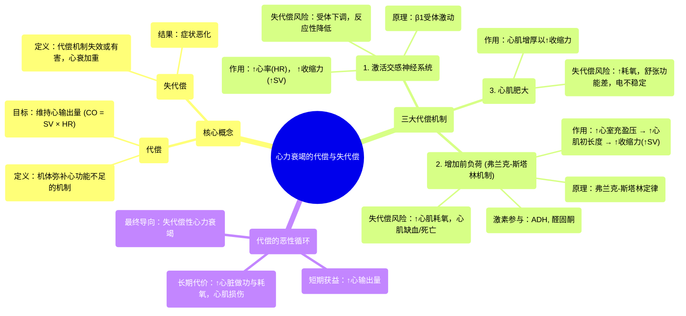

# 04 Compensation and decompensation in heart failure NCLEX-RN Khan Academy

  <video controls preload="metadata" playsinline>
    <source src="https://helly.s3.bitiful.net/心血管学科/%E4%B8%93%E8%BE%91%2012%EF%BC%9A%E5%BF%83%E5%8A%9B%E8%A1%B0%E7%AB%AD%E5%85%A8%E6%94%BB%E7%95%A5%20%28Heart%20Failure%29/04%20Compensation%20and%20decompensation%20in%20heart%20failure%20NCLEX-RN%20Khan%20Academy.mp4" type="video/mp4">
    
您的浏览器不支持播放，请升级。

  </video>

::: tip ⚡️ 核心考点 (30s速读)
*   **核心考点**：心力衰竭时，身体会通过激活交感神经系统、增加前负荷和心肌肥大三种主要方式进行“代偿”，以维持心输出量。但长期过度代偿会导致受体下调、心肌耗氧增加和细胞死亡，最终进入“失代偿”状态，症状恶化。
*   **临床意义**：理解代偿与失代偿的机制，是掌握心衰病理生理、评估病情进展和制定治疗方案（如使用β受体阻滞剂、利尿剂）的关键基础。
:::

## 🧠 深度精讲

*   **概念1：代偿与失代偿**
    *   **代偿**：指心脏功能下降时，心脏和身体通过一系列机制（如加快心率、增强收缩力）来弥补心输出量的不足，试图满足机体需求的过程。
    *   **失代偿**：当代偿机制长期、过度使用，最终失效或产生有害副作用时，心脏无法再维持足够的泵血功能，导致心力衰竭症状（如呼吸困难、水肿）明显加重的状态。

*   **概念2：三种主要代偿机制**
    所有代偿机制的最终目的都是增加**心输出量**（CO = 每搏输出量 × 心率）。
    1.  **激活交感神经系统**：
        *   **机制**：心输出量下降时，身体启动“战斗或逃跑”应激反应。交感神经释放儿茶酚胺（如肾上腺素），作用于心脏的β1受体，使心脏**收缩更有力**（增加每搏输出量）并**跳动更快**（增加心率）。
        *   **弊端（失代偿风险）**：长期过度激活会导致β受体**下调**（数量减少），心脏对交感刺激的反应性下降，犹如朋友被频繁求助后不再接电话。

    2.  **增加前负荷（弗兰克-斯塔林机制）**：
        *   **机制**：前负荷指心室在舒张末期（收缩前）的充盈压。身体通过释放**抗利尿激素**、**醛固酮**等激素促进水钠潴留，增加血容量，使心室充盈更多，心肌纤维被拉长。
        *   **原理（弗兰克-斯塔林定律）**：在一定范围内，心肌纤维初长度（与前负荷相关）越长，收缩力越强，每搏输出量越大（如同拉伸橡皮筋后回弹力量更大）。
        *   **弊端（失代偿风险）**：过度拉伸和增强收缩会**大幅增加心肌耗氧量**。若冠状动脉无法提供相应增加的血液供应，心肌细胞会因缺血缺氧而受损、死亡。

    3.  **心肌肥大**：
        *   **机制**：心脏长期负荷过重，心肌细胞体积增大，导致心脏壁增厚（向心性肥大），试图通过“增肌”来增强收缩力。
        *   **弊端（失代偿风险）**：肥大心肌的耗氧量进一步增加，且常伴随心肌纤维化、舒张功能减退和电活动不稳定，最终可能加速心功能恶化。

*   **概念3：代偿的恶性循环**
    上述代偿机制短期内可改善心输出量，但长期来看，它们**增加心脏做功和耗氧**，同时可能**直接损害心肌细胞**，并引发水钠潴留（前负荷增加）加重心脏负担。这些因素共同构成一个**恶性循环**，推动病情从代偿期向失代偿期发展。

## 📚 双语术语表 (Terminology)
| 英文术语 | 中文翻译 | 定义/解释 |
| :--- | :--- | :--- |
| Compensation | 代偿 | 心脏功能减退时，机体通过其他机制弥补不足，维持基本功能的状态。 |
| Decompensation | 失代偿 | 代偿机制失效或过度导致有害影响，心脏功能明显恶化，症状加重的状态。 |
| Cardiac Output (CO) | 心输出量 | 每分钟一侧心室泵出的血液总量，等于每搏输出量×心率。 |
| Stroke Volume (SV) | 每搏输出量 | 一次心搏中，一侧心室射出的血液量。 |
| Sympathetic Nervous System | 交感神经系统 | 自主神经系统的一部分，负责“战斗或逃跑”应激反应，可加快心率、增强心肌收缩力。 |
| Preload | 前负荷 | 心室在舒张末期（收缩开始前）的容量或压力，反映了心肌纤维的初长度。 |
| Frank-Starling Law | 弗兰克-斯塔林定律 | 在一定生理限度内，心室舒张末期容积（前负荷）越大，心肌收缩力越强，每搏输出量越多。 |
| Myocardial Hypertrophy | 心肌肥大 | 心肌细胞体积增大而非数量增多，导致心脏重量增加和室壁增厚。 |
| Down-regulation | 下调 | 长期暴露于高浓度激动剂（如儿茶酚胺）后，细胞表面受体数量减少的现象，导致组织对该激动剂的敏感性下降。 |
| Antidiuretic Hormone (ADH) | 抗利尿激素 | 由下丘脑合成、垂体释放的激素，促进肾脏集合管重吸收水，减少尿量，增加血容量。 |
| Aldosterone | 醛固酮 | 由肾上腺皮质分泌的激素，促进肾脏远曲小管和集合管重吸收钠、排出钾，同时伴有水的重吸收，增加血容量。 |

## 🗺️ 知识图谱

