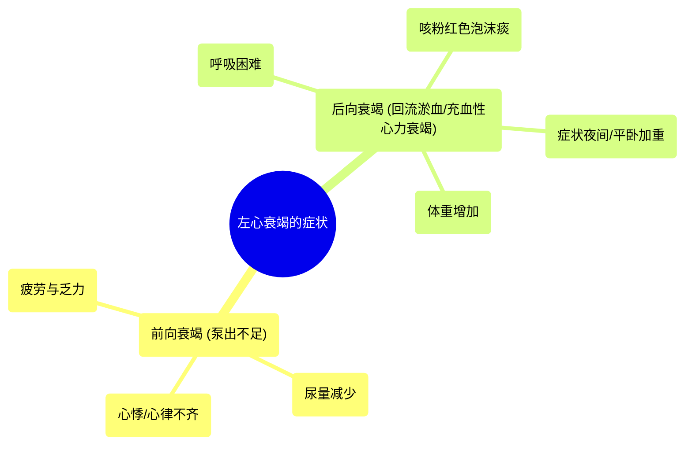

# 05 Symptoms of left sided heart failure Circulatory System and Disease NCLEX-RN Khan Academy

  <video controls preload="metadata" playsinline>
    <source src="https://helly.s3.bitiful.net/心血管学科/%E4%B8%93%E8%BE%91%2012%EF%BC%9A%E5%BF%83%E5%8A%9B%E8%A1%B0%E7%AB%AD%E5%85%A8%E6%94%BB%E7%95%A5%20%28Heart%20Failure%29/05%20Symptoms%20of%20left%20sided%20heart%20failure%20Circulatory%20System%20and%20Disease%20NCLEX-RN%20Khan%20Academy.mp4" type="video/mp4">
    
您的浏览器不支持播放，请升级。

  </video>

::: tip ⚡️ 核心考点 (30s速读)
*   **核心考点**：左心衰竭症状分为**前向衰竭**（泵出不足）与**后向衰竭**（接收/回流障碍）两大类。
*   **临床意义**：前向衰竭导致**全身供血/供氧不足**（疲劳、尿少、心悸）；后向衰竭导致**肺循环淤血**（呼吸困难、粉红泡沫痰、夜间加重、体重增加），即**充血性心力衰竭**的典型表现。
:::

## 🧠 深度精讲

*   **概念1：左心衰竭的定义与分类**
    左心衰竭指心脏左侧（左心房、左心室）泵血功能下降，无法将足够的富氧血液泵送至全身。根据病理生理机制，其症状可分为两大类：**前向衰竭**（Forward Failure）和**后向衰竭**（Backward Failure）。这种分类有助于系统理解临床表现。

*   **概念2：前向衰竭的症状（泵出不足）**
    由于心脏泵出到全身的血液减少，导致**全身器官灌注不足和代偿机制激活**。
    1.  **疲倦与疲劳**：核心症状。全身组织（尤其是肌肉）因得不到足够的氧气而产生能量不足。
    2.  **尿量减少**：身体感知到血容量不足，通过激活肾素-血管紧张素-醛固酮系统（RAAS）等机制，命令肾脏重吸收更多水分和钠，以减少尿液排出，试图增加血容量。
    3.  **心悸或心律不齐**：心脏的代偿机制。为了弥补每次搏动泵血量的减少，心脏尝试通过加快心率（心动过速）或增强收缩力来增加心输出量，患者可感到心慌、心跳沉重或不规则（如房颤）。

*   **概念3：后向衰竭的症状（回流淤血）**
    由于左心无法有效排空，血液在肺静脉和左心系统内“淤积”并向后逆流，导致**肺循环压力升高和液体渗出**，即**充血性心力衰竭**或**肺水肿**。
    1.  **呼吸困难**：肺淤血导致肺泡和肺间质充满液体，妨碍氧气交换，患者感到气短、呼吸费力。
    2.  **咳粉红色泡沫痰**：严重肺水肿时，液体渗入肺泡，与空气混合形成泡沫，痰中可能因含有少量红细胞而呈粉红色。
    3.  **夜间阵发性呼吸困难/端坐呼吸**：平卧时，下肢血液更容易回流至胸腔，加重肺淤血，导致夜间咳嗽、憋醒，需坐起才能缓解。
    4.  **体重增加**：由于全身性液体潴留（不仅限于肺部），患者体重会在短期内明显增加，是监测心衰体液状态的简易指标。

## 📚 双语术语表 (Terminology)
| 英文术语 | 中文翻译 | 定义/解释 |
| :--- | :--- | :--- |
| Left-sided heart failure | 左心衰竭 | 心脏左侧泵血功能不足，无法满足全身需求。 |
| Forward failure | 前向衰竭 | 指心脏泵出血液的能力不足，导致向前灌注全身的血量减少。 |
| Backward failure | 后向衰竭 | 指心脏接收或排空血液的能力不足，导致血液在后方（肺循环）淤积。 |
| Congestive heart failure (CHF) | 充血性心力衰竭 | 常用于描述后向衰竭导致的以液体淤积（充血）为特征的心衰状态。 |
| Pulmonary edema | 肺水肿 | 液体异常积聚在肺间质和肺泡内，通常由左心衰竭导致肺静脉压力升高引起。 |
| Fatigue | 疲劳 | 因组织供氧不足导致的极度疲倦感。 |
| Palpitations | 心悸 | 患者自觉心跳过快、过重或不规则的感觉。 |
| Arrhythmia | 心律不齐 | 心脏跳动的节律或频率异常。 |
| Alveoli | 肺泡 | 肺部进行气体交换的微小气囊。 |
| Decompensated heart failure | 失代偿性心力衰竭 | 心脏代偿机制失效，症状加重的严重心衰阶段。 |

## 🗺️ 知识图谱

