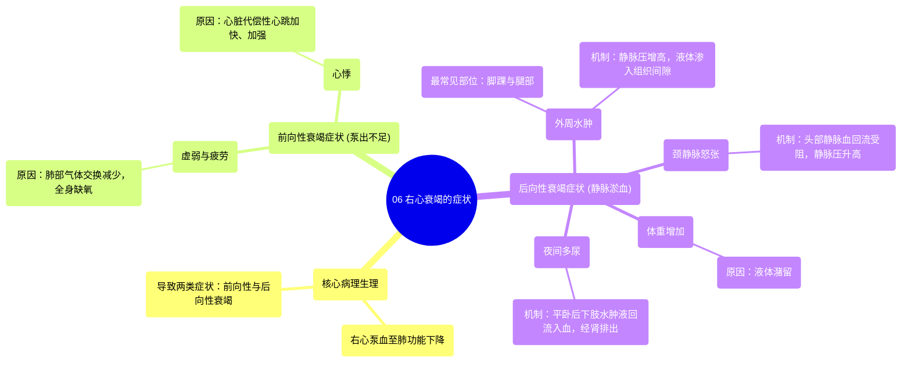

# 06 Symptoms of right sided heart failure Circulatory System and Disease NCLEX-RN Khan Academy

  <video controls preload="metadata" playsinline>
    <source src="https://helly.s3.bitiful.net/心血管学科/%E4%B8%93%E8%BE%91%2012%EF%BC%9A%E5%BF%83%E5%8A%9B%E8%A1%B0%E7%AB%AD%E5%85%A8%E6%94%BB%E7%95%A5%20%28Heart%20Failure%29/06%20Symptoms%20of%20right%20sided%20heart%20failure%20Circulatory%20System%20and%20Disease%20NCLEX-RN%20Khan%20Academy.mp4" type="video/mp4">
    
您的浏览器不支持播放，请升级。

  </video>

::: tip ⚡️ 核心考点 (30s速读)
*   **核心考点**：右心衰竭的症状源于右心室泵血至肺部的功能受损，导致**前向性衰竭**（泵出不足）和**后向性衰竭**（血液淤积）两类症状。
*   **临床意义**：与左心衰竭（淤血在肺）不同，右心衰竭的淤血主要发生在**体循环静脉系统**，典型表现为**下肢水肿、颈静脉怒张**和**夜间多尿**，而前向性衰竭则导致**疲劳、心悸**。
:::

## 🧠 深度精讲

*   **概念1：右心衰竭的病理生理基础**
    右心负责接收来自全身的**静脉血**（低氧、高二氧化碳），并将其泵入肺部进行气体交换。当右心衰竭时，其泵血能力下降，导致两个核心问题：1) **前向性衰竭**：泵入肺部的血量减少，影响氧合；2) **后向性衰竭**：血液在体循环静脉系统内淤积。

*   **概念2：前向性衰竭的症状**
    由于泵入肺部的血量减少，导致**氧气-二氧化碳交换效率下降**，身体处于相对缺氧状态。这引发：
    1.  **虚弱与疲劳**：组织供氧不足的直接结果。
    2.  **心悸**：心脏为代偿泵血不足，试图通过**增强收缩力**和**加快心率**来弥补，患者可感觉到心跳沉重或加速。

*   **概念3：后向性衰竭的症状**
    由于右心无法有效接收来自体循环的静脉血，导致血液在静脉系统内**淤积**，静脉压升高，液体渗出到组织间隙，形成**水肿**。淤血部位取决于重力等因素：
    1.  **外周水肿**：最常见于身体最低处，即**脚踝和腿部**，表现为凹陷性水肿。
    2.  **颈静脉怒张**：头部静脉血回流受阻，导致**颈静脉**压力增高、 visibly 充盈扩张，是评估右心压力升高的关键体征。
    3.  **体重增加**：由于液体潴留所致。
    4.  **夜间多尿**：患者躺下后，下肢淤积的液体因重力作用**回流至血液循环**，被肾脏滤过排出，导致夜尿增多。这与左心衰竭时尿量减少形成对比。

## 📚 双语术语表 (Terminology)
| 英文术语 | 中文翻译 | 定义/解释 |
| :--- | :--- | :--- |
| Right-sided heart failure | 右心衰竭 | 心脏右侧（右心房、右心室）泵血功能受损，无法将静脉血有效泵入肺循环的病理状态。 |
| Deoxygenated blood | 静脉血 / 去氧血 | 已被身体组织利用、含氧量较低、二氧化碳含量较高的血液。 |
| Forward failure | 前向性衰竭 | 指心脏泵血能力下降，导致向前方器官（对右心而言是肺）输送血液不足所引起的症状群。 |
| Backward failure | 后向性衰竭 | 指心脏接收回流血液的能力下降，导致血液在后方静脉系统淤积所引起的症状群（如水肿）。 |
| Palpitations | 心悸 | 患者自觉心跳不适、过速、过重或不规则的感觉。 |
| Congestion | 淤血 / 充血 | 血液在血管或器官中异常积聚的状态。 |
| Edema | 水肿 | 组织间隙内液体异常积聚。右心衰竭常导致**外周性水肿**。 |
| Jugular vein distention | 颈静脉怒张 | 颈静脉因压力增高而 visibly 充盈、扩张，是右心压力升高的重要体征。 |
| Nocturia | 夜间多尿 | 夜间排尿次数和尿量异常增多。在右心衰竭中，与体位改变后体液重新分布有关。 |

## 🗺️ 知识图谱

