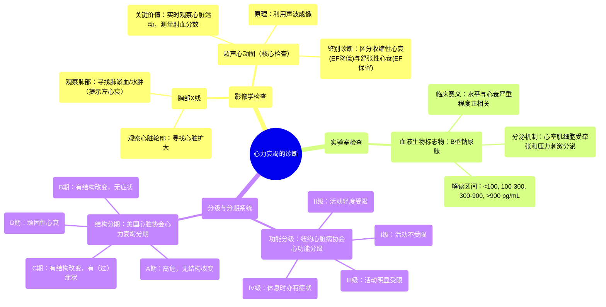

# 07 Heart failure diagnosis Circulatory System and Disease NCLEX-RN Khan Academy

  <video controls preload="metadata" playsinline>
    <source src="https://helly.s3.bitiful.net/心血管学科/%E4%B8%93%E8%BE%91%2012%EF%BC%9A%E5%BF%83%E5%8A%9B%E8%A1%B0%E7%AB%AD%E5%85%A8%E6%94%BB%E7%95%A5%20%28Heart%20Failure%29/07%20Heart%20failure%20diagnosis%20Circulatory%20System%20and%20Disease%20NCLEX-RN%20Khan%20Academy.mp4" type="video/mp4">
    
您的浏览器不支持播放，请升级。

  </video>

::: tip ⚡️ 核心考点 (30s速读)
*   **核心考点**：心力衰竭的诊断依赖于影像学检查（胸部X线、超声心动图）、血液生物标志物（BNP）和功能分级系统（NYHA分级、AHA分期）的综合评估。
*   **临床意义**：诊断目的不仅是确认心衰，更重要的是评估其类型（收缩性/舒张性）、严重程度、病因及对治疗的反应，以指导个体化治疗。
:::

## 🧠 深度精讲

*   **概念1：影像学诊断**
    *   **胸部X线**：利用电磁辐射成像。主要观察两点：1) **心脏轮廓**：寻找**心脏扩大**的迹象，这在收缩性和舒张性心力衰竭中均可发生。2) **肺部**：寻找**肺淤血**或**肺水肿**的迹象（表现为肺部阴影增加），这提示左心衰竭及严重程度。
    *   **超声心动图**：利用**声波**（而非辐射）成像，是诊断心衰的**核心工具**。其价值在于：1) **可视化心脏运动**：提供实时视频，直观评估心脏结构和功能。2) **测量射血分数**：这是区分**收缩性心力衰竭**（射血分数降低）和**舒张性心力衰竭**（射血分数保留）的关键指标。

*   **概念2：血液生物标志物 - B型钠尿肽**
    *   **来源与机制**：BNP主要由心脏**心室**的肌细胞在受到**过度牵张**和**压力增高**（如前负荷增加）时分泌。心衰越重，心室牵张越明显，BNP水平越高。
    *   **临床解读**：通过测量血液中BNP水平辅助诊断和评估心衰严重程度：
        *   <100 pg/mL：通常提示无心衰。
        *   100-300 pg/mL：可能提示心衰。
        *   300-900 pg/mL：提示轻度至中度心衰。
        *   >900 pg/mL：提示重度心衰。

*   **概念3：功能与结构分级系统**
    *   **纽约心脏病协会心功能分级**：基于**症状**对体力活动的限制程度进行分级，属于**主观功能评估**。
        *   **I级**：体力活动不受限，日常活动不引起症状。
        *   **II级**：体力活动轻度受限，休息时无症状，但日常活动会引起症状。
        *   **III级**：体力活动明显受限，休息时无症状，但低于日常的活动即可引起症状。
        *   **IV级**：不能从事任何体力活动，休息时也有症状，活动后加重。
    *   **美国心脏协会心力衰竭分期**：基于**心脏结构损害**的进展进行分期，属于**客观结构评估**。
        *   **A期**：有心衰风险（如高血压、糖尿病），但无心脏结构改变或症状。
        *   **B期**：已出现心脏结构性改变（如左室肥厚、射血分数降低），但尚无心力衰竭症状。
        *   **C期**：既往或目前有心力衰竭症状，并伴有心脏结构性病变。
        *   **D期**：顽固性心衰，需要特殊干预（如高级药物治疗、器械支持或移植）。

## 📚 双语术语表 (Terminology)
| 英文术语 | 中文翻译 | 定义/解释 |
| :--- | :--- | :--- |
| Heart Failure | 心力衰竭 | 心脏泵血功能无法满足机体代谢需求的临床综合征。 |
| Chest X-ray | 胸部X线 | 利用X射线对胸部和心脏、肺部进行成像的检查。 |
| Cardiomegaly | 心脏扩大 | 心脏体积异常增大，在X线上表现为心影增大。 |
| Pulmonary Congestion/Edema | 肺淤血/肺水肿 | 左心衰竭导致肺静脉压力增高，液体渗入肺间质和肺泡。 |
| Echocardiogram | 超声心动图 | 利用超声波检查心脏结构和功能的无创影像学技术。 |
| Ejection Fraction (EF) | 射血分数 | 每次心跳时心室泵出的血液占心室舒张末期容积的百分比，是评估心脏泵血功能的关键指标。 |
| Systolic Heart Failure | 收缩性心力衰竭 | 以心肌收缩力减弱、射血分数降低为特征的心力衰竭。 |
| Diastolic Heart Failure | 舒张性心力衰竭 | 以心室舒张功能受损、充盈受限为特征，但射血分数可能正常或保留的心力衰竭。 |
| B-type Natriuretic Peptide (BNP) | B型钠尿肽 | 由心室肌细胞分泌的一种肽类激素，其血液水平随心室壁压力和牵张增加而升高，是诊断和评估心衰严重程度的重要生物标志物。 |
| New York Heart Association (NYHA) Classification | 纽约心脏病协会心功能分级 | 根据患者体力活动受限程度和症状进行的心功能主观分级系统（I-IV级）。 |
| American Heart Association (AHA) Stages | 美国心脏协会心力衰竭分期 | 根据心脏结构性病变和症状的发展进行的心力衰竭客观分期系统（A-D期）。 |

## 🗺️ 知识图谱

