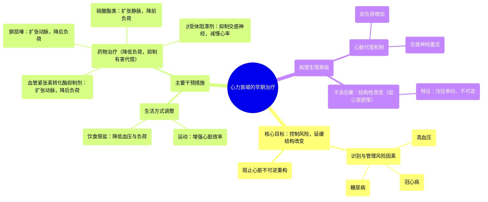

# 08 Heart failure treatment - Early stages _ Circulatory System and Disease _ NCLEX-RN _ Khan Academy

  <video controls preload="metadata" playsinline>
    <source src="https://helly.s3.bitiful.net/心血管学科/%E4%B8%93%E8%BE%91%2012%EF%BC%9A%E5%BF%83%E5%8A%9B%E8%A1%B0%E7%AB%AD%E5%85%A8%E6%94%BB%E7%95%A5%20%28Heart%20Failure%29/08%20Heart%20failure%20treatment%20-%20Early%20stages%20_%20Circulatory%20System%20and%20Disease%20_%20NCLEX-RN%20_%20Khan%20Academy.mp4" type="video/mp4">
    
您的浏览器不支持播放，请升级。

  </video>

::: tip ⚡️ 核心考点 (30s速读)
*   **核心考点**：心力衰竭早期治疗的核心目标是**控制风险因素、延缓或逆转心脏结构性改变**，而非直接处理心衰症状。
*   **临床意义**：早期干预（生活方式调整+药物）可有效降低血压、减轻心脏负荷，从而**阻止或延缓**心脏进入不可逆的结构重塑和功能恶化阶段。
:::

## 🧠 深度精讲

*   **心力衰竭的早期阶段特征**：患者可能没有明显症状，仅表现为**风险因素**的存在，如高血压、冠心病、糖尿病等。这些是未来可能发展为心力衰竭或导致已有心衰恶化的“危险信号”。此时患者日常生活能力通常不受影响。
*   **早期干预的紧迫性**：心脏的结构性改变（如心室肥厚、扩张）往往是**单向的、不可逆的**，一旦发生，倾向于持续恶化。因此，在出现明显症状前进行干预至关重要。
*   **早期治疗策略**：
    1.  **生活方式干预**：
        *   **运动**：增强心血管适能，提高心脏泵血效率。
        *   **饮食调整（尤其限盐）**：降低血压，减轻心脏后负荷，减少心脏为代偿而发生的结构性改变风险。
    2.  **药物治疗（目标：降低心脏负荷，抑制有害代偿）**：
        *   **血管紧张素转化酶抑制剂**：扩张血管（动脉为主），降低血压，使心脏更易泵血。
        *   **肼屈嗪与硝酸酯类药物**：
            *   肼屈嗪：扩张动脉和小动脉，降低后负荷。
            *   硝酸酯类：主要扩张静脉，降低静脉压和前负荷，限制因前负荷增加导致的心脏重构。
        *   **β受体阻滞剂**：阻断心脏的β受体，抑制交感神经系统过度激活，从而减慢心率、降低心肌收缩力，限制因交感神经兴奋导致的有害重构。

## 📚 双语术语表 (Terminology)

| 英文术语 | 中文翻译 | 定义/解释 |
| :--- | :--- | :--- |
| Heart failure (early stages) | 心力衰竭（早期阶段） | 心脏泵血功能已受损，但患者可能无症状，仅存在风险因素的阶段。 |
| Risk factors | 风险因素 | 增加疾病发生可能性的条件或行为，如高血压、糖尿病。 |
| Structural changes | 结构性改变 | 心脏肌肉、心室大小或形状发生的物理变化，如心室肥厚或扩张。 |
| Unidirectional / One-way street | 单向的 / 单行道 | 形容心脏结构性改变通常不可逆转，只会进展。 |
| Compensation | 代偿 | 心脏为维持输出量而启动的机制（如增加心率、心肌肥厚），长期有害。 |
| Exercise | 运动 | 推荐的生活方式干预，旨在提高心脏效率和心血管健康。 |
| Salt intake reduction | 减少盐摄入 | 重要的饮食调整，有助于降低血压，减轻心脏负荷。 |
| ACE inhibitors | 血管紧张素转化酶抑制剂 | 一类通过扩张血管来降低血压和心脏后负荷的药物。 |
| Vasodilator | 血管扩张剂 | 能使血管松弛、管腔扩大的药物。 |
| Hydralazine | 肼屈嗪 | 主要扩张动脉和小动脉的血管扩张剂，降低后负荷。 |
| Nitrates | 硝酸酯类药物 | 主要扩张静脉的血管扩张剂，降低前负荷。 |
| Preload | 前负荷 | 心脏舒张末期心室内的血容量（压力），是影响心输出量的因素之一。 |
| Beta blockers | β受体阻滞剂 | 通过阻断β肾上腺素能受体来减慢心率、降低心肌收缩力的药物。 |
| Sympathetic nervous system | 交感神经系统 | 身体的“战斗或逃跑”反应系统，激活时会增加心率和心肌收缩力。 |

## 🗺️ 知识图谱

