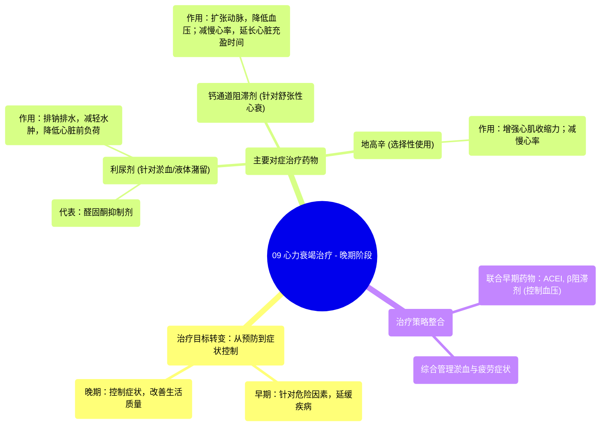

# 09 Heart failure treatment - Late stages Circulatory System and Disease NCLEX-RN Khan Academy

  <video controls preload="metadata" playsinline>
    <source src="https://helly.s3.bitiful.net/心血管学科/%E4%B8%93%E8%BE%91%2012%EF%BC%9A%E5%BF%83%E5%8A%9B%E8%A1%B0%E7%AB%AD%E5%85%A8%E6%94%BB%E7%95%A5%20%28Heart%20Failure%29/09%20Heart%20failure%20treatment%20-%20Late%20stages%20Circulatory%20System%20and%20Disease%20NCLEX-RN%20Khan%20Academy.mp4" type="video/mp4">
    
您的浏览器不支持播放，请升级。

  </video>

::: tip ⚡️ 核心考点 (30s速读)
*   **核心考点**：心力衰竭晚期治疗的核心目标是**控制已出现的症状**，特别是**淤血（液体潴留）** 和**疲劳**，以改善患者生活质量。
*   **临床意义**：治疗策略从早期的“预防/延缓”转变为晚期的“对症管理”，主要药物包括**利尿剂**（减轻淤血）、**钙通道阻滞剂**（舒张性心衰）和**地高辛**（特定情况），同时早期药物（如ACEI/β阻滞剂）仍可能用于血压控制。
:::

## 🧠 深度精讲

*   **心力衰竭晚期治疗的目标转变**：在心力衰竭的早期阶段，治疗侧重于控制高血压、冠心病等危险因素，以延缓或阻止心衰症状的出现。然而，当疾病进入晚期，患者已经出现明显的症状（如呼吸困难、疲劳）时，治疗目标就转变为**直接管理和控制这些症状**，以减轻患者痛苦并提高其生活质量。

*   **针对淤血（液体潴留）的治疗**：这是晚期心衰治疗的首要任务之一。
    *   **主要药物**：**利尿剂**。其作用是帮助肾脏排出体内多余的钠和水，从而减少总体液量和血容量。
    *   **双重获益**：
        1.  **缓解症状**：直接减轻因液体过多引起的症状，例如肺部积液导致的**呼吸短促（肺水肿）**、下肢水肿等。
        2.  **降低心脏负荷**：减少血容量可以降低血管内的压力（即降低血压），从而减轻心脏泵血时需要克服的阻力，有助于防止心功能进一步恶化。
    *   **代表药物**：**醛固酮抑制剂/拮抗剂**。醛固酮是一种促使肾脏重吸收钠和水的激素。抑制其作用，就能促进钠和水的排泄，有效减少液体潴留。

*   **针对舒张性心力衰竭的特殊治疗**：
    *   **适用情况**：主要用于**舒张性心力衰竭**，即心脏肌肉变僵硬，在舒张期无法充分放松以容纳足够血液的情况。
    *   **主要药物**：**钙通道阻滞剂**。
    *   **作用机制**：
        1.  **扩张动脉**：阻断血管平滑肌细胞的钙通道，使动脉血管放松、扩张，从而**降低动脉血压**，让心脏更容易将血液泵出去。
        2.  **减慢心率、减弱心肌收缩力**：阻断心肌细胞的钙通道，可以**降低心率**并轻度减弱心肌收缩力。这为僵硬的心脏提供了更长的舒张期来充盈血液，是改善舒张功能的关键。

*   **其他晚期治疗药物**：
    *   **地高辛**：目前应用已减少，主要用于特定患者。
        *   **正性肌力作用**：增强心肌收缩力，使心脏泵血更有力。
        *   **负性频率作用**：减慢心率。尤其适用于合并快速性心律失常（如房颤）且心率控制不佳的心衰患者。
    *   **早期药物的延续使用**：在早期阶段使用的**血管紧张素转换酶抑制剂**和**β受体阻滞剂**，在晚期阶段仍可能继续使用，以帮助控制血压、减轻心脏负荷，并改善长期预后。

## 📚 双语术语表 (Terminology)
| 英文术语 | 中文翻译 | 定义/解释 |
| :--- | :--- | :--- |
| Heart Failure (Late Stages) | 心力衰竭（晚期） | 心力衰竭症状已明显出现，影响生活质量的阶段。 |
| Congestion / Fluid Buildup | 淤血 / 液体潴留 | 由于心脏泵血功能下降，导致液体在肺部（肺水肿）或身体其他组织（如腿部）积聚。 |
| Diuretics | 利尿剂 | 一类促进肾脏排出钠和水的药物，用于减轻心衰患者的液体潴留和水肿。 |
| Aldosterone Inhibitors/Antagonists | 醛固酮抑制剂/拮抗剂 | 一类通过阻断醛固酮激素作用来促进排钠利尿的利尿剂。 |
| Diastolic Heart Failure | 舒张性心力衰竭 | 一种心力衰竭类型，心脏肌肉舒张功能受损，无法在舒张期充分放松以容纳足够血液。 |
| Calcium Channel Blockers (CCBs) | 钙通道阻滞剂 | 一类通过阻断细胞膜上的钙离子通道来发挥作用的药物，用于舒张性心衰时可扩张血管、减慢心率。 |
| Digoxin | 地高辛 | 一种强心苷类药物，具有增强心肌收缩力和减慢心率的作用，用于特定心衰患者。 |
| Fatigue | 疲劳 | 心衰的常见症状，由于心脏泵出的血液无法满足身体组织代谢需求所致。 |

## 🗺️ 知识图谱

