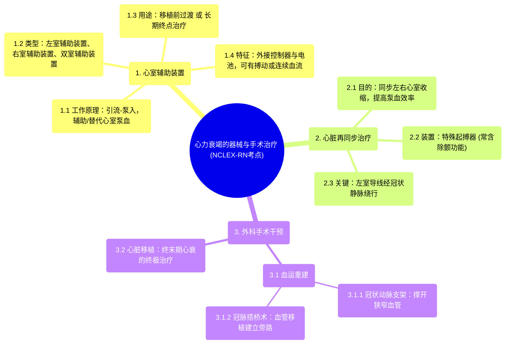

# 10 Heart failure treatment - Devices and surgery NCLEX-RN Khan Academy

  <video controls preload="metadata" playsinline>
    <source src="https://helly.s3.bitiful.net/心血管学科/%E4%B8%93%E8%BE%91%2012%EF%BC%9A%E5%BF%83%E5%8A%9B%E8%A1%B0%E7%AB%AD%E5%85%A8%E6%94%BB%E7%95%A5%20%28Heart%20Failure%29/10%20Heart%20failure%20treatment%20-%20Devices%20and%20surgery%20NCLEX-RN%20Khan%20Academy.mp4" type="video/mp4">
    
您的浏览器不支持播放，请升级。

  </video>

::: tip ⚡️ 核心考点 (30s速读)
*   **核心考点**：当药物和生活方式调整不足以控制终末期心力衰竭症状时，需考虑器械植入或外科手术干预。
*   **临床意义**：掌握不同器械（如心室辅助装置、心脏再同步治疗）和手术（如支架、搭桥、移植）的原理、适应症和区别，是评估和管理重症心衰患者的关键。
:::

## 🧠 深度精讲

*   **概念1：心室辅助装置**
    *   **定义**：一种植入式机械泵，用于辅助或完全替代衰竭心室的泵血功能。根据辅助的心室不同，可分为左心室辅助装置、右心室辅助装置和双心室辅助装置。
    *   **工作原理**：通过一根导管将血液从心室引出，经体外或体内的泵加压后，通过另一根导管泵入动脉系统，从而绕过或辅助了衰竭的心室。
    *   **关键特征**：
        1.  **连接方式**：通常通过腹部的小孔连接外部控制单元和电池。
        2.  **血流模式**：可分为搏动性泵（模拟心脏节律）和连续性血流泵（无脉搏）。
        3.  **主要用途**：作为心脏移植前的“桥梁”或无法移植患者的长期治疗（“终点治疗”）。

*   **概念2：心脏再同步治疗**
    *   **定义**：一种通过植入特殊起搏器（常含除颤功能），同步刺激左右心室收缩，以改善心脏泵血效率的治疗方法。
    *   **工作原理**：装置通过导线（电极）同时向左右心室发送电信号，纠正心室间或心室内不同步收缩的问题，使心脏协调、高效地泵血。
    *   **关键特征**：
        1.  **导线路径**：左心室导线需经冠状静脉窦绕行至心脏外侧壁。
        2.  **附加功能**：常整合植入式心律转复除颤器功能，可在发生致命性快速心律失常时进行电击复律。

*   **概念3：外科手术干预**
    *   **定义**：通过外科手段直接改善心脏血供或替换心脏本身。
    *   **主要类型**：
        1.  **冠状动脉支架植入术**：通过球囊扩张并植入支架，撑开狭窄的冠状动脉，恢复血流。
        2.  **冠状动脉旁路移植术**：取用患者自身其他部位的血管（如乳内动脉、大隐静脉），在堵塞的冠状动脉近端和远端之间搭建“桥梁”，建立新的血流通道。
        3.  **心脏移植**：将患者的衰竭心脏整体移除，替换为健康的供体心脏。这是终末期心衰的终极外科治疗方案，但受限于供体来源和严格的适应症。

## 📚 双语术语表 (Terminology)
| 英文术语 | 中文翻译 | 定义/解释 |
| :--- | :--- | :--- |
| Ventricular Assist Device (VAD) | 心室辅助装置 | 辅助或替代衰竭心室泵血功能的机械装置。 |
| Left VAD (LVAD) | 左心室辅助装置 | 专门辅助左心室的VAD。 |
| Right VAD (RVAD) | 右心室辅助装置 | 专门辅助右心室的VAD。 |
| BIVAD | 双心室辅助装置 | 同时辅助左、右两个心室的VAD。 |
| Cardiac Resynchronization Therapy (CRT) | 心脏再同步治疗 | 通过起搏器同步左右心室收缩，改善心衰患者心脏功能的治疗。 |
| Pacemaker | 起搏器 | 产生电脉冲刺激心脏以维持或调节心率的植入式装置。 |
| Implantable Cardioverter Defibrillator (ICD) | 植入式心律转复除颤器 | 能监测心率并在检测到致命性快速心律失常时自动电击治疗的植入式装置。 |
| Lead | 电极导线 | 连接起搏器/ICD与心脏，用于传递电信号的绝缘电线。 |
| Stent | 支架 | 植入狭窄血管内以保持其通畅的网状小管。 |
| Coronary Artery Bypass Graft (CABG) | 冠状动脉旁路移植术 | 俗称“搭桥手术”，使用自身血管为堵塞的冠状动脉建立新的血流旁路。 |
| Heart Transplantation | 心脏移植 | 用健康的供体心脏替换患者衰竭心脏的外科手术。 |
| End-stage Heart Failure | 终末期心力衰竭 | 心力衰竭的最严重阶段，常规治疗无效，需考虑高级疗法如VAD或移植。 |

## 🗺️ 知识图谱

