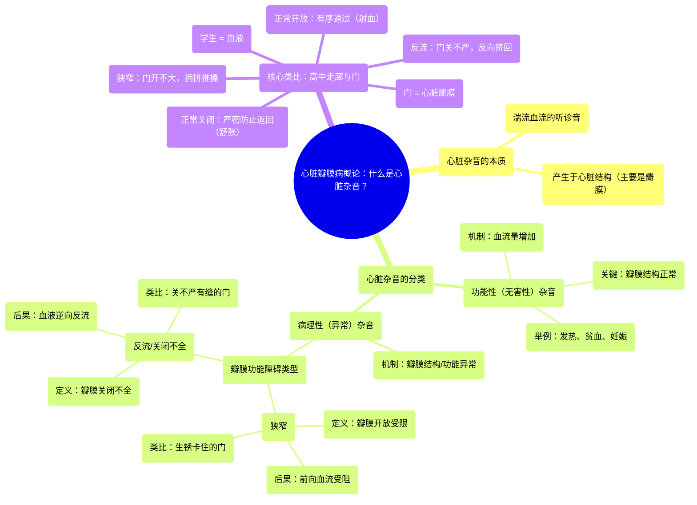

# 01 What is valvular heart disease Circulatory System and Disease NCLEX-RN Khan Academy

  <video controls preload="metadata" playsinline>
    <source src="https://helly.s3.bitiful.net/心血管学科/%E4%B8%93%E8%BE%91%2013%EF%BC%9A%E5%BF%83%E8%84%8F%E7%93%A3%E8%86%9C%E7%97%85%20%28Heart%20Valve%20Diseases%29/01%20What%20is%20valvular%20heart%20disease%20Circulatory%20System%20and%20Disease%20NCLEX-RN%20Khan%20Academy.mp4" type="video/mp4">
    
您的浏览器不支持播放，请升级。

  </video>

::: tip ⚡️ 核心考点 (30s速读)
*   **核心考点**：心脏杂音是湍流血流的听诊音，分为功能性（无害）与病理性（异常）。病理性杂音源于瓣膜功能障碍，主要分为**狭窄**（瓣膜开放受限）和**反流/关闭不全**（瓣膜关闭不全）。
*   **临床意义**：听到杂音需鉴别其性质。功能性杂音常见于高血流状态（如妊娠、贫血），无需特殊处理；病理性杂音则提示瓣膜结构异常（如风湿热、退行性变），需进一步评估和治疗。
:::

## 🧠 深度精讲

*   **心脏杂音的本质**：心脏杂音是血液在流经心脏结构（尤其是瓣膜）时产生湍流所发出的声音。可以想象为水流经过狭窄或不平整的管道时发出的“嘶嘶”或“吹风”样声音。视频中，在正常的“lub-dub”心音之间听到的额外声音，就是杂音的典型表现。
*   **功能性（无害）杂音**：这种杂音并非由心脏结构异常引起。其核心机制是**血流量增加**流经一个**结构完全正常**的瓣膜。例如，在发热、贫血、妊娠或运动时，心输出量增加，血流速度加快，即使瓣膜正常也可能产生轻微湍流，形成杂音。关键在于，瓣膜本身没有病变。
*   **病理性（异常）杂音**：这种杂音直接源于**心脏瓣膜的结构或功能异常**。异常瓣膜干扰了血流的正常方向或流量，导致湍流。病理性杂音是心脏瓣膜病的重要体征。
*   **瓣膜功能障碍的两种类型**：
    1.  **狭窄**：指瓣膜**开放受限**，开口变窄。这阻碍了血液向前流动。可以想象为一扇生锈、卡住的门，学生（血液）需要用力推挤才能通过狭窄的门缝，造成拥堵和混乱（湍流）。例如，主动脉瓣狭窄。
    2.  **反流（关闭不全）**：指瓣膜**关闭不全**，留有缝隙。这导致血液在瓣膜关闭后发生**逆向反流**。可以想象为一扇关不严、有缝隙的门，部分学生（血液）可以从错误的方向挤回去。例如，二尖瓣关闭不全。
*   **类比记忆（高中走廊与门）**：
    *   **正常情况**：下课铃响，门（瓣膜）完全打开，学生（血液）有序通过（射血期）；随后门严密关闭，防止学生返回（舒张期）。
    *   **狭窄**：门铰链生锈，只能打开一条缝，学生拥挤通过，产生推搡（湍流杂音）。
    *   **反流**：门变形关不严，留下缝隙，部分学生得以反向挤回走廊，造成混乱（湍流杂音）。

## 📚 双语术语表 (Terminology)
| 英文术语 | 中文翻译 | 定义/解释 |
| :--- | :--- | :--- |
| Heart murmur | 心脏杂音 | 血液流经心脏结构（尤其是瓣膜）时产生湍流所发出的异常心音。 |
| Turbulent flow | 湍流 | 血流不规则、混乱的流动状态，与平滑的层流相对，是产生杂音的原因。 |
| Functional / Innocent murmur | 功能性 / 无害性杂音 | 由血流量增加引起，但心脏结构（瓣膜）正常的杂音，通常为良性。 |
| Pathologic murmur | 病理性杂音 | 由心脏结构异常（如瓣膜病变）直接导致的杂音，提示存在心脏疾病。 |
| Stenosis | 狭窄 | 心脏瓣膜开放受限，导致血流通过受阻的病理状态。 |
| Regurgitation / Insufficiency | 反流 / 关闭不全 | 心脏瓣膜关闭不全，导致血液在瓣膜关闭后发生逆向泄漏的病理状态。 |
| Valve | （心脏）瓣膜 | 心脏内保证血液单向流动的结构。主要有四个：二尖瓣、三尖瓣、主动脉瓣、肺动脉瓣。 |
| Mitral valve | 二尖瓣 | 位于左心房和左心室之间的瓣膜，有两个瓣叶。 |
| Tricuspid valve | 三尖瓣 | 位于右心房和右心室之间的瓣膜，有三个瓣叶。 |
| Aortic valve | 主动脉瓣 | 位于左心室和主动脉之间的瓣膜，通常有三个瓣叶。 |
| Pulmonic valve | 肺动脉瓣 | 位于右心室和肺动脉之间的瓣膜，通常有三个瓣叶。 |

## 🗺️ 知识图谱

