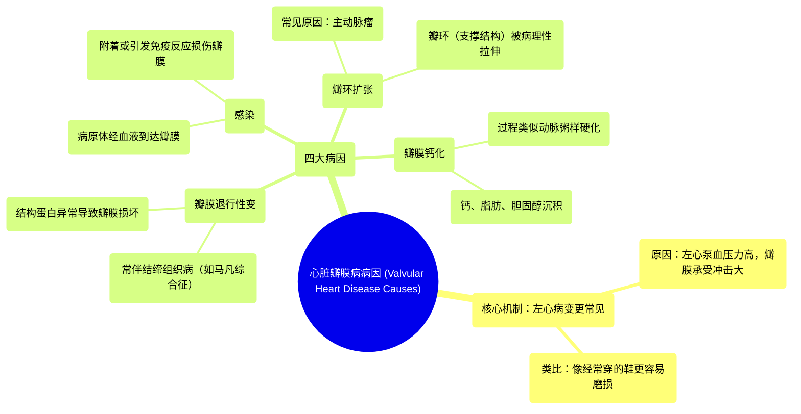

# 02 Valvular heart disease causes Circulatory System and Disease NCLEX-RN Khan Academy

  <video controls preload="metadata" playsinline>
    <source src="https://helly.s3.bitiful.net/心血管学科/%E4%B8%93%E8%BE%91%2013%EF%BC%9A%E5%BF%83%E8%84%8F%E7%93%A3%E8%86%9C%E7%97%85%20%28Heart%20Valve%20Diseases%29/02%20Valvular%20heart%20disease%20causes%20Circulatory%20System%20and%20Disease%20NCLEX-RN%20Khan%20Academy.mp4" type="video/mp4">
    
您的浏览器不支持播放，请升级。

  </video>

::: tip ⚡️ 核心考点 (30s速读)
*   **核心考点**：心脏瓣膜病的四大病因（钙化、退行性变、感染、瓣环扩张）及其好发于左心（二尖瓣、主动脉瓣）的原因。
*   **临床意义**：理解病因是诊断和治疗瓣膜病（如二尖瓣反流、主动脉瓣狭窄）的基础。左心瓣膜因承受更高压力而更易受损，是临床关注的重点。
:::

## 🧠 深度精讲

*   **心脏瓣膜定位与视角**：视频通过一个独特的“俯视”视角示意图，直观展示了心脏四个瓣膜的相对位置：肺动脉瓣（PV）、主动脉瓣（AV）、二尖瓣和三尖瓣。这有助于建立空间概念。
*   **瓣膜病的四大病因**：
    1.  **瓣膜钙化**：过程与动脉粥样硬化相似，涉及钙离子、脂肪和胆固醇在瓣膜上的沉积，导致瓣膜变硬、功能异常。
    2.  **瓣膜退行性变**：常与结缔组织病（如马凡综合征）相关。由于构成瓣膜结构的蛋白质出现问题，导致瓣膜逐渐损坏、功能丧失。
    3.  **感染**：病原体（细菌、病毒等）进入血液后，可附着于瓣膜表面或引发免疫反应，损害瓣膜的正常开闭功能。
    4.  **瓣环扩张**：支撑瓣膜的纤维环（瓣环）因疾病（如主动脉瘤）而被过度拉伸、变形，导致瓣膜无法正常闭合，引发反流。
*   **左心瓣膜病更常见的原因**：心脏左侧（主动脉瓣、二尖瓣）负责将血液泵向全身，承受的压力远高于右侧（肺动脉瓣、三尖瓣）。这种持续的高压冲击，使得左心瓣膜像“经常穿的鞋”一样更容易磨损和患病，因此临床中左心瓣膜病变更为多见。

## 📚 双语术语表 (Terminology)
| 英文术语 | 中文翻译 | 定义/解释 |
| :--- | :--- | :--- |
| Valvular heart disease | 心脏瓣膜病 | 心脏瓣膜结构或功能异常，影响血液正常流动的疾病。 |
| Mitral valve | 二尖瓣 | 位于左心房和左心室之间的瓣膜，有两个瓣叶。 |
| Aortic valve | 主动脉瓣 | 位于左心室和主动脉之间的瓣膜，通常有三个瓣叶。 |
| Pulmonic valve | 肺动脉瓣 | 位于右心室和肺动脉之间的瓣膜。 |
| Tricuspid valve | 三尖瓣 | 位于右心房和右心室之间的瓣膜，有三个瓣叶。 |
| Murmur | 心脏杂音 | 血液流经心脏或大血管时产生的异常声音，常提示瓣膜等问题。 |
| Mitral regurgitation | 二尖瓣反流 | 二尖瓣关闭不全，导致左心室收缩时血液反流回左心房。 |
| Aortic stenosis | 主动脉瓣狭窄 | 主动脉瓣开口狭窄，阻碍血液从左心室泵入主动脉。 |
| Calcification | 钙化 | 钙盐在组织（如瓣膜）中异常沉积，使其变硬。 |
| Atherosclerosis | 动脉粥样硬化 | 脂肪、胆固醇等物质在动脉壁内积聚形成斑块，使动脉硬化、狭窄。 |
| Degeneration | 退行性变 | 组织或器官随年龄或疾病逐渐功能衰退、结构损坏。 |
| Connective tissue disorder | 结缔组织病 | 影响结缔组织（如皮肤、骨骼、血管、瓣膜）的一类疾病，如马凡综合征。 |
| Marfan syndrome | 马凡综合征 | 一种遗传性结缔组织病，常影响骨骼、眼睛和心血管系统（包括主动脉和瓣膜）。 |
| Annulus | 瓣环 | 心脏瓣膜底部的纤维环状结构，用于固定和支撑瓣叶。 |
| Annular dilation | 瓣环扩张 | 瓣环因病理性扩大而变形，导致瓣膜关闭不全。 |
| Aortic aneurysm | 主动脉瘤 | 主动脉壁局部异常膨出，有破裂风险，可牵拉主动脉瓣环导致反流。 |

## 🗺️ 知识图谱

