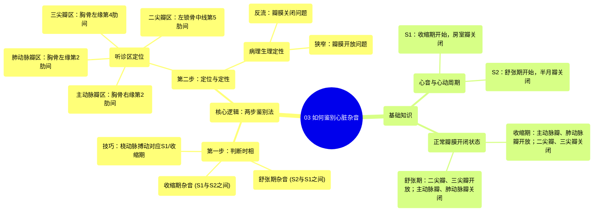

# 03 How to identify murmurs Circulatory System and Disease NCLEX-RN Khan Academy

  <video controls preload="metadata" playsinline>
    <source src="https://helly.s3.bitiful.net/心血管学科/%E4%B8%93%E8%BE%91%2013%EF%BC%9A%E5%BF%83%E8%84%8F%E7%93%A3%E8%86%9C%E7%97%85%20%28Heart%20Valve%20Diseases%29/03%20How%20to%20identify%20murmurs%20Circulatory%20System%20and%20Disease%20NCLEX-RN%20Khan%20Academy.mp4" type="video/mp4">
    
您的浏览器不支持播放，请升级。

  </video>

::: tip ⚡️ 核心考点 (30s速读)
*   **核心考点**：通过“何时发生”与“何处最响”两个关键问题，系统性地鉴别心脏杂音。
*   **临床意义**：掌握此逻辑算法，能将听诊到的杂音准确定位到具体的心脏瓣膜病变（狭窄或关闭不全），是心血管疾病诊断的基本功。
:::

## 🧠 深度精讲

*   **心音与心动周期**：第一心音（S1）标志心室收缩（**收缩期**）开始，主要由二尖瓣和三尖瓣关闭产生。第二心音（S2）标志心室舒张（**舒张期**）开始，主要由主动脉瓣和肺动脉瓣关闭产生。因此，**S1与S2之间为收缩期，S2与下一个S1之间为舒张期**。
*   **杂音鉴别逻辑算法**：
    1.  **第一步：确认杂音**。听诊时发现异常心音。
    2.  **第二步：判断时相**。确定杂音发生在收缩期还是舒张期。快速心率的鉴别技巧：触摸**桡动脉**，搏动与**S1**同步，对应收缩期开始。
    3.  **第三步：分析病理**（基于正常瓣膜开闭状态）：
        *   **收缩期杂音**：此时正常开放的瓣膜（主动脉瓣、肺动脉瓣）若开放受阻（**狭窄**），或正常关闭的瓣膜（二尖瓣、三尖瓣）若关闭不全（**反流/关闭不全**），会产生杂音。
        *   **舒张期杂音**：此时正常开放的瓣膜（二尖瓣、三尖瓣）若狭窄，或正常关闭的瓣膜（主动脉瓣、肺动脉瓣）若反流，会产生杂音。
    4.  **第四步：定位瓣膜**：通过杂音最响亮的听诊区确定具体病变瓣膜。
*   **心脏瓣膜听诊区**：
    *   **主动脉瓣区**：胸骨右缘第2肋间（右第2肋间隙）。
    *   **肺动脉瓣区**：胸骨左缘第2肋间（左第2肋间隙）。
    *   **三尖瓣区**：胸骨左缘第4肋间（第4肋间隙）。
    *   **二尖瓣区**：左锁骨中线第5肋间（第5肋间隙，心尖搏动处）。

## 📚 双语术语表 (Terminology)
| 英文术语 | 中文翻译 | 定义/解释 |
| :--- | :--- | :--- |
| Systole | 收缩期 | 心室收缩，向主动脉和肺动脉射血的时期。 |
| Diastole | 舒张期 | 心室舒张，接受心房血液充盈的时期。 |
| S1 (First Heart Sound) | 第一心音 | 标志收缩期开始，主要由二尖瓣和三尖瓣关闭产生。 |
| S2 (Second Heart Sound) | 第二心音 | 标志舒张期开始，主要由主动脉瓣和肺动脉瓣关闭产生。 |
| Murmur | 心脏杂音 | 心音之外持续时间较长的异常声音，多由血流湍流引起。 |
| Stenosis | 狭窄 | 心脏瓣膜开放受限，血流通过受阻。 |
| Regurgitation / Insufficiency | 反流 / 关闭不全 | 心脏瓣膜关闭不全，导致血液逆流。 |
| Aortic Valve | 主动脉瓣 | 位于左心室和主动脉之间的瓣膜。 |
| Pulmonic Valve | 肺动脉瓣 | 位于右心室和肺动脉之间的瓣膜。 |
| Mitral Valve | 二尖瓣 | 位于左心房和左心室之间的瓣膜。 |
| Tricuspid Valve | 三尖瓣 | 位于右心房和右心室之间的瓣膜。 |
| Intercostal Space | 肋间隙 | 相邻两根肋骨之间的空间。 |
| Radial Artery | 桡动脉 | 位于手腕处的动脉，常用于触摸脉搏。 |

## 🗺️ 知识图谱

