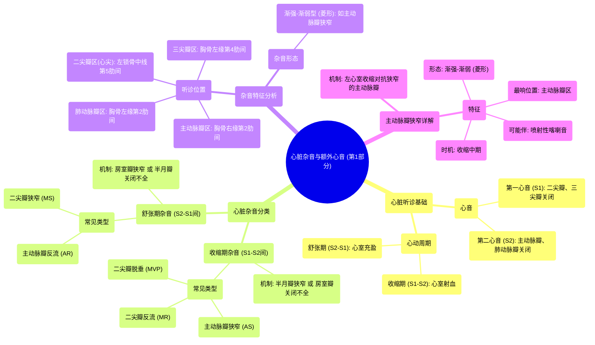

# 04 Systolic murmurs, diastolic murmurs, and extra heart sounds - Part 1 NCLEX-RN Khan Academy

  <video controls preload="metadata" playsinline>
    <source src="https://helly.s3.bitiful.net/心血管学科/%E4%B8%93%E8%BE%91%2013%EF%BC%9A%E5%BF%83%E8%84%8F%E7%93%A3%E8%86%9C%E7%97%85%20%28Heart%20Valve%20Diseases%29/04%20Systolic%20murmurs%2C%20diastolic%20murmurs%2C%20and%20extra%20heart%20sounds%20-%20Part%201%20NCLEX-RN%20Khan%20Academy.mp4" type="video/mp4">
    
您的浏览器不支持播放，请升级。

  </video>

::: tip ⚡️ 核心考点 (30s速读)
*   **核心考点**：心脏杂音的分类（收缩期/舒张期）取决于其出现在S1-S2（收缩期）还是S2-S1（舒张期）之间。杂音的产生源于瓣膜病变（狭窄或关闭不全）导致的湍流。
*   **临床意义**：通过杂音出现的时间（收缩期/舒张期）、最响听诊位置（如主动脉瓣区、心尖部）和形态（如渐强-渐弱型），可以初步推断是哪种瓣膜病变（如主动脉瓣狭窄、二尖瓣反流等）。
:::

## 🧠 深度精讲

*   **心脏听诊基础**：心脏听诊的核心是识别第一心音（S1）和第二心音（S2）。S1标志心室收缩开始，由二尖瓣和三尖瓣关闭产生；S2标志心室舒张开始，由主动脉瓣和肺动脉瓣关闭产生。S1与S2之间为**收缩期**，S2与下一个S1之间为**舒张期**。
*   **杂音分类逻辑**：杂音的分类基于血液流动与瓣膜状态的矛盾。
    *   **收缩期杂音**：发生在心室向动脉射血时。此时房室瓣（二、三尖瓣）应关闭，半月瓣（主、肺动脉瓣）应开放。因此，收缩期杂音可能源于：1）半月瓣**狭窄**（血流通过受阻）；2）房室瓣**关闭不全/反流**（血液倒流回心房）。
    *   **舒张期杂音**：发生在心室充盈时。此时半月瓣应关闭，房室瓣应开放。因此，舒张期杂音可能源于：1）半月瓣**关闭不全/反流**（血液从动脉倒流回心室）；2）房室瓣**狭窄**（血流进入心室受阻）。
*   **听诊位置**：听诊位置的选择基于血液流出病变瓣膜后的预期流向。
    *   **主动脉瓣区**：胸骨右缘第2肋间。主要听诊主动脉瓣病变（如狭窄、关闭不全）。
    *   **肺动脉瓣区**：胸骨左缘第2肋间。主要听诊肺动脉瓣病变。
    *   **三尖瓣区**：胸骨左缘第4肋间。
    *   **二尖瓣区（心尖部）**：左锁骨中线第5肋间。主要听诊二尖瓣病变。
*   **主动脉瓣狭窄详解**：视频以此为例，详细说明了杂音的产生机制和特征。
    *   **时机**：杂音并非始于S1，因为在S1（二尖瓣关闭）后，心室需要时间增压以推开狭窄的主动脉瓣。瓣叶突然弹开时可能产生**喷射性喀喇音**。
    *   **形态**：随着心室收缩力增强，通过狭窄瓣膜的血流速度和流量增加，杂音响度增强；心室收缩末期压力下降，杂音响度减弱。因此形成**渐强-渐弱型（菱形）** 杂音。
    *   **听诊**：通常在**主动脉瓣区**听诊最响亮，向颈部血管传导。

## 📚 双语术语表 (Terminology)
| 英文术语 | 中文翻译 | 定义/解释 |
| :--- | :--- | :--- |
| S1 (First Heart Sound) | 第一心音 | 主要由二尖瓣和三尖瓣关闭产生，标志心室收缩开始。 |
| S2 (Second Heart Sound) | 第二心音 | 主要由主动脉瓣和肺动脉瓣关闭产生，标志心室舒张开始。 |
| Systole | 收缩期 | 心脏收缩，心室向动脉射血的时期，介于S1和S2之间。 |
| Diastole | 舒张期 | 心脏舒张，心室充盈的时期，介于S2和下一个S1之间。 |
| Murmur | 心脏杂音 | 血液在心脏或大血管内因湍流而产生的异常声音。 |
| Systolic Murmur | 收缩期杂音 | 发生在S1和S2之间的杂音。 |
| Diastolic Murmur | 舒张期杂音 | 发生在S2和S1之间的杂音。 |
| Aortic Stenosis (AS) | 主动脉瓣狭窄 | 主动脉瓣开放受限，导致左心室射血受阻。典型杂音为收缩期喷射性、渐强-渐弱型。 |
| Mitral Regurgitation (MR) | 二尖瓣反流 | 二尖瓣关闭不全，导致左心室收缩时血液反流回左心房。典型为全收缩期杂音。 |
| Ejection Click (EC) | 喷射性喀喇音 | 常见于主动脉瓣狭窄等，因僵硬瓣膜突然打开而产生的高调额外心音。 |
| Crescendo-Decrescendo | 渐强-渐弱型 | 描述杂音响度先增强后减弱的形态，状如菱形，是典型喷射性杂音的特征。 |
| Aortic Area | 主动脉瓣听诊区 | 胸骨右缘第2肋间，用于听诊主动脉瓣病变。 |
| Mitral Area / Apex | 二尖瓣听诊区 / 心尖部 | 左锁骨中线第5肋间，用于听诊二尖瓣病变。 |

## 🗺️ 知识图谱

