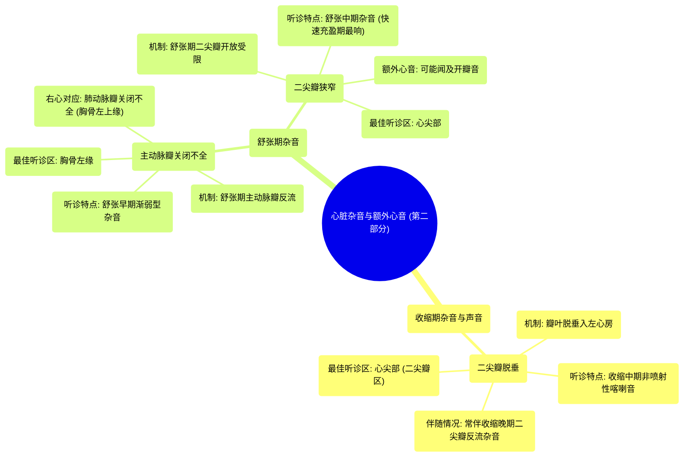

# 05 Systolic murmurs, diastolic murmurs, and extra heart sounds - Part 2 NCLEX-RN Khan Academy

  <video controls preload="metadata" playsinline>
    <source src="https://helly.s3.bitiful.net/心血管学科/%E4%B8%93%E8%BE%91%2013%EF%BC%9A%E5%BF%83%E8%84%8F%E7%93%A3%E8%86%9C%E7%97%85%20%28Heart%20Valve%20Diseases%29/05%20Systolic%20murmurs%2C%20diastolic%20murmurs%2C%20and%20extra%20heart%20sounds%20-%20Part%202%20NCLEX-RN%20Khan%20Academy.mp4" type="video/mp4">
    
您的浏览器不支持播放，请升级。

  </video>

::: tip ⚡️ 核心考点 (30s速读)
*   **核心考点**：掌握二尖瓣脱垂（收缩中期喀喇音）、主动脉瓣关闭不全（舒张早期渐弱型杂音）和二尖瓣狭窄（舒张中期隆隆样杂音）的听诊特点、发生机制和最佳听诊区。
*   **临床意义**：收缩中期喀喇音是诊断二尖瓣脱垂的关键体征；舒张期杂音通常提示更严重的瓣膜病变，需结合杂音形态和听诊位置进行鉴别。
:::

## 🧠 深度精讲

*   **二尖瓣脱垂**
    *   **机制**：二尖瓣瓣叶在收缩期脱垂入左心房，导致腱索或瓣叶突然绷紧，产生“喀喇音”。
    *   **听诊特点**：
        *   **声音**：收缩中期或中晚期**非喷射性喀喇音**。
        *   **杂音**：常伴有收缩晚期杂音（二尖瓣反流），杂音形态（一贯型或渐强型）存在争议，但喀喇音本身是诊断关键。
        *   **最佳听诊区**：心尖部（二尖瓣区）。

*   **主动脉瓣关闭不全**
    *   **机制**：舒张期主动脉瓣关闭不全，血液从主动脉反流回左心室。
    *   **听诊特点**：
        *   **时期**：**舒张早期**。
        *   **形态**：**渐弱型**。舒张早期左心室压力最低，反流量最大，杂音最响；随着心室充盈压力升高，反流减少，杂音减弱。
        *   **最佳听诊区**：沿**胸骨左缘**（因血液反向流动，不在传统主动脉瓣听诊区）。

*   **二尖瓣狭窄**
    *   **机制**：舒张期二尖瓣开放受限，血流从左心房流入左心室受阻。
    *   **听诊特点**：
        *   **时期**：**舒张中期**。
        *   **形态**：杂音在舒张早期（快速充盈期）最响，因该时期房室间压力差最大。
        *   **额外心音**：可能听到**开瓣音**（二尖瓣开放拍击音），位于第二心音之后。
        *   **最佳听诊区**：心尖部。

## 📚 双语术语表 (Terminology)
| 英文术语 | 中文翻译 | 定义/解释 |
| :--- | :--- | :--- |
| Systolic murmur | 收缩期杂音 | 发生在心脏收缩期（第一心音与第二心音之间）的异常心音。 |
| Diastolic murmur | 舒张期杂音 | 发生在心脏舒张期（第二心音与下一周期第一心音之间）的异常心音。 |
| Mitral valve prolapse | 二尖瓣脱垂 | 一种心脏瓣膜病，收缩期二尖瓣瓣叶脱垂入左心房。 |
| Click | 喀喇音 | 一种高调、清脆的额外心音。 |
| Non-ejection click | 非喷射性喀喇音 | 与血液经瓣膜喷射无关的喀喇音，如二尖瓣脱垂所致。 |
| Aortic regurgitation | 主动脉瓣关闭不全 | 舒张期主动脉瓣无法完全闭合，导致血液从主动脉反流回左心室。 |
| Decrescendo murmur | 渐弱型杂音 | 杂音响度从起始逐渐减弱的类型。 |
| Mitral stenosis | 二尖瓣狭窄 | 二尖瓣开口狭窄，阻碍舒张期血液从左心房流入左心室。 |
| Rapid filling | 快速充盈期 | 舒张早期，房室间压力差最大，血液快速充盈心室的阶段。 |
| Left sternal border | 胸骨左缘 | 胸骨左侧边缘的区域，是听诊某些心脏杂音（如主动脉瓣关闭不全）的重要位置。 |
| Apex / Mitral area | 心尖部/二尖瓣区 | 通常位于左锁骨中线第5肋间，是听诊二尖瓣病变（如狭窄、脱垂、反流）杂音的最佳位置。 |

## 🗺️ 知识图谱

