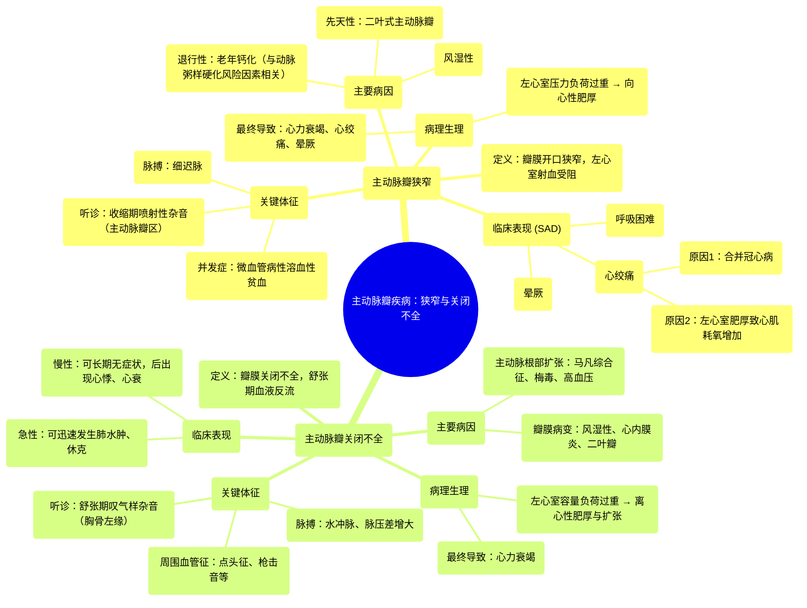

# 06 Aortic stenosis and aortic regurgitation Circulatory System and Disease NCLEX-RN Khan Academy

  <video controls preload="metadata" playsinline>
    <source src="https://helly.s3.bitiful.net/心血管学科/%E4%B8%93%E8%BE%91%2013%EF%BC%9A%E5%BF%83%E8%84%8F%E7%93%A3%E8%86%9C%E7%97%85%20%28Heart%20Valve%20Diseases%29/06%20Aortic%20stenosis%20and%20aortic%20regurgitation%20Circulatory%20System%20and%20Disease%20NCLEX-RN%20Khan%20Academy.mp4" type="video/mp4">
    
您的浏览器不支持播放，请升级。

  </video>

::: tip ⚡️ 核心考点 (30s速读)
*   **核心考点**：主动脉瓣狭窄（AS）是瓣膜开口变窄，导致左心室射血受阻；主动脉瓣关闭不全（AR）是瓣膜关闭不全，导致血液从主动脉反流回左心室。两者均导致左心室负荷增加，最终引起心力衰竭。
*   **临床意义**：AS典型表现为“SAD”三联征（晕厥、心绞痛、呼吸困难），听诊可闻及收缩期喷射性杂音。AR典型表现为脉压差增大、水冲脉，听诊可闻及舒张期叹气样杂音。两者均需评估左心室功能，严重者需考虑瓣膜置换。
:::

## 🧠 深度精讲

*   **主动脉瓣狭窄**
    *   **定义与病理生理**：主动脉瓣口面积减小，导致左心室射血受阻。左心室需增加收缩力以克服阻力，长期导致左心室向心性肥厚。最终，肥厚的心肌耗氧量增加、顺应性下降，导致心输出量减少和肺淤血，引发心力衰竭。
    *   **病因**：主要病因包括：1) **先天性二叶式主动脉瓣**：瓣膜为两叶，承受更大应力，易早期钙化、狭窄。2) **老年退行性钙化**：与动脉粥样硬化风险因素（如吸烟、高血压、高血脂、糖尿病）相关。3) **风湿性心脏病**：较少见，常与二尖瓣病变并存。
    *   **临床表现 (SAD)**：
        *   **S (Syncope，晕厥)**：心输出量不足导致脑灌注减少，常在活动时发生。
        *   **A (Angina，心绞痛)**：原因有二：① 合并冠状动脉粥样硬化，狭窄加重心肌缺血；② 左心室肥厚导致心肌耗氧量增加，供不应求。
        *   **D (Dyspnea，呼吸困难)**：左心室舒张末压升高导致左心房压和肺静脉压升高，引起肺淤血。
    *   **体征**：
        *   **脉搏**：细迟脉（脉搏弱而上升缓慢）。
        *   **心脏听诊**：胸骨右缘第二肋间（主动脉瓣听诊区）可闻及粗糙的**收缩期喷射性杂音**，向颈部传导。可能伴有收缩早期喷射音（二叶瓣时常见）。
        *   **其他**：心尖搏动增强、位置可能左移（左心室肥厚）；可并发微血管病性溶血性贫血（MAHA，因红细胞通过狭窄瓣膜时受剪切力破坏）。

*   **主动脉瓣关闭不全**
    *   **定义与病理生理**：主动脉瓣关闭不全，舒张期血液从主动脉反流回左心室。这导致左心室在舒张期同时接受来自左心房的血流和反流的血液，造成**容量负荷过重**。长期导致左心室离心性肥厚和扩张，最终引起心力衰竭。
    *   **病因**：可分为瓣膜本身病变（如风湿性心脏病、感染性心内膜炎、二叶式主动脉瓣）和主动脉根部扩张（如马凡综合征、梅毒性主动脉炎、高血压）两类。
    *   **临床表现**：慢性者可长期无症状。失代偿后出现心悸、心绞痛、左心衰竭症状（如呼吸困难）。急性者可迅速出现肺水肿和休克。
    *   **体征**：
        *   **脉搏**：**水冲脉**（脉搏骤起骤落）、**脉压差增大**（收缩压升高，舒张压降低）。
        *   **心脏听诊**：胸骨左缘第三、四肋间可闻及**舒张期叹气样递减型杂音**。严重反流时，心尖部可闻及Austin Flint杂音（功能性二尖瓣狭窄的舒张期隆隆样杂音）。
        *   **周围血管征**：点头征、股动脉枪击音、杜氏双重杂音等。

## 📚 双语术语表 (Terminology)
| 英文术语 | 中文翻译 | 定义/解释 |
| :--- | :--- | :--- |
| Aortic Stenosis (AS) | 主动脉瓣狭窄 | 主动脉瓣口开放受限，导致左心室射血受阻的疾病。 |
| Aortic Regurgitation (AR) | 主动脉瓣关闭不全 | 主动脉瓣关闭不全，导致舒张期血液从主动脉反流回左心室。 |
| Bicuspid Aortic Valve | 二叶式主动脉瓣 | 一种常见的先天性心脏畸形，主动脉瓣仅有两个瓣叶，易发生钙化和狭窄。 |
| SAD | SAD三联征 | 主动脉瓣狭窄的典型症状：晕厥、心绞痛、呼吸困难。 |
| Syncope | 晕厥 | 短暂性意识丧失，常由脑灌注不足引起。 |
| Angina | 心绞痛 | 心肌缺血引起的胸痛或不适。 |
| Dyspnea | 呼吸困难 | 主观上感到空气不足、呼吸费力。 |
| Pulsus Parvus et Tardus | 细迟脉 | 脉搏弱而上升缓慢，是主动脉瓣狭窄的典型体征。 |
| Systolic Ejection Murmur | 收缩期喷射性杂音 | 发生在心脏收缩期、血液通过狭窄出口时产生的杂音，AS时在主动脉瓣区最响。 |
| Left Ventricular Hypertrophy (LVH) | 左心室肥厚 | 左心室心肌质量增加，是对压力或容量负荷过重的代偿性改变。 |
| Microangiopathic Hemolytic Anemia (MAHA) | 微血管病性溶血性贫血 | 红细胞在微小血管内受机械性损伤（如通过狭窄瓣膜）而破裂引起的贫血。 |
| Diastolic Decrescendo Murmur | 舒张期递减型杂音 | 杂音在舒张早期最响，随后逐渐减弱，是AR的典型听诊发现。 |
| Water-Hammer Pulse | 水冲脉 | 脉搏骤起骤落，有力而饱满，是AR的典型周围血管征。 |
| Widened Pulse Pressure | 脉压差增大 | 收缩压与舒张压之差增大，常见于AR。 |
| Austin Flint Murmur | 奥斯汀·弗林特杂音 | 严重AR时，反流血液冲击二尖瓣前叶，导致相对性二尖瓣狭窄，在心尖部产生的舒张期隆隆样杂音。 |

## 🗺️ 知识图谱

