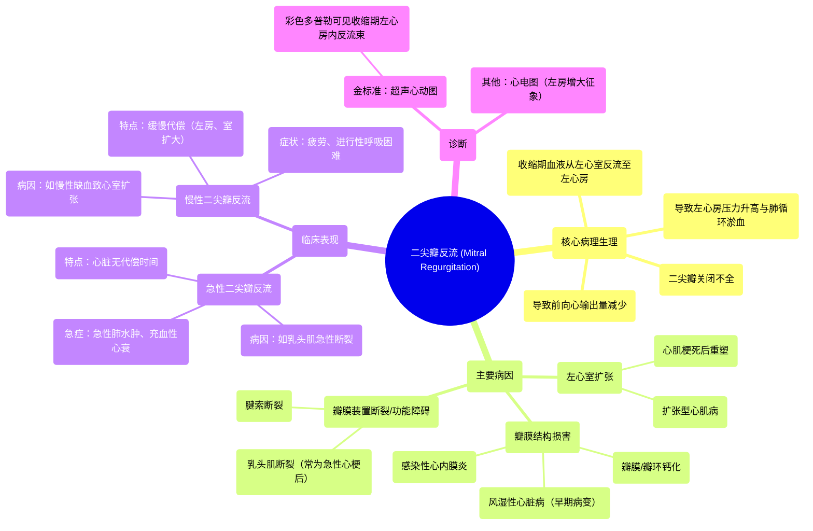

# 07 Mitral valve regurgitation and mitral valve prolapse NCLEX-RN Khan Academy

  <video controls preload="metadata" playsinline>
    <source src="https://helly.s3.bitiful.net/心血管学科/%E4%B8%93%E8%BE%91%2013%EF%BC%9A%E5%BF%83%E8%84%8F%E7%93%A3%E8%86%9C%E7%97%85%20%28Heart%20Valve%20Diseases%29/07%20Mitral%20valve%20regurgitation%20and%20mitral%20valve%20prolapse%20NCLEX-RN%20Khan%20Academy.mp4" type="video/mp4">
    
您的浏览器不支持播放，请升级。

  </video>

::: tip ⚡️ 核心考点 (30s速读)
*   **核心考点**：二尖瓣反流是指心脏收缩时，二尖瓣（左心房与左心室之间的瓣膜）关闭不全，导致血液从左心室异常反流回左心房。这会引起左心房压力增高，血液淤积，最终可能导致肺循环淤血和心力衰竭。
*   **临床意义**：需区分急性与慢性。急性反流（如乳头肌断裂）是急症，可迅速导致肺水肿；慢性反流（如左心室扩张）症状发展较慢，表现为进行性疲劳、呼吸困难。
:::

## 🧠 深度精讲

*   **概念1：二尖瓣反流的病理生理**
    二尖瓣反流的根本问题是瓣膜在心脏收缩期无法完全闭合。正常情况下，血液从左心室泵入主动脉供应全身。当二尖瓣“松弛”或关闭不全时，一部分血液会逆向流入左心房。这导致两个主要后果：1) **前向心输出量减少**，身体供血不足，引起疲劳；2) **左心房容量和压力增加**，压力逆向传导至肺静脉和肺部毛细血管，引起肺淤血，导致呼吸短促、呼吸困难，严重时出现肺水肿。

*   **概念2：主要病因与机制**
    病因多样，核心是破坏二尖瓣装置（瓣叶、瓣环、腱索、乳头肌）的结构或功能完整性：
    1.  **左心室扩张**：如心肌梗死后心室重塑、扩张型心肌病（缺血性或非缺血性）。心室腔扩大拉伸二尖瓣瓣环，使瓣叶对合不良。
    2.  **风湿性心脏病**：是二尖瓣反流的**早期**病变（晚期为二尖瓣狭窄），由反复风湿热发作引起瓣膜增厚、挛缩所致。
    3.  **感染性心内膜炎**：瓣膜感染形成赘生物，阻碍瓣膜闭合。
    4.  **乳头肌/腱索功能障碍或断裂**：常见于急性心肌梗死。乳头肌缺血坏死或腱索断裂，导致瓣叶失去牵拉而呈“连枷样”运动，关闭严重失效，常引起**急性**重度反流。
    5.  **瓣膜/瓣环钙化**：退行性变导致瓣膜活动度下降，影响关闭。

*   **概念3：急性与慢性反流的临床特点**
    *   **急性二尖瓣反流**：通常由**乳头肌断裂**等突发事件引起。心脏无代偿时间，左心房突然承受大量反流血液，压力急剧升高，迅速导致**急性肺水肿（闪电样肺水肿）**和**充血性心力衰竭**，属于**内科急症**。
    *   **慢性二尖瓣反流**：病因如慢性缺血导致的心室扩张。心脏有较长时间通过左心房、左心室扩大来代偿。症状隐匿且缓慢进展，典型表现为**进行性疲劳、活动后气短**，后期出现肺淤血体征。查体可见**左心房增大**（心电图或超声心动图提示）。

*   **概念4：诊断与影像学特征**
    超声心动图是诊断和评估反流程度的金标准。视频中演示的超声心动图显示：心脏收缩时，左心房内出现异常的**蓝色反流束**（彩色多普勒显示背离探头的血流），直接证实了二尖瓣反流的存在。

## 📚 双语术语表 (Terminology)

| 英文术语 | 中文翻译 | 定义/解释 |
| :--- | :--- | :--- |
| Mitral Regurgitation (MR) | 二尖瓣反流 | 心脏收缩时，二尖瓣关闭不全，血液从左心室反流回左心房。 |
| Mitral Valve | 二尖瓣 | 位于左心房和左心室之间的心脏瓣膜。 |
| Left Ventricle (LV) | 左心室 | 心脏的主要泵血腔室，将血液泵入主动脉。 |
| Left Atrium (LA) | 左心房 | 接收来自肺静脉的富氧血液，并将其送入左心室。 |
| Papillary Muscle | 乳头肌 | 心室壁上的锥形肌肉，通过腱索连接并牵拉房室瓣（如二尖瓣），防止其翻入心房。 |
| Chordae Tendineae | 腱索 | 连接乳头肌和二尖瓣瓣叶的纤维条索，起到锚定和稳定瓣叶的作用。 |
| Echocardiogram | 超声心动图 | 利用超声波检查心脏结构和功能的影像学技术，是诊断瓣膜病的主要工具。 |
| Acute Pulmonary Edema / Flash Pulmonary Edema | 急性肺水肿 / 闪电样肺水肿 | 由于左心压力急剧升高，导致液体快速渗入肺泡，引起的严重、危及生命的呼吸困难。 |
| Dilated Cardiomyopathy | 扩张型心肌病 | 一种心肌疾病，特征为心脏（尤其是左心室）扩大和收缩功能减弱。 |
| Rheumatic Heart Disease | 风湿性心脏病 | 由风湿热引起的慢性心脏瓣膜损害。 |
| Endocarditis | 心内膜炎 | 心脏内膜（尤其是瓣膜）的感染。 |
| Remodeling (post-MI) | （心肌梗死后）重塑 | 心肌梗死后，心脏为适应损伤而发生的大小、形状和结构改变。 |

## 🗺️ 知识图谱

