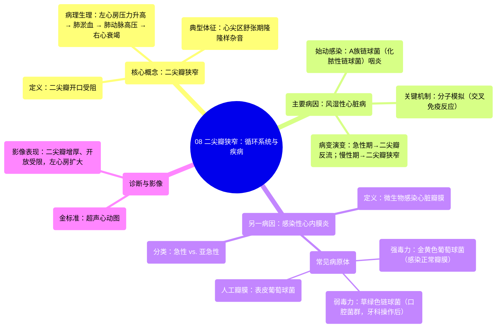

# 08 Mitral stenosis Circulatory System and Disease NCLEX-RN Khan Academy

  <video controls preload="metadata" playsinline>
    <source src="https://helly.s3.bitiful.net/心血管学科/%E4%B8%93%E8%BE%91%2013%EF%BC%9A%E5%BF%83%E8%84%8F%E7%93%A3%E8%86%9C%E7%97%85%20%28Heart%20Valve%20Diseases%29/08%20Mitral%20stenosis%20Circulatory%20System%20and%20Disease%20NCLEX-RN%20Khan%20Academy.mp4" type="video/mp4">
    
您的浏览器不支持播放，请升级。

  </video>

::: tip ⚡️ 核心考点 (30s速读)
*   **核心考点**：二尖瓣狭窄是指左心房与左心室之间的二尖瓣无法正常开放，导致左心房血液流入左心室受阻。其典型病因是风湿性心脏病，由A族链球菌（化脓性链球菌）感染后，机体免疫系统通过“分子模拟”机制攻击自身心脏瓣膜所致。
*   **临床意义**：血液在左心房和肺部淤积，导致肺淤血和肺动脉高压，最终可能引发右心衰竭。典型体征包括心尖区舒张期隆隆样杂音。理解其病因链（链球菌性咽炎 → 风湿热 → 风湿性心脏病 → 二尖瓣狭窄）对预防和诊断至关重要。
:::

## 🧠 深度精讲

*   **概念1：二尖瓣狭窄的定义与血流动力学影响**
    二尖瓣是位于左心房和左心室之间的单向“阀门”，确保血液从左心房顺畅流入左心室。当二尖瓣因病变（如瓣叶增厚、粘连、钙化）而变得僵硬、开口面积减小时，即称为**二尖瓣狭窄**。这会导致左心房血液流出受阻，压力升高。升高的压力会逆向传递至肺静脉和肺毛细血管，引起**肺淤血**（表现为呼吸困难、咳嗽、咯血），长期可导致**肺动脉高压**和**右心室肥厚、衰竭**。

*   **概念2：风湿性心脏病——二尖瓣狭窄的主要病因**
    这是二尖瓣狭窄最常见的原因。其发病并非细菌直接侵袭心脏，而是一种**自身免疫反应**。
    1.  **始动因素**：A族β-溶血性链球菌（主要是**化脓性链球菌**）引起的上呼吸道感染（如链球菌性咽炎）。
    2.  **关键机制**：**分子模拟**。链球菌的某些抗原结构与人体心脏瓣膜（尤其是二尖瓣）的组织成分相似。当免疫系统产生抗体清除细菌时，这些抗体“误认”自身心脏组织为外来敌人，并发起攻击，导致瓣膜发生炎症、瘢痕形成，最终狭窄。
    3.  **病变演变**：风湿热急性期常导致**二尖瓣反流**（关闭不全）；反复发作后，慢性瘢痕形成则导致特征性的**二尖瓣狭窄**。

*   **概念3：感染性心内膜炎——另一个重要病因**
    这是心脏瓣膜（包括二尖瓣）的微生物感染。感染形成的赘生物（微生物团块）可破坏瓣膜结构，导致狭窄或反流。
    *   **感染途径**：
        *   **一过性菌血症**：如牙科操作、侵入性检查时，口腔中的草绿色链球菌等正常菌群进入血液。
        *   **毒力强的细菌**：如金黄色葡萄球菌，可直接感染正常瓣膜。
        *   **人工瓣膜**：表皮葡萄球菌易在人工材料上定植，引起感染。
    *   **分类**：根据病程和病原体毒力，可分为急性和亚急性细菌性心内膜炎。

## 📚 双语术语表 (Terminology)
| 英文术语 | 中文翻译 | 定义/解释 |
| :--- | :--- | :--- |
| Mitral Stenosis (MS) | 二尖瓣狭窄 | 左心房与左心室之间的二尖瓣开口面积减小，阻碍血液从左心房流入左心室。 |
| Echocardiogram (Echo) | 超声心动图 | 利用超声波检查心脏结构和功能的影像学技术，是诊断瓣膜病的首选方法。 |
| Rheumatic Fever | 风湿热 | 由A族链球菌感染后引发的自身免疫性疾病，可累及关节、皮肤、中枢神经系统和心脏。 |
| Rheumatic Heart Disease (RHD) | 风湿性心脏病 | 风湿热反复发作导致的心脏瓣膜永久性损害，二尖瓣狭窄是其晚期特征性病变。 |
| Group A Streptococcus (GAS) | A族链球菌 | 一类细菌，其中化脓性链球菌是引起链球菌性咽炎和风湿热的病原体。 |
| Streptococcus pyogenes | 化脓性链球菌 | A族链球菌中的主要致病菌种，是链球菌性咽炎的病原体。 |
| Molecular Mimicry | 分子模拟 | 一种发病机制，指病原体抗原与宿主自身组织抗原相似，导致交叉免疫反应，攻击自身组织。 |
| Infective Endocarditis (IE) | 感染性心内膜炎 | 心脏瓣膜或心内膜的微生物感染，常形成赘生物，可破坏瓣膜功能。 |
| Staphylococcus aureus | 金黄色葡萄球菌 | 一种毒力较强的细菌，可引起急性感染性心内膜炎，甚至感染正常瓣膜。 |
| Viridans Streptococci | 草绿色链球菌群 | 口腔正常菌群的一部分，是引起亚急性感染性心内膜炎的常见病原体。 |
| Staphylococcus epidermidis | 表皮葡萄球菌 | 常存在于皮肤的正常菌群，易在人工瓣膜、导管等医疗器械上形成生物膜，引起感染。 |

## 🗺️ 知识图谱

