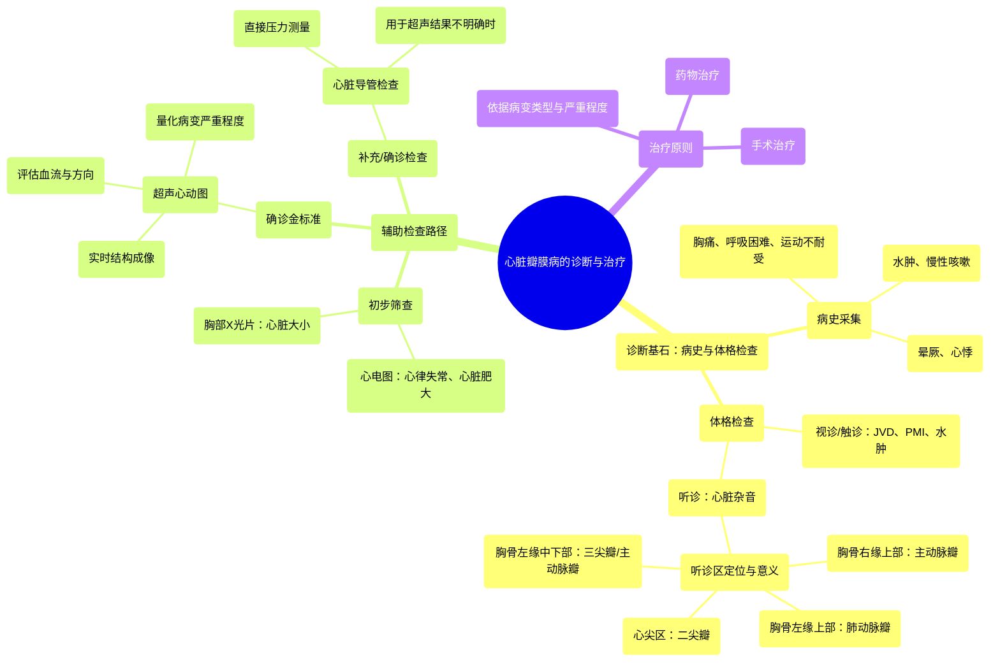

# 09 Valvular heart disease diagnosis and treatment _ NCLEX-RN _ Khan Academy

  <video controls preload="metadata" playsinline>
    <source src="https://helly.s3.bitiful.net/心血管学科/%E4%B8%93%E8%BE%91%2013%EF%BC%9A%E5%BF%83%E8%84%8F%E7%93%A3%E8%86%9C%E7%97%85%20%28Heart%20Valve%20Diseases%29/09%20Valvular%20heart%20disease%20diagnosis%20and%20treatment%20_%20NCLEX-RN%20_%20Khan%20Academy.mp4" type="video/mp4">
    
您的浏览器不支持播放，请升级。

  </video>

::: tip ⚡️ 核心考点 (30s速读)
*   **核心考点**：心脏瓣膜病的诊断始于详尽的病史采集和体格检查，确诊依赖于超声心动图（金标准），必要时采用心脏导管检查。治疗需根据瓣膜病变类型和严重程度，选择药物或手术干预。
*   **临床意义**：掌握从症状、体征到确诊的完整流程，是识别和管理瓣膜性心脏病的关键，对改善患者预后至关重要。
:::

## 🧠 深度精讲

*   **诊断流程**：心脏瓣膜病的诊断遵循“病史与体格检查 → 初步筛查 → 确诊”的路径。任何优秀的诊断都始于一份良好的病史和体格检查（H&P）。
*   **病史采集**：需重点询问非特异性但指向心脏的症状，如胸痛、呼吸困难（尤其是活动后）、运动不耐受、下肢水肿、慢性咳嗽、晕厥（syncope）或心悸（palpitations）。
*   **体格检查**：寻找心脏问题的线索，包括：
    *   **视诊/触诊**：颈静脉怒张（JVD）、心尖搏动最强点（PMI）位置异常、外周水肿（尤其是足踝部）。
    *   **听诊**：**心脏杂音**是瓣膜病的特异性体征。需在四个主要听诊区系统听诊：
        1.  **胸骨右缘上部**：提示主动脉瓣病变。
        2.  **胸骨左缘上部**：提示肺动脉瓣病变。
        3.  **胸骨左缘中下部**：主要为三尖瓣区，也可为主动脉瓣。
        4.  **心尖区（锁骨中线第5肋间）**：提示二尖瓣病变。
*   **辅助检查**：
    *   **初步筛查**：
        *   **心电图（EKG/ECG）**：可发现心律失常、心房或心室肥大、心肌梗死等间接证据。
        *   **胸部X光片（CXR）**：可评估心脏大小（如心胸比>50%提示心脏扩大/心肌肥大）。
    *   **确诊金标准**：
        *   **超声心动图（Echocardiography/Echo）**：利用声波实时成像心脏，可直观显示心脏结构、瓣膜形态与运动、血流方向与速度，并能**量化**瓣膜狭窄或反流的严重程度（轻度至重度）。
    *   **补充检查**：
        *   **心脏导管检查（Cardiac Catheterization/Cardiac Cath）**：更具侵入性。通过股动脉等路径将导管送入心脏，直接测量各心腔及跨瓣膜的压力差，用于超声心动图结果不明确时的确诊。
*   **治疗原则**：视频内容在此处中断。一般而言，治疗取决于瓣膜病的类型（狭窄/反流）、严重程度、症状及对心功能的影响。选项包括药物治疗（控制症状、延缓进展）和手术治疗（瓣膜修复或置换）。

## 📚 双语术语表 (Terminology)
| 英文术语 | 中文翻译 | 定义/解释 |
| :--- | :--- | :--- |
| H&P | 病史与体格检查 | 诊断的基础，指详细的病史询问和全面的身体检查。 |
| Syncope | 晕厥 | 由于脑部血流暂时减少导致的短暂意识丧失。 |
| Palpitations | 心悸 | 患者自觉心跳沉重、快速或不规则的感觉。 |
| Jugular Venous Distension (JVD) | 颈静脉怒张 | 颈部静脉异常充盈或搏动，提示右心压力增高或心力衰竭。 |
| Point of Maximal Impulse (PMI) | 心尖搏动最强点 | 心脏收缩时心尖部撞击胸壁最明显的点，其位置和性质可反映心脏大小和功能。 |
| Murmur | 心脏杂音 | 血液流经心脏瓣膜、腔室或血管时产生湍流所引起的心音以外的异常声音。 |
| EKG/ECG | 心电图 | 记录心脏电活动的检查，用于诊断心律失常、心肌缺血、心室肥厚等。 |
| Chest X-ray (CXR) | 胸部X光片 | 利用X射线成像胸部，可评估心脏大小、轮廓和肺血管情况。 |
| Cardiomegaly | 心脏扩大 | 指心脏体积异常增大，通常在胸片上评估。 |
| Echocardiography (Echo) | 超声心动图 | 利用超声波实时显示心脏结构和功能的影像学检查，是诊断心脏瓣膜病的金标准。 |
| Regurgitation | 反流 | 瓣膜关闭不全，导致血液在心脏收缩或舒张时异常反向流动。 |
| Stenosis | 狭窄 | 瓣膜开口变窄，阻碍血液正常通过。 |
| Cardiac Catheterization (Cardiac Cath) | 心脏导管检查 | 一种侵入性检查，将导管经血管送入心脏，用于测量压力、评估冠状动脉或瓣膜情况。 |
| Femoral Artery | 股动脉 | 位于腹股沟区的大动脉，常作为心脏导管检查的穿刺入路。 |
| Aorta | 主动脉 | 人体最大的动脉，将含氧血从左心室输送到全身。 |

## 🗺️ 知识图谱

