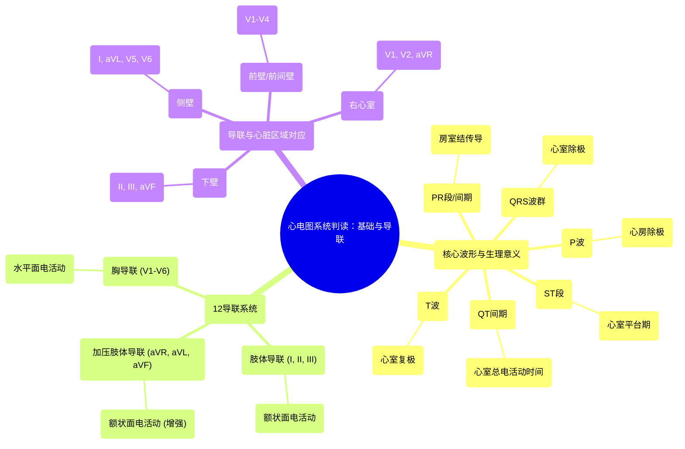

# 01 MASTER ECGEKG INTERPRETATION A Systematic Approach for 12 Lead ECGEKGs

  <video controls preload="metadata" playsinline>
    <source src="https://helly.s3.bitiful.net/心血管学科/%E4%B8%93%E8%BE%91%2014%EF%BC%9A%E5%BF%83%E8%A1%80%E7%AE%A1%E5%86%85%E7%A7%91%E7%BB%BC%E5%90%88%20%28Cardiovascular%20Medicine%29/01%20MASTER%20ECGEKG%20INTERPRETATION%20A%20Systematic%20Approach%20for%2012%20Lead%20ECGEKGs.mp4" type="video/mp4">
    
您的浏览器不支持播放，请升级。

  </video>

::: tip ⚡️ 核心考点 (30s速读)
*   **核心考点**：掌握心电图各波形（P波、PR段、QRS波群、ST段、T波、QT间期）的生理学意义，以及12导联（肢体导联、加压肢体导联、胸导联）与心脏解剖区域的对应关系。
*   **临床意义**：这是系统性判读心电图、识别心律失常、心肌缺血/梗死（如STEMI）等心脏电活动异常的基础。
:::

## 🧠 深度精讲

*   **心电图波形与心脏电活动**：心电图记录的是心脏整体的电活动序列。
    *   **P波**：代表**心房除极**，由窦房结（SA node）发放冲动引起。
    *   **PR段**：代表电冲动在**房室结（AV node）** 内的传导和延迟，是心房除极结束到心室除极开始前的等电位线。
    *   **PR间期**：从P波起点到QRS波群起点，代表**从心房除极开始，经房室结传导，至心室开始除极前**的总时间。
    *   **QRS波群**：代表**心室除极**。电冲动经希氏束、左右束支及浦肯野纤维网快速传导至整个心室肌。
    *   **ST段**：代表心室**除极完毕**到**复极开始**前的平台期，此时心室肌细胞处于持续除极状态，无净电活动向量。ST段的改变（抬高或压低）是诊断心肌缺血或梗死的关键。
    *   **T波**：代表**心室复极**。
    *   **QT间期**：从QRS波群起点到T波终点，代表**心室从开始除极到完全复极**所需的总时间。QT间期延长与恶性室性心律失常风险增加相关。

*   **心电图导联与心脏区域**：12导联心电图从不同角度（平面）观察心脏电活动。
    *   **肢体导联（I, II, III）与加压肢体导联（aVR, aVL, aVF）**：主要反映心脏在额状面（上下、左右）的电活动。
    *   **胸导联（V1-V6）**：主要反映心脏在水平面（前、后、左、右）的电活动，尤其针对左心室。
    *   **区域对应关系**（为快速定位病变区域）：
        *   **下壁**：导联 II, III, aVF
        *   **侧壁**：导联 I, aVL, V5, V6
        *   **前壁/前间壁**：导联 V1-V4
        *   **右心室**：导联 V1, V2, aVR（需结合临床）

## 📚 双语术语表 (Terminology)
| 英文术语 | 中文翻译 | 定义/解释 |
| :--- | :--- | :--- |
| P-wave | P波 | 心电图第一个正向波，代表心房肌除极。 |
| PR segment | PR段 | P波终点至QRS波群起点间的等电位线，代表电冲动在房室结内的传导。 |
| PR interval | PR间期 | P波起点至QRS波群起点的时间，反映心房开始除极到心室开始除极的时间。 |
| QRS complex | QRS波群 | 代表心室肌除极的快速综合波。 |
| ST segment | ST段 | QRS波群终点至T波起点间的线段，代表心室除极完毕到复极开始的平台期。 |
| T-wave | T波 | 代表心室肌复极。 |
| QT interval | QT间期 | QRS波群起点至T波终点的时间，代表心室除极和复极的总时间。 |
| SA node | 窦房结 | 心脏正常的起搏点，位于右心房上部。 |
| AV node | 房室结 | 位于房间隔下部，负责传导延迟，保证心房收缩后再心室收缩。 |
| Depolarization | 除极 | 心肌细胞由静息状态转为兴奋状态的过程（对应收缩）。 |
| Repolarization | 复极 | 心肌细胞由兴奋状态恢复为静息状态的过程（对应舒张）。 |
| Lead | 导联 | 记录心脏电活动的特定电极连接方式。 |
| STEMI | ST段抬高型心肌梗死 | 一种严重的心肌梗死类型，心电图上表现为相关导联ST段弓背向上抬高。 |

## 🗺️ 知识图谱

