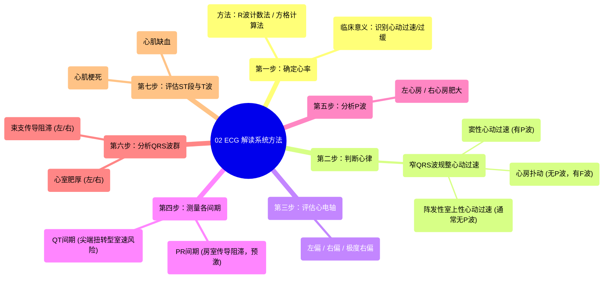

# 02 ECG Interpretation Clinical Medicine

  <video controls preload="metadata" playsinline>
    <source src="https://helly.s3.bitiful.net/心血管学科/%E4%B8%93%E8%BE%91%2014%EF%BC%9A%E5%BF%83%E8%A1%80%E7%AE%A1%E5%86%85%E7%A7%91%E7%BB%BC%E5%90%88%20%28Cardiovascular%20Medicine%29/02%20ECG%20Interpretation%20Clinical%20Medicine.mp4" type="video/mp4">
    
您的浏览器不支持播放，请升级。

  </video>

::: tip ⚡️ 核心考点 (30s速读)
*   **核心考点**：掌握一套系统的心电图解读方法，其核心步骤包括：确定心率、判断心律、评估心电轴、测量各间期、分析P波、QRS波群、ST段与T波。
*   **临床意义**：这套方法能快速识别心动过速/过缓、心律失常类型、传导阻滞、心肌缺血/梗死等关键临床问题，是每位临床医生的必备技能。
:::

## 🧠 深度精讲

视频介绍了一套高效、系统的心电图解读方法，共分为七个核心步骤，旨在帮助临床医生快速、准确地分析心电图。

1.  **第一步：确定心率**
    *   **目的**：快速判断患者是心动过速（>100次/分）、心动过缓（<60次/分）还是心率正常（60-100次/分）。
    *   **计算方法**：
        *   **R波计数法**：计算节律条（通常为10秒）上的R波数量，乘以6，即得每分钟心率。例如，11个R波 × 6 = 66次/分。
        *   **方格计算法**：测量两个相邻R波之间的大格数（1大格=0.2秒）。用300除以该大格数，即得心率。例如，R-R间期约4.5大格，300 ÷ 4.5 ≈ 67次/分。

2.  **第二步：判断心律**
    *   **目的**：在确定心率异常（尤其是心动过速）后，进一步明确心律失常的类型。
    *   **分类框架**：根据QRS波宽度和R-R间期是否规整，将心动过速分为四类：窄QRS波规整、窄QRS波不规整、宽QRS波规整、宽QRS波不规整。视频重点讲解了**窄QRS波规整心动过速**的鉴别：
        *   **窦性心动过速**：心率>100次/分，窄QRS波，R-R间期规整，**每个QRS波前都有形态正常的P波**（在aVR导联倒置）。
        *   **2:1心房扑动**：心率常固定于150次/分左右，窄QRS波，R-R间期规整，**无典型P波**，代之以规律的“锯齿状”扑动波（F波）。
        *   **阵发性室上性心动过速**：心率通常很快（如150-250次/分），窄QRS波，R-R间期规整，**通常看不到P波**，或可能看到逆行P波。

3.  **第三步：评估心电轴**
    *   **目的**：判断心脏电活动的主要方向是否存在偏移，如左偏、右偏或极度右偏，可能提示心室肥厚、传导阻滞等。

4.  **第四步：测量各间期**
    *   **PR间期**：主要帮助诊断**房室传导阻滞**（一度、二度、三度）。此外，短PR间期伴delta波提示**预激综合征**。
    *   **QT间期**：延长会增加发生**尖端扭转型室性心动过速**的风险，需特别关注。

5.  **第五步：分析P波**
    *   **目的**：寻找**左心房或右心房肥大/扩大**的证据。P波形态的改变（如增宽、高尖）是重要线索。

6.  **第六步：分析QRS波群**
    *   **目的**：判断是否存在**束支传导阻滞**（如左束支传导阻滞、右束支传导阻滞）或**心室肥厚**（左心室肥厚、右心室肥厚）。

7.  **第七步：评估ST段与T波**
    *   **目的**：这是诊断**心肌缺血**和**心肌梗死**的关键步骤。需观察ST段是抬高还是压低，T波是倒置还是高尖。

## 📚 双语术语表 (Terminology)
| 英文术语 | 中文翻译 | 定义/解释 |
| :--- | :--- | :--- |
| ECG / EKG | 心电图 | 记录心脏电活动的图形。 |
| Tachycardia | 心动过速 | 心率 > 100 次/分钟。 |
| Bradycardia | 心动过缓 | 心率 < 60 次/分钟。 |
| QRS Complex | QRS波群 | 心电图上代表心室除极的波形。 |
| Narrow QRS | 窄QRS波 | QRS波宽度 < 120 毫秒（3个小格）。 |
| Wide QRS | 宽QRS波 | QRS波宽度 ≥ 120 毫秒。 |
| Regular Rhythm | 规整心律 | R-R间期恒定不变。 |
| Irregular Rhythm | 不规整心律 | R-R间期不恒定。 |
| Sinus Tachycardia | 窦性心动过速 | 起源于窦房结的正常快速心律，P波形态正常。 |
| Atrial Flutter | 心房扑动 | 一种房性快速心律失常，心电图呈规律的锯齿状扑动波（F波）。 |
| Paroxysmal Supraventricular Tachycardia (PSVT) | 阵发性室上性心动过速 | 起源于心房或房室交界区的一组快速心律失常，通常突发突止。 |
| PR Interval | PR间期 | 从P波起点到QRS波起点，代表心房除极到心室除极开始的时间。 |
| QT Interval | QT间期 | 从QRS波起点到T波终点，代表心室除极和复极的总时间。 |
| AV Block | 房室传导阻滞 | 心脏电信号从心房到心室的传导延迟或中断。 |
| Wolff-Parkinson-White Syndrome | 预激综合征 | 一种由于存在异常房室旁路导致短PR间期和delta波的心律失常综合征。 |
| Torsades de Pointes | 尖端扭转型室性心动过速 | 一种特殊类型的多形性室性心动过速，与QT间期延长密切相关。 |
| Bundle Branch Block | 束支传导阻滞 | 希氏束左或右束支的传导阻滞，导致QRS波增宽。 |
| Ventricular Hypertrophy | 心室肥厚 | 心室肌肉异常增厚。 |
| ST Segment | ST段 | QRS波终点到T波起点之间的线段，其改变常提示心肌缺血。 |
| Myocardial Infarction | 心肌梗死 | 部分心肌因血液供应中断而坏死。 |

## 🗺️ 知识图谱

